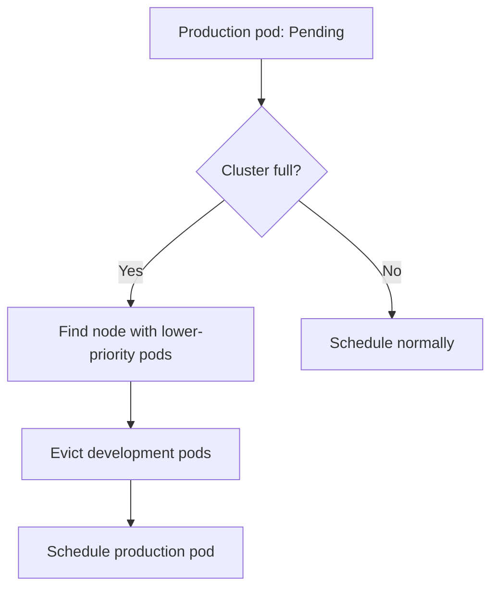

> 💡 **Quick Answer:** configuration

## The Problem

This is a fundamental Kubernetes topic that engineers search for frequently. A comprehensive reference with production-ready examples saves hours of trial and error.

## The Solution

### Create Priority Classes

```yaml
# System critical (highest)
apiVersion: scheduling.k8s.io/v1
kind: PriorityClass
metadata:
  name: system-critical
value: 1000000
globalDefault: false
preemptionPolicy: PreemptLowerPriority
description: "System components — ingress, monitoring"
---
# Production workloads
apiVersion: scheduling.k8s.io/v1
kind: PriorityClass
metadata:
  name: production
value: 100000
globalDefault: false
description: "Production application workloads"
---
# Development (lowest)
apiVersion: scheduling.k8s.io/v1
kind: PriorityClass
metadata:
  name: development
value: 1000
globalDefault: true     # Default for pods without priorityClassName
preemptionPolicy: Never  # Don't evict others
description: "Development and testing workloads"
```

### Use in Pods

```yaml
apiVersion: apps/v1
kind: Deployment
metadata:
  name: critical-api
spec:
  template:
    spec:
      priorityClassName: production    # ← Set priority
      containers:
        - name: api
          image: api:v1
```

### How Preemption Works

```bash
# Scenario: cluster is full, new high-priority pod is Pending
# 1. Scheduler finds node where evicting low-priority pods frees enough resources
# 2. Low-priority pods get graceful termination (terminationGracePeriodSeconds)
# 3. High-priority pod is scheduled on that node
```

| Priority Value | Class | Preemption |
|---------------|-------|------------|
| 1,000,000+ | system-critical | Evicts everything below |
| 100,000 | production | Evicts dev workloads |
| 1,000 | development | Never preempts (policy: Never) |



## Frequently Asked Questions

### What's `preemptionPolicy: Never`?

The pod has priority for scheduling order (higher priority pods are considered first) but will NOT evict running pods. Use this for important-but-not-critical workloads.

### Built-in priority classes?

`system-cluster-critical` (2000000000) and `system-node-critical` (2000001000) are built-in. Don't use values near these for your own classes.

## Best Practices

- Start with the simplest configuration that meets your needs
- Test changes in staging before production
- Use `kubectl describe` and events for troubleshooting
- Document your decisions for the team

## Key Takeaways

- This is essential Kubernetes knowledge for production operations
- Follow the principle of least privilege and minimal configuration
- Monitor and iterate based on real-world behavior
- Automation reduces human error and improves consistency
