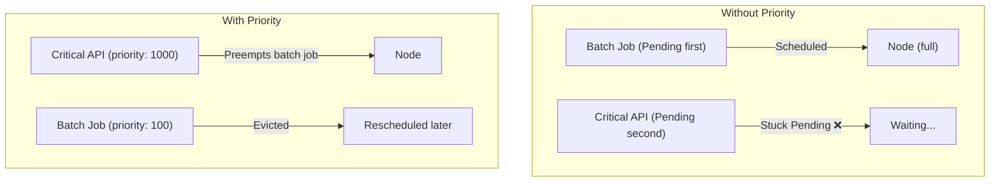

> 💡 **Quick Answer:** PriorityClass assigns scheduling priority to pods. Higher-priority pods get scheduled first and can preempt (evict) lower-priority pods when resources are scarce. Create PriorityClasses with values 0-1,000,000,000, then set \`priorityClassName\` in pod spec. System-critical pods use values above 1 billion.

## The Problem

When cluster resources are exhausted, new pods stay Pending. Without priority, scheduling is FIFO — a batch job queued first blocks a critical production service. PriorityClasses let you define which workloads matter most and allow critical pods to evict less important ones.



## The Solution

### Define PriorityClasses

```yaml
# Critical production services
apiVersion: scheduling.k8s.io/v1
kind: PriorityClass
metadata:
  name: critical
value: 1000000                        # Higher = more important
globalDefault: false
preemptionPolicy: PreemptLowerPriority  # Can evict lower-priority pods
description: "Critical production services"
---
# Standard workloads
apiVersion: scheduling.k8s.io/v1
kind: PriorityClass
metadata:
  name: standard
value: 100000
globalDefault: true                    # Default for pods without priorityClassName
preemptionPolicy: PreemptLowerPriority
description: "Standard production workloads"
---
# Batch/background jobs
apiVersion: scheduling.k8s.io/v1
kind: PriorityClass
metadata:
  name: batch
value: 10000
globalDefault: false
preemptionPolicy: Never               # Won't evict others, but gets evicted first
description: "Batch jobs and background tasks"
---
# Best-effort / development
apiVersion: scheduling.k8s.io/v1
kind: PriorityClass
metadata:
  name: best-effort
value: 1000
globalDefault: false
preemptionPolicy: Never
description: "Development and testing workloads"
```

### Use PriorityClass in Pods

```yaml
apiVersion: apps/v1
kind: Deployment
metadata:
  name: payment-api
spec:
  template:
    spec:
      priorityClassName: critical      # ← This pod gets priority
      containers:
        - name: api
          image: payment-api:v2.0
          resources:
            requests:
              cpu: "500m"
              memory: "512Mi"
```

### How Preemption Works

```
1. payment-api (priority: 1000000) is Pending — no resources available
2. Scheduler finds node running batch-job (priority: 10000)
3. Scheduler evicts batch-job (lower priority)
4. batch-job gets graceful termination (terminationGracePeriodSeconds)
5. payment-api scheduled on freed resources
6. batch-job rescheduled when resources available
```

### Non-Preempting Priority (Queue Jumping Only)

```yaml
apiVersion: scheduling.k8s.io/v1
kind: PriorityClass
metadata:
  name: high-priority-no-preempt
value: 500000
preemptionPolicy: Never     # Gets scheduled first, but never evicts others
description: "High priority but won't preempt running pods"
```

### Built-In System PriorityClasses

| PriorityClass | Value | Used By |
|--------------|:-----:|---------|
| \`system-node-critical\` | 2,000,001,000 | kube-proxy, kubelet, CNI |
| \`system-cluster-critical\` | 2,000,000,000 | CoreDNS, metrics-server, kube-apiserver |
| User-defined | 0 - 1,000,000,000 | Your workloads |

```bash
# View all PriorityClasses
kubectl get priorityclasses
# NAME                      VALUE          GLOBAL-DEFAULT   AGE
# system-node-critical      2000001000     false            30d
# system-cluster-critical   2000000000     false            30d
# critical                  1000000        false            5d
# standard                  100000         true             5d
# batch                     10000          false            5d
```

### Recommended Priority Hierarchy

```yaml
# Tier 1: Infrastructure (system PriorityClasses)
# system-node-critical:    2,000,001,000
# system-cluster-critical: 2,000,000,000

# Tier 2: Production Critical
# critical:       1,000,000   (payment, auth, API gateway)

# Tier 3: Production Standard
# standard:         100,000   (web apps, microservices) — globalDefault

# Tier 4: Batch Processing
# batch:             10,000   (ETL, reports, ML training)

# Tier 5: Best Effort
# best-effort:        1,000   (dev, testing, experiments)
```

### Quota with Priority

Limit resources per priority level:

```yaml
apiVersion: v1
kind: ResourceQuota
metadata:
  name: batch-quota
  namespace: data-team
spec:
  hard:
    pods: "50"
    requests.cpu: "100"
    requests.memory: "200Gi"
  scopeSelector:
    matchExpressions:
      - scopeName: PriorityClass
        operator: In
        values: ["batch", "best-effort"]
```

## Common Issues

| Issue | Cause | Fix |
|-------|-------|-----|
| Critical pod still Pending | No lower-priority pods to preempt | Add nodes or increase cluster capacity |
| Batch jobs constantly evicted | Too many high-priority workloads | Right-size requests, add nodes, or use \`preemptionPolicy: Never\` for mid-tier |
| No globalDefault set | Pods without priorityClassName get priority 0 | Set one PriorityClass as \`globalDefault: true\` |
| PDB blocking preemption | PodDisruptionBudget prevents eviction | Scheduler respects PDB — increase replicas or adjust PDB |
| Cascade preemption | Evicted pod preempts another, causing churn | Use fewer priority levels, wider gaps between values |

## Best Practices

- **Use 4-5 priority tiers max** — too many levels cause preemption chains
- **Set a globalDefault** — pods without priorityClassName get a sane default
- **Use \`preemptionPolicy: Never\` for batch** — they wait instead of evicting
- **Don't use values above 1 billion** — reserved for system components
- **Combine with ResourceQuota** — prevent low-priority namespaces from hoarding resources
- **Always set resource requests** — preemption is based on resource requests, not limits

## Key Takeaways

- PriorityClass controls scheduling order AND preemption behavior
- Higher priority pods can evict lower priority pods when resources are scarce
- \`preemptionPolicy: Never\` = queue jumping without eviction
- System PriorityClasses (>1 billion) are reserved — don't use them
- Set one \`globalDefault: true\` PriorityClass for your standard workloads
- Preemption respects PodDisruptionBudgets and graceful termination
