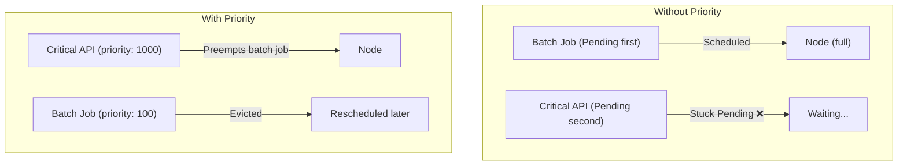

> 💡 **Quick Answer:** PriorityClass assigns scheduling priority to pods. Higher-priority pods get scheduled first and can preempt (evict) lower-priority pods when resources are scarce. Create PriorityClasses with values 0-1,000,000,000, then set `priorityClassName` in pod spec. System-critical pods use values above 1 billion.

## The Problem

When cluster resources are exhausted, new pods stay Pending. Without priority, scheduling is FIFO — a batch job queued first blocks a critical production service. PriorityClasses let you define which workloads matter most and allow critical pods to evict less important ones.


```mermaid
flowchart TB
    subgraph NOPRIO["Without Priority"]
        Q1["Batch Job (Pending first)"] -->|"Scheduled"| N1["Node (full)"]
        Q2["Critical API (Pending second)"] -->|"Stuck Pending ❌"| WAIT["Waiting..."]
    end
    subgraph PRIO["With Priority"]
        Q3["Critical API (priority: 1000)"] -->|"Preempts batch job"| N2["Node"]
        Q4["Batch Job (priority: 100)"] -->|"Evicted"| EVICT["Rescheduled later"]
    end
```

## The Solution

### Define PriorityClasses

```yaml
# Critical production services
apiVersion: scheduling.k8s.io/v1
kind: PriorityClass
metadata:
  name: critical
value: 1000000                        # Higher = more important
globalDefault: false
preemptionPolicy: PreemptLowerPriority  # Can evict lower-priority pods
description: "Critical production services"
---
# Standard workloads
apiVersion: scheduling.k8s.io/v1
kind: PriorityClass
metadata:
  name: standard
value: 100000
globalDefault: true                    # Default for pods without priorityClassName
preemptionPolicy: PreemptLowerPriority
description: "Standard production workloads"
---
# Batch/background jobs
apiVersion: scheduling.k8s.io/v1
kind: PriorityClass
metadata:
  name: batch
value: 10000
globalDefault: false
preemptionPolicy: Never               # Won't evict others, but gets evicted first
description: "Batch jobs and background tasks"
---
# Best-effort / development
apiVersion: scheduling.k8s.io/v1
kind: PriorityClass
metadata:
  name: best-effort
value: 1000
globalDefault: false
preemptionPolicy: Never
description: "Development and testing workloads"
```

### Use PriorityClass in Pods

```yaml
apiVersion: apps/v1
kind: Deployment
metadata:
  name: payment-api
spec:
  template:
    spec:
      priorityClassName: critical      # ← This pod gets priority
      containers:
        - name: api
          image: payment-api:v2.0
          resources:
            requests:
              cpu: "500m"
              memory: "512Mi"
```

### How Preemption Works

```
1. payment-api (priority: 1000000) is Pending — no resources available
2. Scheduler finds node running batch-job (priority: 10000)
3. Scheduler evicts batch-job (lower priority)
4. batch-job gets graceful termination (terminationGracePeriodSeconds)
5. payment-api scheduled on freed resources
6. batch-job's controller (Job/Deployment) recreates it; it stays Pending until capacity frees up
```

### Non-Preempting Priority (Queue Jumping Only)

```yaml
apiVersion: scheduling.k8s.io/v1
kind: PriorityClass
metadata:
  name: high-priority-no-preempt
value: 500000
preemptionPolicy: Never     # Gets scheduled first, but never evicts others
description: "High priority but won't preempt running pods"
```

### Built-In System PriorityClasses

| PriorityClass | Value | Used By |
|--------------|:-----:|---------|
| `system-node-critical` | 2,000,001,000 | kube-proxy, kubelet, CNI |
| `system-cluster-critical` | 2,000,000,000 | CoreDNS, metrics-server, kube-apiserver |
| User-defined | 0 - 1,000,000,000 | Your workloads |

```bash
# View all PriorityClasses
kubectl get priorityclasses
# NAME                      VALUE          GLOBAL-DEFAULT   AGE
# system-node-critical      2000001000     false            30d
# system-cluster-critical   2000000000     false            30d
# critical                  1000000        false            5d
# standard                  100000         true             5d
# batch                     10000          false            5d
```

### Recommended Priority Hierarchy

```yaml
# Tier 1: Infrastructure (system PriorityClasses)
# system-node-critical:    2,000,001,000
# system-cluster-critical: 2,000,000,000

# Tier 2: Production Critical
# critical:       1,000,000   (payment, auth, API gateway)

# Tier 3: Production Standard
# standard:         100,000   (web apps, microservices) — globalDefault

# Tier 4: Batch Processing
# batch:             10,000   (ETL, reports, ML training)

# Tier 5: Best Effort
# best-effort:        1,000   (dev, testing, experiments)
```

### GPU Clusters

Priority matters most on scarce accelerators: give production inference a preempting class and dev notebooks/experiments a low, non-preempting class so a burst of experiments can't hold GPUs that production needs. See [PriorityClasses for GPU workloads](/recipes/configuration/priorityclasses-gpu-workloads/).

### Verify and Monitor Preemption

```bash
# Priority class and resolved priority of each pod
kubectl get pods -A -o custom-columns=NS:.metadata.namespace,NAME:.metadata.name,CLASS:.spec.priorityClassName,PRIO:.spec.priority

# Pods with priority 0 (no class and no globalDefault)
kubectl get pods -A -o json | jq -r '.items[] | select((.spec.priority // 0) == 0) | "\(.metadata.namespace)/\(.metadata.name)"'

# Watch preemptions as they happen
kubectl get events -A -w --field-selector reason=Preempted
```

The Priority admission plugin resolves `priorityClassName` (or the `globalDefault` class) into `spec.priority` at creation — changing a PriorityClass later doesn't affect running pods.

```yaml
# A preemption spike usually means the cluster is undersized, not misconfigured
apiVersion: monitoring.coreos.com/v1
kind: PrometheusRule
metadata: {name: priority-alerts}
spec:
  groups:
    - name: pod-priority
      rules:
        - alert: HighPreemptionRate
          expr: increase(scheduler_preemption_attempts_total[1h]) > 10
          for: 5m
          labels: {severity: warning}
```

### Quota with Priority

Limit resources per priority level:

```yaml
apiVersion: v1
kind: ResourceQuota
metadata:
  name: batch-quota
  namespace: data-team
spec:
  hard:
    pods: "50"
    requests.cpu: "100"
    requests.memory: "200Gi"
  scopeSelector:
    matchExpressions:
      - scopeName: PriorityClass
        operator: In
        values: ["batch", "best-effort"]
```

## Common Issues

| Issue | Cause | Fix |
|-------|-------|-----|
| Critical pod still Pending | No lower-priority pods to preempt | Add nodes or increase cluster capacity |
| Batch jobs constantly evicted | Too many high-priority workloads | Right-size requests, add nodes, or use `preemptionPolicy: Never` for mid-tier |
| No globalDefault set | Pods without priorityClassName get priority 0 | Set one PriorityClass as `globalDefault: true` |
| Preemption violated a PDB | Scheduler honors PDBs only best-effort | It prefers victims whose PDB isn't violated, but will violate one if no other option exists — protect critical pods with priority, not just PDBs |
| Cascade preemption | Evicted pod preempts another, causing churn | Use fewer priority levels, wider gaps between values |

## Best Practices

- **Use 4-5 priority tiers max** — too many levels cause preemption chains
- **Set a globalDefault** — pods without priorityClassName get a sane default
- **Use `preemptionPolicy: Never` for batch** — they wait instead of evicting
- **Don't use values above 1 billion** — reserved for system components
- **Combine with ResourceQuota** — prevent low-priority namespaces from hoarding resources
- **Always set resource requests** — preemption is based on resource requests, not limits

## Key Takeaways

- PriorityClass controls scheduling order AND preemption behavior
- Higher priority pods can evict lower priority pods when resources are scarce
- `preemptionPolicy: Never` = queue jumping without eviction
- System PriorityClasses (>1 billion) are reserved — don't use them
- Set one `globalDefault: true` PriorityClass for your standard workloads
- Preemption gives victims their graceful termination period and honors PDBs only best-effort
- Monitor with `kubectl get events -A --field-selector reason=Preempted`

## Frequently Asked Questions

### What is pod preemption in Kubernetes?

When a pod can't be scheduled, the scheduler looks for a node where evicting one or more lower-priority pods would make it fit, gracefully terminates those victims, and sets the pending pod's `status.nominatedNodeName` so it lands there once resources free up.

### What is the difference between priority and preemption?

Priority orders the scheduling queue: higher-priority pending pods are tried first. Preemption is the optional ability to evict lower-priority running pods to make room, controlled per PriorityClass by `preemptionPolicy` (`PreemptLowerPriority` or `Never`).

### Does preemption respect PodDisruptionBudgets?

Only best-effort. The scheduler prefers victims whose eviction won't violate a PDB, but if no such set exists it preempts anyway. PDBs are fully enforced only for the Eviction API (drains, autoscalers).

### What priority do pods get without a priorityClassName?

The value of the PriorityClass marked `globalDefault: true`, or 0 if none exists. Only one PriorityClass can be the global default, and changing it doesn't affect pods that already exist.

### What is the maximum PriorityClass value?

User-defined classes can go up to 1,000,000,000. Higher values are reserved for the built-in `system-cluster-critical` (2,000,000,000) and `system-node-critical` (2,000,001,000) classes.
