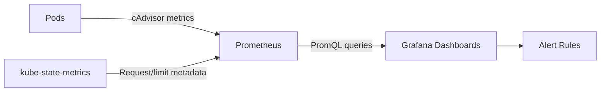

> 💡 **Quick Answer:** Use Prometheus + Grafana to monitor pod CPU/memory. Key queries: `container_cpu_usage_seconds_total` for actual CPU, `container_memory_working_set_bytes` for memory, compared against `kube_pod_container_resource_requests` and `kube_pod_container_resource_limits`. Import Grafana dashboard 15759 for a ready-made pod resource overview.

## The Problem

`kubectl top` shows a snapshot, but you need historical trends to right-size pods, catch memory leaks, and prevent OOMKills. Grafana dashboards with Prometheus data show: actual vs requested resources (are you over/under-provisioning?), trends over time, per-namespace costs, and alerts when containers approach limits.



## The Solution

### Essential PromQL Queries

```promql
# CPU usage rate (cores) per pod
sum(rate(container_cpu_usage_seconds_total{
  namespace="my-app", container!=""
}[5m])) by (pod)

# Memory usage (bytes) per pod
sum(container_memory_working_set_bytes{
  namespace="my-app", container!=""
}) by (pod)

# CPU usage vs requests (percentage)
sum(rate(container_cpu_usage_seconds_total{container!=""}[5m])) by (pod, namespace)
/
sum(kube_pod_container_resource_requests{resource="cpu"}) by (pod, namespace)
* 100

# Memory usage vs limits (OOMKill risk)
sum(container_memory_working_set_bytes{container!=""}) by (pod, namespace)
/
sum(kube_pod_container_resource_limits{resource="memory"}) by (pod, namespace)
* 100

# Pods with no resource requests set (bad practice)
kube_pod_container_resource_requests{resource="cpu"} == 0

# Top 10 memory consumers
topk(10,
  sum(container_memory_working_set_bytes{container!=""}) by (pod, namespace)
)

# CPU throttling percentage
sum(rate(container_cpu_cfs_throttled_periods_total[5m])) by (pod)
/
sum(rate(container_cpu_cfs_periods_total[5m])) by (pod)
* 100
```

### Grafana Dashboard JSON

```json
{
  "title": "Pod Resource Monitor",
  "panels": [
    {
      "title": "CPU Usage vs Requests",
      "type": "timeseries",
      "targets": [{
        "expr": "sum(rate(container_cpu_usage_seconds_total{namespace=~\"$namespace\",container!=\"\"}[5m])) by (pod)",
        "legendFormat": "{{pod}} usage"
      }, {
        "expr": "sum(kube_pod_container_resource_requests{namespace=~\"$namespace\",resource=\"cpu\"}) by (pod)",
        "legendFormat": "{{pod}} request"
      }]
    },
    {
      "title": "Memory Usage vs Limits",
      "type": "timeseries",
      "targets": [{
        "expr": "sum(container_memory_working_set_bytes{namespace=~\"$namespace\",container!=\"\"}) by (pod)",
        "legendFormat": "{{pod}} usage"
      }, {
        "expr": "sum(kube_pod_container_resource_limits{namespace=~\"$namespace\",resource=\"memory\"}) by (pod)",
        "legendFormat": "{{pod}} limit"
      }]
    },
    {
      "title": "CPU Throttling %",
      "type": "gauge",
      "targets": [{
        "expr": "avg(rate(container_cpu_cfs_throttled_periods_total{namespace=~\"$namespace\"}[5m]) / rate(container_cpu_cfs_periods_total{namespace=~\"$namespace\"}[5m]) * 100)"
      }],
      "thresholds": [
        {"color": "green", "value": 0},
        {"color": "yellow", "value": 25},
        {"color": "red", "value": 50}
      ]
    },
    {
      "title": "OOMKill Events",
      "type": "stat",
      "targets": [{
        "expr": "sum(increase(kube_pod_container_status_restarts_total{namespace=~\"$namespace\"}[24h]))"
      }]
    }
  ]
}
```

### Alert Rules

```yaml
apiVersion: monitoring.coreos.com/v1
kind: PrometheusRule
metadata:
  name: pod-resource-alerts
spec:
  groups:
    - name: pod-resources
      rules:
        - alert: PodMemoryNearLimit
          expr: |
            (container_memory_working_set_bytes{container!=""}
            / on(pod,namespace,container) kube_pod_container_resource_limits{resource="memory"})
            > 0.9
          for: 5m
          labels:
            severity: warning
          annotations:
            summary: "Pod {{ $labels.pod }} using >90% memory limit"
            
        - alert: PodCPUThrottled
          expr: |
            rate(container_cpu_cfs_throttled_periods_total[5m])
            / rate(container_cpu_cfs_periods_total[5m])
            > 0.5
          for: 15m
          labels:
            severity: warning
          annotations:
            summary: "Pod {{ $labels.pod }} CPU throttled >50%"

        - alert: PodOverProvisionedCPU
          expr: |
            (sum(rate(container_cpu_usage_seconds_total{container!=""}[24h])) by (pod,namespace)
            / sum(kube_pod_container_resource_requests{resource="cpu"}) by (pod,namespace))
            < 0.1
          for: 24h
          labels:
            severity: info
          annotations:
            summary: "Pod {{ $labels.pod }} using <10% of CPU request — consider reducing"
```

### Import Pre-Built Dashboards

```bash
# Popular community dashboards:
# 15759 — Kubernetes Pod Resources Overview
# 6417  — Node Exporter Full (already covered in our guide)
# 3119  — Kubernetes Cluster Monitoring
# 1860  — Node Exporter for Prometheus

# Import via Grafana UI: + → Import → Enter dashboard ID
# Or via API:
curl -X POST http://grafana:3000/api/dashboards/import \
  -H "Content-Type: application/json" \
  -H "Authorization: Bearer $GRAFANA_TOKEN" \
  -d '{"dashboard": {"id": 15759}, "overwrite": true, "inputs": [{"name": "DS_PROMETHEUS", "value": "Prometheus"}]}'
```

## Common Issues

| Issue | Cause | Fix |
|-------|-------|-----|
| No container metrics | cAdvisor not scraping | Check Prometheus targets for kubelet |
| `kube_pod_container_resource_*` missing | kube-state-metrics not installed | Install kube-state-metrics |
| Dashboard shows no data | Wrong Prometheus datasource | Verify datasource in Grafana |
| CPU throttling high but usage low | CPU limit too low | Increase limits or remove CPU limits |
| Memory shows `rss` not `working_set` | Wrong metric | Use `container_memory_working_set_bytes` (OOMKill basis) |

## Best Practices

- **Use `working_set_bytes` not `rss`** — Kubernetes OOMKiller uses working set
- **Track requests AND limits** — requests affect scheduling; limits affect throttling/OOM
- **Alert on >90% memory limit** — gives time to react before OOMKill
- **Monitor CPU throttling** — high throttling means CPU limits are too low
- **Review over-provisioned pods weekly** — <10% usage means wasted resources
- **Use namespace-scoped dashboards** — team owners monitor their own workloads

## Key Takeaways

- Prometheus + Grafana provides historical pod resource monitoring
- Key metrics: cpu_usage, memory_working_set, cpu_throttled, resource_requests/limits
- Dashboard 15759 is a great starting point for pod resource overview
- Alert on memory approaching limits (>90%) and high CPU throttling (>50%)
- Track usage vs requests to right-size pods and reduce waste
