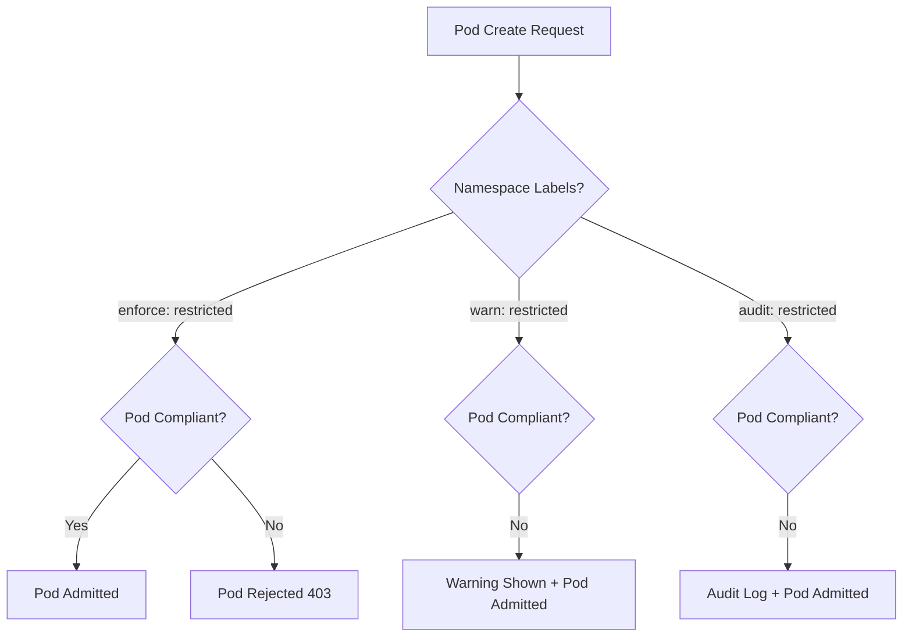

> 💡 **Quick Answer:** Pod Security Admission (PSA) enforces Pod Security Standards (Privileged, Baseline, Restricted) via namespace labels — no webhooks or external tools required. It replaced PodSecurityPolicy in 1.25.

## The Problem

After PodSecurityPolicy removal in 1.25, clusters need a built-in mechanism to prevent privileged containers, host namespace access, and other dangerous pod configurations without installing third-party policy engines.

## The Solution

### Label Namespaces

```yaml
apiVersion: v1
kind: Namespace
metadata:
  name: production
  labels:
    pod-security.kubernetes.io/enforce: restricted
    pod-security.kubernetes.io/enforce-version: v1.30
    pod-security.kubernetes.io/audit: restricted
    pod-security.kubernetes.io/warn: restricted
```

### Three Modes

```yaml
# Enforce: Block non-compliant pods
pod-security.kubernetes.io/enforce: baseline

# Audit: Log violations (allow pod)
pod-security.kubernetes.io/audit: restricted

# Warn: Show warning to user (allow pod)
pod-security.kubernetes.io/warn: restricted
```

### Gradual Migration

```yaml
apiVersion: v1
kind: Namespace
metadata:
  name: staging
  labels:
    # Allow everything but warn about violations
    pod-security.kubernetes.io/enforce: privileged
    pod-security.kubernetes.io/warn: baseline
    pod-security.kubernetes.io/audit: baseline
---
apiVersion: v1
kind: Namespace
metadata:
  name: production
  labels:
    # Strict enforcement
    pod-security.kubernetes.io/enforce: restricted
    pod-security.kubernetes.io/audit: restricted
    pod-security.kubernetes.io/warn: restricted
```

### Compliant Pod (Restricted Level)

```yaml
apiVersion: v1
kind: Pod
metadata:
  name: secure-app
  namespace: production
spec:
  securityContext:
    runAsNonRoot: true
    seccompProfile:
      type: RuntimeDefault
  containers:
    - name: app
      image: myapp:2.0
      securityContext:
        allowPrivilegeEscalation: false
        capabilities:
          drop: ["ALL"]
        runAsNonRoot: true
        seccompProfile:
          type: RuntimeDefault
      resources:
        limits:
          memory: 256Mi
```

### Dry-Run Before Enforcement

```bash
# Check what would be blocked
kubectl label --dry-run=server --overwrite ns production \
  pod-security.kubernetes.io/enforce=restricted

# Output shows which existing pods would violate
```



## Common Issues

**Existing pods violating new enforcement**
PSA only checks at admission time. Existing pods continue running. Use `--dry-run=server` to audit before enforcing.

**System namespaces need privileged**
```bash
# kube-system must remain privileged
kubectl label ns kube-system pod-security.kubernetes.io/enforce=privileged --overwrite
```

**Workloads needing specific capabilities**
Restricted level drops ALL capabilities. If your app needs `NET_BIND_SERVICE`:
- Use Baseline level for that namespace, or
- Use a policy engine (Kyverno/VAP) for fine-grained exceptions

## Best Practices

- Start with `warn` + `audit` modes to identify violations before enforcing
- Use `enforce-version` to pin policy version during cluster upgrades
- Apply `restricted` to all production namespaces
- Keep `kube-system` and operator namespaces at `privileged`
- Use the dry-run label approach to audit existing workloads
- Combine PSA with ValidatingAdmissionPolicy for custom rules beyond the three levels

## Key Takeaways

- Three levels: Privileged (allow all), Baseline (prevent known escalations), Restricted (hardened)
- Three modes: enforce (block), audit (log), warn (user warning)
- Applied via namespace labels — no CRDs or controllers needed
- Built into every Kubernetes 1.25+ cluster by default
- Only checks at admission time — doesn't affect already-running pods
- Pin versions to avoid behavior changes during upgrades
