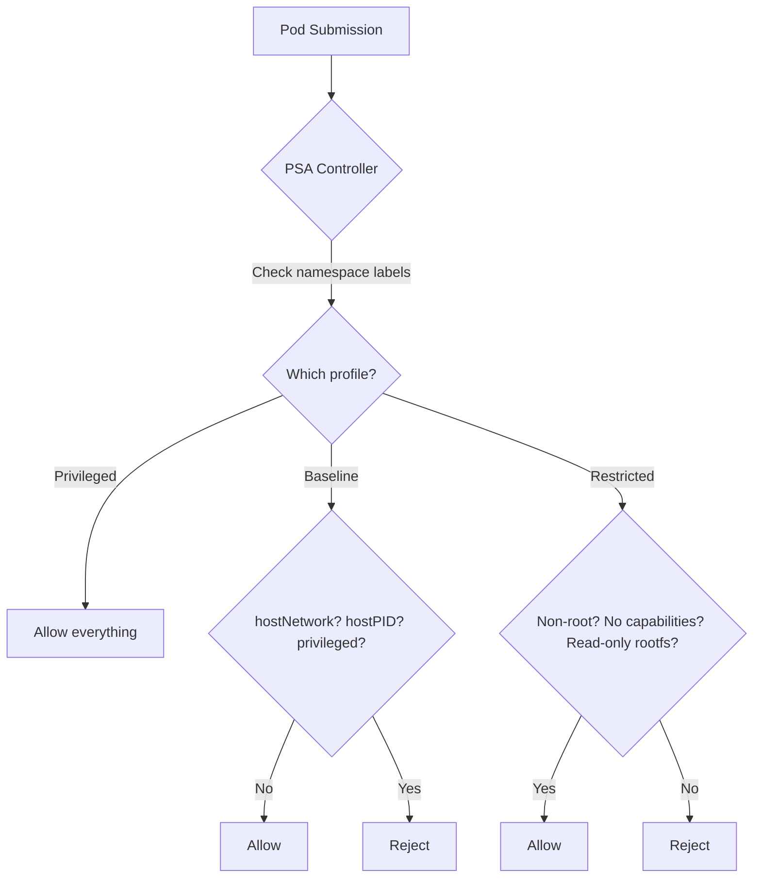

> 💡 **Quick Answer:** Implement Pod Security Standards (PSS) with Pod Security Admission. Configure privileged, baseline, and restricted profiles for namespace-level pod security.

## The Problem

Pod Security Standards (PSS) replaced PodSecurityPolicies (PSP) in Kubernetes 1.25. They define three security profiles — privileged, baseline, and restricted — enforced by the built-in Pod Security Admission controller.

## The Solution

### The Three Security Profiles

| Profile | Use Case | Restrictions |
|---------|----------|-------------|
| **Privileged** | System workloads, CNI, storage drivers | None — full access |
| **Baseline** | Most workloads | No hostNetwork, hostPID, privileged containers |
| **Restricted** | Security-sensitive workloads | Non-root, read-only rootfs, no capabilities |

### Step 1: Label Namespaces

```bash
# Enforce restricted profile (reject non-compliant pods)
kubectl label namespace production \
  pod-security.kubernetes.io/enforce=restricted \
  pod-security.kubernetes.io/enforce-version=latest

# Warn but don't reject (for migration)
kubectl label namespace staging \
  pod-security.kubernetes.io/warn=restricted \
  pod-security.kubernetes.io/audit=restricted \
  pod-security.kubernetes.io/enforce=baseline

# System namespaces stay privileged
kubectl label namespace kube-system \
  pod-security.kubernetes.io/enforce=privileged
```

### Step 2: Write Compliant Pod Specs

```yaml
# Restricted-compliant pod
apiVersion: v1
kind: Pod
metadata:
  name: secure-app
  namespace: production
spec:
  securityContext:
    runAsNonRoot: true
    seccompProfile:
      type: RuntimeDefault
  containers:
    - name: app
      image: myapp:v1.0
      securityContext:
        allowPrivilegeEscalation: false
        readOnlyRootFilesystem: true
        runAsNonRoot: true
        runAsUser: 1000
        capabilities:
          drop: ["ALL"]
      volumeMounts:
        - name: tmp
          mountPath: /tmp
  volumes:
    - name: tmp
      emptyDir: {}    # Writable /tmp since rootfs is read-only
```

### Step 3: Audit Existing Workloads

```bash
# Dry-run: check which pods would fail restricted profile
kubectl label namespace default \
  pod-security.kubernetes.io/warn=restricted \
  --dry-run=server

# Check specific workloads
kubectl auth can-i --list --as=system:serviceaccount:default:default

# Find non-compliant pods
kubectl get pods -A -o json | jq -r '
  .items[] | select(
    .spec.containers[].securityContext.runAsNonRoot != true or
    .spec.containers[].securityContext.allowPrivilegeEscalation != false
  ) | "\(.metadata.namespace)/\(.metadata.name)"'
```



## Best Practices

- **Start with observation** — measure before optimizing
- **Automate** — manual processes don't scale
- **Iterate** — implement changes gradually and measure impact
- **Document** — keep runbooks for your team

## Key Takeaways

- This is a critical capability for production Kubernetes clusters
- Start with the simplest approach and evolve as needed
- Monitor and measure the impact of every change
- Share knowledge across your team with internal documentation
