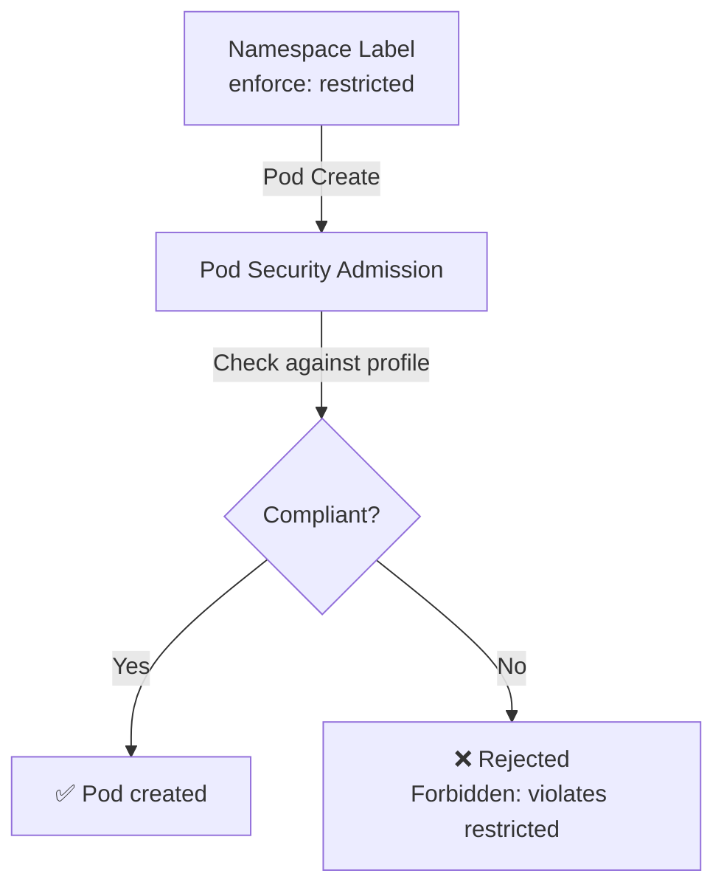

> 💡 **Quick Answer:** Label namespaces with `pod-security.kubernetes.io/enforce: restricted` to enforce Pod Security Standards. Start with `warn` mode to audit violations, then switch to `enforce` when clean.

## The Problem

PodSecurityPolicy was removed in K8s 1.25. Its replacement, Pod Security Admission (PSA), uses namespace labels to enforce three security levels: privileged (no restrictions), baseline (prevents known escalations), and restricted (hardened). Teams need a migration path.

## The Solution

### Security Levels

| Level | Description | Use Case |
|-------|-------------|----------|
| **privileged** | No restrictions | System components, CNI, CSI |
| **baseline** | Prevents known escalations | General workloads |
| **restricted** | Hardened security posture | Multi-tenant, regulated environments |

### Namespace Labels

```yaml
apiVersion: v1
kind: Namespace
metadata:
  name: production
  labels:
    pod-security.kubernetes.io/enforce: restricted
    pod-security.kubernetes.io/enforce-version: latest
    pod-security.kubernetes.io/warn: restricted
    pod-security.kubernetes.io/audit: restricted
---
apiVersion: v1
kind: Namespace
metadata:
  name: monitoring
  labels:
    pod-security.kubernetes.io/enforce: baseline
    pod-security.kubernetes.io/warn: restricted
```

### Restricted-Compliant Pod

```yaml
apiVersion: v1
kind: Pod
metadata:
  name: secure-app
  namespace: production
spec:
  securityContext:
    runAsNonRoot: true
    seccompProfile:
      type: RuntimeDefault
  containers:
    - name: app
      image: registry.example.com/app:1.0
      securityContext:
        allowPrivilegeEscalation: false
        capabilities:
          drop: ["ALL"]
        readOnlyRootFilesystem: true
        runAsUser: 1000
```



## Common Issues

**"violates PodSecurity restricted" — pods rejected**

Common violations: missing `runAsNonRoot`, `seccompProfile` not set, capabilities not dropped. Check warning messages for specific fields.

**System namespaces need privileged**

Label `kube-system`, `kube-node-lease`, and operator namespaces as `privileged`. Don't enforce restricted on system components.

## Best Practices

- **Start with `warn` mode** — see violations without blocking
- **Enforce `restricted` on all application namespaces** — most apps can comply
- **`baseline` for monitoring/logging** — Prometheus/Fluentd may need host access
- **`privileged` only for system namespaces** — kube-system, CNI, CSI operators
- **Pin `enforce-version`** to prevent surprise failures on K8s upgrades

## Key Takeaways

- PSA replaces PodSecurityPolicy with namespace-level enforcement
- Three levels: privileged (none), baseline (sane defaults), restricted (hardened)
- Use `warn` + `audit` labels to discover violations before enforcing
- Restricted-compliant pods need: runAsNonRoot, drop ALL caps, seccomp RuntimeDefault, no privilege escalation
- System namespaces must remain privileged — don't lock out cluster components
