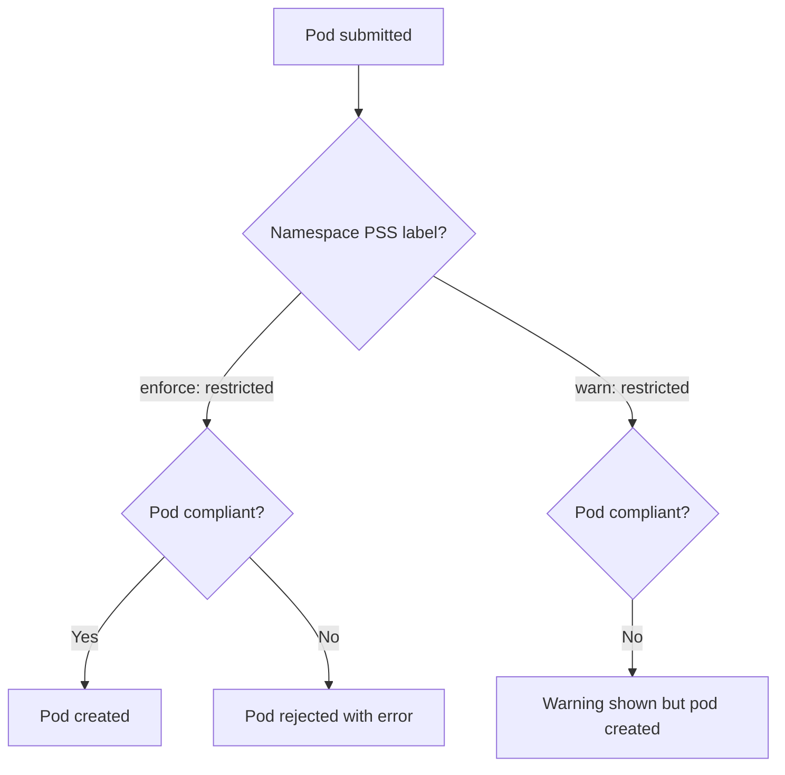

> 💡 **Quick Answer:** security

## The Problem

This is a fundamental Kubernetes topic that engineers search for frequently. A comprehensive reference with production-ready examples saves hours of trial and error.

## The Solution

### Pod Security Levels

| Level | What It Allows | Use For |
|-------|---------------|---------|
| **Privileged** | Everything (no restrictions) | System components, CNI |
| **Baseline** | Blocks known privilege escalations | General workloads |
| **Restricted** | Strictest — non-root, no capabilities | Production apps |

### Enable Per Namespace

```yaml
apiVersion: v1
kind: Namespace
metadata:
  name: production
  labels:
    # Enforce: reject pods that violate
    pod-security.kubernetes.io/enforce: restricted
    pod-security.kubernetes.io/enforce-version: latest
    # Warn: allow but show warning
    pod-security.kubernetes.io/warn: restricted
    # Audit: log violations
    pod-security.kubernetes.io/audit: restricted
```

### Compliant Pod (Restricted)

```yaml
apiVersion: v1
kind: Pod
metadata:
  name: secure-app
spec:
  securityContext:
    runAsNonRoot: true
    runAsUser: 1000
    fsGroup: 2000
    seccompProfile:
      type: RuntimeDefault
  containers:
    - name: app
      image: my-app:v1
      securityContext:
        allowPrivilegeEscalation: false
        readOnlyRootFilesystem: true
        capabilities:
          drop: [ALL]
      # Writable dirs via emptyDir
      volumeMounts:
        - name: tmp
          mountPath: /tmp
        - name: cache
          mountPath: /var/cache
  volumes:
    - name: tmp
      emptyDir: {}
    - name: cache
      emptyDir: {}
```

```bash
# Test: dry-run a pod against a level
kubectl label --dry-run=server --overwrite ns default \
  pod-security.kubernetes.io/enforce=restricted

# Check what's violating
kubectl get pods -n production -o json | jq '.items[].metadata.name'
```



## Frequently Asked Questions

### PodSecurityPolicy vs Pod Security Standards?

PodSecurityPolicy (PSP) was removed in K8s 1.25. Pod Security Standards (PSS) with Pod Security Admission (PSA) is the replacement. PSS is simpler — namespace labels instead of complex policy objects.

## Best Practices

- Start with the simplest configuration that meets your needs
- Test changes in staging before production
- Use `kubectl describe` and events for troubleshooting
- Document your decisions for the team

## Key Takeaways

- This is essential Kubernetes knowledge for production operations
- Follow the principle of least privilege and minimal configuration
- Monitor and iterate based on real-world behavior
- Automation reduces human error and improves consistency
