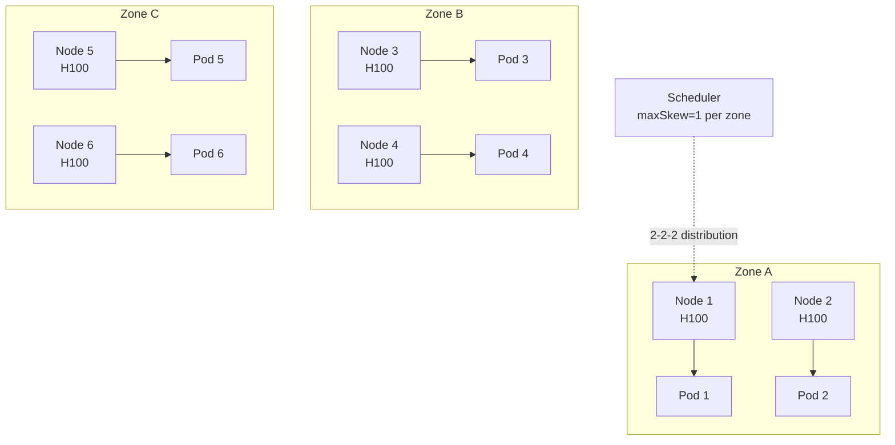

> 💡 **Quick Answer:** Use `topologySpreadConstraints` with `maxSkew: 1` and `topologyKey: topology.kubernetes.io/zone` for zone-balanced HA. For GPU workloads, spread across racks with `topologyKey: topology.kubernetes.io/rack`. Combine with `nodeAffinity` to constrain which nodes are eligible.

## The Problem

Pod affinity/anti-affinity is binary — pods are either co-located or separated. Topology spread provides fine-grained control: "distribute evenly across zones with at most 1 pod difference." This is essential for HA services, GPU rack-aware scheduling, and cost optimization.

## The Solution

### Zone-Balanced Deployment

```yaml
apiVersion: apps/v1
kind: Deployment
metadata:
  name: web-frontend
spec:
  replicas: 6
  template:
    spec:
      topologySpreadConstraints:
        - maxSkew: 1
          topologyKey: topology.kubernetes.io/zone
          whenUnsatisfiable: DoNotSchedule
          labelSelector:
            matchLabels:
              app: web-frontend
        - maxSkew: 1
          topologyKey: kubernetes.io/hostname
          whenUnsatisfiable: ScheduleAnyway
          labelSelector:
            matchLabels:
              app: web-frontend
```

This ensures:
- **Zone level**: At most 1 pod difference between zones (hard constraint)
- **Node level**: Best-effort even spread across nodes (soft constraint)

With 6 replicas across 3 zones: 2-2-2 distribution.

### GPU Rack-Aware Spread

```yaml
topologySpreadConstraints:
  - maxSkew: 1
    topologyKey: topology.kubernetes.io/rack
    whenUnsatisfiable: DoNotSchedule
    labelSelector:
      matchLabels:
        app: inference-pool
    matchLabelKeys:
      - pod-template-hash
```

`matchLabelKeys: [pod-template-hash]` ensures topology spread considers only pods from the SAME revision during rolling updates — prevents new pods from being blocked by old pods' topology.

### Combined with Node Affinity

```yaml
spec:
  affinity:
    nodeAffinity:
      requiredDuringSchedulingIgnoredDuringExecution:
        nodeSelectorTerms:
          - matchExpressions:
              - key: nvidia.com/gpu.product
                operator: In
                values: ["H100-SXM"]
  topologySpreadConstraints:
    - maxSkew: 1
      topologyKey: topology.kubernetes.io/zone
      whenUnsatisfiable: DoNotSchedule
      labelSelector:
        matchLabels:
          app: training-job
```

Spread training pods across zones, but only on H100 nodes.



## Common Issues

**Pods stuck in Pending with `DoNotSchedule`**

Not enough topology domains to satisfy `maxSkew`. Use `whenUnsatisfiable: ScheduleAnyway` for soft constraints, or add `minDomains` (K8s 1.30+).

**Rolling update blocked by topology constraints**

Old and new pods compete for topology slots. Use `matchLabelKeys: [pod-template-hash]` to scope constraints to the current revision only.

## Best Practices

- **Zone spread as hard constraint** (`DoNotSchedule`) — HA is non-negotiable
- **Node spread as soft constraint** (`ScheduleAnyway`) — more flexible
- **Use `matchLabelKeys`** for rolling updates — prevents scheduling deadlocks
- **Combine with PDB** — topology spread for placement, PDB for eviction protection
- **Label nodes with rack/row topology** for GPU-aware scheduling

## Key Takeaways

- `maxSkew: 1` means at most 1 pod difference between topology domains
- `DoNotSchedule` is a hard constraint; `ScheduleAnyway` is a preference
- `matchLabelKeys: [pod-template-hash]` scopes spread to current revision — critical for rolling updates
- Combine zone spread (hard) + node spread (soft) for optimal distribution
- Works with nodeAffinity to constrain eligible nodes before spreading
