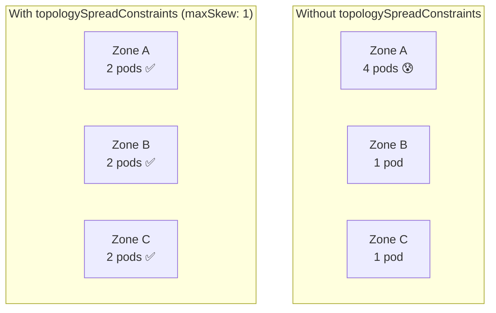

> 💡 **Quick Answer:** \`topologySpreadConstraints\` ensures pods are evenly distributed across failure domains (zones, nodes, racks). Set \`maxSkew: 1\` with \`topologyKey: topology.kubernetes.io/zone\` to spread pods across availability zones with at most 1 pod difference between zones.

## The Problem

Pod anti-affinity prevents pods from landing on the same node, but doesn't guarantee even distribution. With 6 replicas across 3 zones, you might get 4-1-1 instead of 2-2-2. Topology spread constraints enforce balanced placement.



## The Solution

### Spread Across Zones

```yaml
apiVersion: apps/v1
kind: Deployment
metadata:
  name: web-app
spec:
  replicas: 6
  template:
    metadata:
      labels:
        app: web-app
    spec:
      topologySpreadConstraints:
        - maxSkew: 1
          topologyKey: topology.kubernetes.io/zone
          whenUnsatisfiable: DoNotSchedule
          labelSelector:
            matchLabels:
              app: web-app
      containers:
        - name: app
          image: nginx
```

### Spread Across Nodes

```yaml
topologySpreadConstraints:
  - maxSkew: 1
    topologyKey: kubernetes.io/hostname
    whenUnsatisfiable: DoNotSchedule
    labelSelector:
      matchLabels:
        app: web-app
```

### Multi-Level Spread (Zone + Node)

```yaml
topologySpreadConstraints:
  # First: even across zones
  - maxSkew: 1
    topologyKey: topology.kubernetes.io/zone
    whenUnsatisfiable: DoNotSchedule
    labelSelector:
      matchLabels:
        app: web-app
  # Second: even across nodes within each zone
  - maxSkew: 1
    topologyKey: kubernetes.io/hostname
    whenUnsatisfiable: ScheduleAnyway
    labelSelector:
      matchLabels:
        app: web-app
```

### Parameters Explained

| Parameter | Values | Effect |
|-----------|--------|--------|
| \`maxSkew\` | Integer ≥ 1 | Max allowed difference in pod count between topologies |
| \`topologyKey\` | Node label key | Groups nodes into topology domains |
| \`whenUnsatisfiable\` | \`DoNotSchedule\` / \`ScheduleAnyway\` | Block scheduling or soft preference |
| \`labelSelector\` | Label match | Which pods count toward the spread |
| \`minDomains\` | Integer ≥ 1 | Minimum domains to spread across (K8s 1.25+) |
| \`matchLabelKeys\` | Label keys | Auto-scope to same revision (K8s 1.27+) |

### whenUnsatisfiable Options

```yaml
# Hard constraint — pod stays Pending if spread can't be satisfied
whenUnsatisfiable: DoNotSchedule

# Soft constraint — scheduler tries its best, but places pod anyway
whenUnsatisfiable: ScheduleAnyway
```

### matchLabelKeys (Rolling Update Safe)

Prevents new revision pods from being blocked by old revision's distribution:

```yaml
topologySpreadConstraints:
  - maxSkew: 1
    topologyKey: topology.kubernetes.io/zone
    whenUnsatisfiable: DoNotSchedule
    labelSelector:
      matchLabels:
        app: web-app
    matchLabelKeys:
      - pod-template-hash    # Only count pods from same ReplicaSet
```

### minDomains

Ensure pods spread across at least N domains:

```yaml
topologySpreadConstraints:
  - maxSkew: 1
    topologyKey: topology.kubernetes.io/zone
    whenUnsatisfiable: DoNotSchedule
    minDomains: 3            # Must use at least 3 zones
    labelSelector:
      matchLabels:
        app: web-app
```

### Verify Spread

```bash
# Check pod distribution across zones
kubectl get pods -l app=web-app -o wide | awk '{print $7}' | sort | uniq -c
#   2 worker-zone-a-01
#   2 worker-zone-b-01
#   2 worker-zone-c-01

# Check node zone labels
kubectl get nodes -L topology.kubernetes.io/zone
# NAME                  ZONE
# worker-zone-a-01      us-east-1a
# worker-zone-b-01      us-east-1b
# worker-zone-c-01      us-east-1c
```

### vs Pod Anti-Affinity

| Feature | topologySpreadConstraints | podAntiAffinity |
|---------|:------------------------:|:---------------:|
| Even distribution | ✅ Enforces balance | ❌ Only prevents co-location |
| maxSkew control | ✅ Fine-grained | ❌ All-or-nothing |
| Soft preference | ✅ ScheduleAnyway | ✅ preferredDuringScheduling |
| Multi-level | ✅ Zone + node combined | ⚠️ Complex config |
| Rolling update safe | ✅ matchLabelKeys | ❌ Can block rollouts |

## Common Issues

| Issue | Cause | Fix |
|-------|-------|-----|
| Pods stuck Pending | Not enough zones/nodes for maxSkew | Use \`ScheduleAnyway\` or increase nodes |
| Uneven after scale-down | Scheduler doesn't rebalance existing pods | Use Descheduler for rebalancing |
| Rolling update blocked | Old pods counted in spread | Add \`matchLabelKeys: [pod-template-hash]\` |
| topologyKey not found | Nodes missing the label | Label nodes: \`kubectl label node X topology.kubernetes.io/zone=us-east-1a\` |
| Spread ignored | \`ScheduleAnyway\` used — it's best-effort | Switch to \`DoNotSchedule\` for strict |

## Best Practices

- **Use zone spread for production services** — survives AZ failures
- **Combine zone (hard) + node (soft)** — even across zones, best-effort across nodes
- **Set \`matchLabelKeys: [pod-template-hash]\`** — prevents rolling update deadlocks
- **Use \`ScheduleAnyway\` for node-level** — avoid Pending pods in small clusters
- **Pair with PodDisruptionBudget** — spread handles placement, PDB handles eviction
- **Use Descheduler** to rebalance after scale events

## Key Takeaways

- \`topologySpreadConstraints\` enforces even pod distribution across zones/nodes
- \`maxSkew: 1\` means at most 1 pod difference between any two domains
- \`DoNotSchedule\` = hard constraint, \`ScheduleAnyway\` = soft preference
- Combine zone (hard) + node (soft) for production HA deployments
- \`matchLabelKeys\` prevents rolling update deadlocks (K8s 1.27+)
- Superior to pod anti-affinity for even distribution across failure domains
