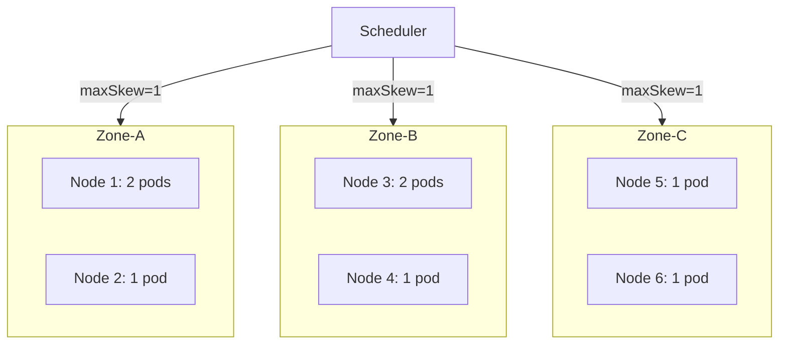

> 💡 **Quick Answer:** `topologySpreadConstraints` ensures pods are evenly distributed across topology domains (zones, nodes) using `maxSkew` to limit imbalance and `whenUnsatisfiable` to control scheduling behavior.

## The Problem

Pod anti-affinity prevents co-location but doesn't ensure even distribution. Without topology spread constraints, the scheduler may place all pods in one zone — causing cascading failures during zone outages.

## The Solution

### Spread Across Zones

```yaml
apiVersion: apps/v1
kind: Deployment
metadata:
  name: web-app
spec:
  replicas: 6
  selector:
    matchLabels:
      app: web-app
  template:
    metadata:
      labels:
        app: web-app
    spec:
      topologySpreadConstraints:
        - maxSkew: 1
          topologyKey: topology.kubernetes.io/zone
          whenUnsatisfiable: DoNotSchedule
          labelSelector:
            matchLabels:
              app: web-app
        - maxSkew: 1
          topologyKey: kubernetes.io/hostname
          whenUnsatisfiable: ScheduleAnyway
          labelSelector:
            matchLabels:
              app: web-app
      containers:
        - name: app
          image: web-app:3.0
          resources:
            requests:
              cpu: 250m
              memory: 128Mi
```

### With Node Affinity Combined

```yaml
topologySpreadConstraints:
  - maxSkew: 1
    topologyKey: topology.kubernetes.io/zone
    whenUnsatisfiable: DoNotSchedule
    labelSelector:
      matchLabels:
        app: web-app
    nodeAffinityPolicy: Honor
    nodeTaintsPolicy: Honor
```

### Minimum Domains (1.30+)

```yaml
topologySpreadConstraints:
  - maxSkew: 1
    topologyKey: topology.kubernetes.io/zone
    whenUnsatisfiable: DoNotSchedule
    labelSelector:
      matchLabels:
        app: web-app
    minDomains: 3
```



## Common Issues

**Pods stuck Pending with DoNotSchedule**
If topology domains are unbalanced or insufficient, pods can't be placed. Use `ScheduleAnyway` for soft preference:
```bash
kubectl get pods -o wide | grep Pending
kubectl describe pod <pending-pod> | grep -A5 Events
```

**maxSkew calculation confusion**
`maxSkew` is relative to the domain with the minimum pod count. With zones having [3, 2, 2] pods and `maxSkew: 1`, the max any zone can have is min(2) + maxSkew(1) = 3.

**Interaction with pod anti-affinity**
Topology spread and anti-affinity are both evaluated. If anti-affinity is `Required`, it takes precedence.

## Best Practices

- Use `DoNotSchedule` for zone spread (hard requirement for HA)
- Use `ScheduleAnyway` for node spread (soft preference)
- Set `maxSkew: 1` for most even distribution
- Combine zone + node spread for multi-level distribution
- Add `minDomains` when you need guaranteed multi-zone presence
- Always include a `labelSelector` matching the same pods

## Key Takeaways

- `topologyKey` defines the domain (zone, node, rack, etc.)
- `maxSkew` is the maximum allowed difference between domain pod counts
- `DoNotSchedule` blocks scheduling; `ScheduleAnyway` applies a scoring penalty
- Multiple constraints are ANDed — all must be satisfiable
- `nodeAffinityPolicy: Honor` respects node affinity when computing skew
- Cluster-level defaults can be set via scheduler profiles
