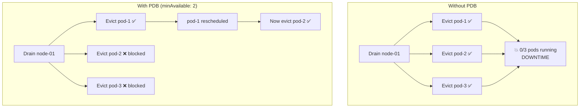

> 💡 **Quick Answer:** A PodDisruptionBudget (PDB) limits how many pods of a workload can be voluntarily disrupted at once during node drains, upgrades, or cluster autoscaler scale-downs. Set \`minAvailable\` (minimum pods that must stay running) or \`maxUnavailable\` (maximum pods that can be down simultaneously).

## The Problem

During node maintenance, upgrades, or autoscaler operations, Kubernetes evicts pods. Without a PDB, all pods of a deployment could be evicted simultaneously, causing downtime. PDBs tell the eviction API "you can take down at most N pods at a time."



## The Solution

### Using minAvailable

```yaml
apiVersion: policy/v1
kind: PodDisruptionBudget
metadata:
  name: web-app-pdb
spec:
  minAvailable: 2                # At least 2 pods must always be running
  selector:
    matchLabels:
      app: web-app               # Must match deployment labels
```

### Using maxUnavailable

```yaml
apiVersion: policy/v1
kind: PodDisruptionBudget
metadata:
  name: web-app-pdb
spec:
  maxUnavailable: 1              # At most 1 pod can be down at a time
  selector:
    matchLabels:
      app: web-app
```

### Percentage Values

```yaml
# At least 80% of pods must remain available
spec:
  minAvailable: "80%"
  selector:
    matchLabels:
      app: web-app

# At most 25% of pods can be unavailable
spec:
  maxUnavailable: "25%"
  selector:
    matchLabels:
      app: web-app
```

### Which to Use?

| Setting | Best For | Example |
|---------|----------|---------|
| \`minAvailable: N\` | Fixed minimum capacity | Database: always need 2 replicas |
| \`maxUnavailable: 1\` | Rolling eviction | Web apps: evict one at a time |
| \`minAvailable: "80%"\` | Scaling workloads | Percentage scales with replica count |
| \`maxUnavailable: "25%"\` | Large deployments | Allow quarter of fleet down |

### Verify PDB Status

```bash
kubectl get pdb
# NAME          MIN AVAILABLE   MAX UNAVAILABLE   ALLOWED DISRUPTIONS   AGE
# web-app-pdb   2               N/A               1                     5m

kubectl describe pdb web-app-pdb
# Status:
#   Current Healthy:   3
#   Desired Healthy:   2
#   Disruptions Allowed: 1
#   Expected Pods:     3
```

## Common Issues

| Issue | Cause | Fix |
|-------|-------|-----|
| Node drain stuck | PDB blocks all evictions | Reduce \`minAvailable\` or add replicas |
| PDB allows 0 disruptions | Not enough healthy pods | Scale up deployment first |
| Cluster autoscaler can't scale down | PDB prevents eviction | Use \`maxUnavailable: 1\` instead of \`minAvailable: N\` where N = replicas |
| PDB doesn't protect against crashes | PDB only covers voluntary disruptions | Use health probes + restart policies |
| Selector doesn't match | Labels mismatch | Verify \`kubectl get pods -l app=web-app\` |

## Best Practices

- **Every production deployment should have a PDB** — it's free availability protection
- **Use \`maxUnavailable: 1\`** as default — works for most workloads
- **Don't set \`minAvailable\` equal to replicas** — blocks all evictions including upgrades
- **Use percentages for auto-scaling workloads** — adapts to replica count
- **Combine with pod anti-affinity** — spread pods across nodes for true HA
- **Test with \`kubectl drain --dry-run\`** — verify PDB behavior before maintenance

## Key Takeaways

- PDB limits voluntary pod disruptions (drains, upgrades, autoscaler) — not crashes
- \`minAvailable\`: minimum pods that must stay running
- \`maxUnavailable\`: maximum pods that can be down simultaneously
- Supports absolute numbers or percentages
- \`ALLOWED DISRUPTIONS: 0\` means no pods can be evicted — will block node drains
- Essential for zero-downtime maintenance and cluster upgrades
