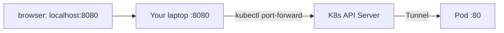

> 💡 **Quick Answer:** Use kubectl port-forward to access Kubernetes pods, services, and deployments from your local machine. Debug, test, and access internal services securely.

## The Problem

This is one of the most searched Kubernetes topics. Having a comprehensive, well-structured guide helps both beginners and experienced users quickly find what they need.

## The Solution

### Port Forward to a Pod

```bash
# Forward local port 8080 to pod port 80
kubectl port-forward pod/my-app-7d9f5b 8080:80

# Forward to a service (load-balanced)
kubectl port-forward svc/my-service 8080:80

# Forward to a deployment (picks one pod)
kubectl port-forward deployment/my-app 8080:80

# Multiple ports
kubectl port-forward pod/my-app 8080:80 5432:5432

# Listen on all interfaces (not just localhost)
kubectl port-forward --address 0.0.0.0 svc/my-service 8080:80

# Specific namespace
kubectl port-forward -n monitoring svc/grafana 3000:3000

# Background it
kubectl port-forward svc/grafana 3000:3000 &
```

### Common Use Cases

```bash
# Access a database
kubectl port-forward svc/postgres 5432:5432 &
psql -h localhost -p 5432 -U admin mydb

# Access Grafana dashboard
kubectl port-forward -n monitoring svc/grafana 3000:3000 &
open http://localhost:3000

# Access ArgoCD UI
kubectl port-forward -n argocd svc/argocd-server 8080:443 &
open https://localhost:8080

# Debug an internal API
kubectl port-forward svc/internal-api 9090:80 &
curl http://localhost:9090/health
```



## Frequently Asked Questions

### Is port-forward secure?

Yes — traffic goes through the Kubernetes API server over your authenticated kubectl connection. It doesn't expose the port to the network (unless you use `--address 0.0.0.0`).

### Port-forward vs NodePort vs Ingress?

**Port-forward**: Dev/debug only, single user, temporary. **NodePort**: Semi-permanent, any external client. **Ingress**: Production HTTP routing with TLS.

## Best Practices

- **Start simple** — use the basic form first, add complexity as needed
- **Be consistent** — follow naming conventions across your cluster
- **Document your choices** — add annotations explaining why, not just what
- **Monitor and iterate** — review configurations regularly

## Key Takeaways

- This is fundamental Kubernetes knowledge every engineer needs
- Start with the simplest approach that solves your problem
- Use `kubectl explain` and `kubectl describe` when unsure
- Practice in a test cluster before applying to production
