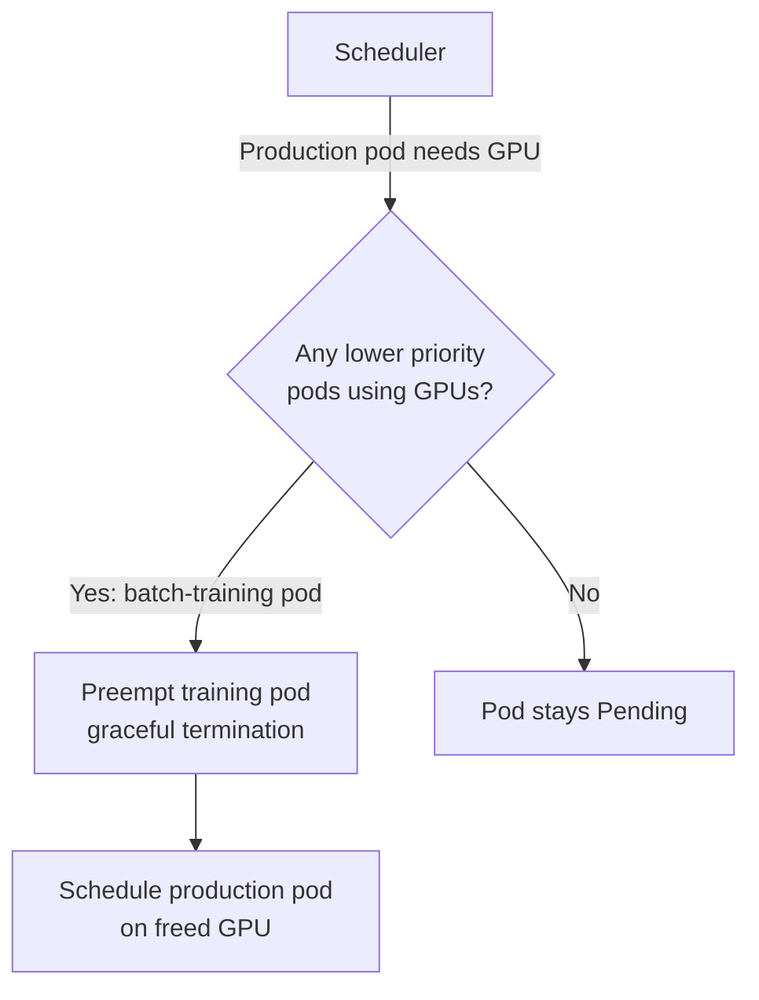

> 💡 **Quick Answer:** Create `PriorityClass` resources with numeric values (higher = more important). Pods with higher priority preempt lower-priority pods when resources are scarce. Use `preemptionPolicy: Never` for batch jobs that should queue without evicting others.

## The Problem

When a cluster is full, new high-priority pods (production services, GPU inference) can't schedule. Without priority classes, scheduling is FIFO — a batch of low-priority training jobs can block critical production deployments.

## The Solution

### PriorityClass Hierarchy

```yaml
apiVersion: scheduling.k8s.io/v1
kind: PriorityClass
metadata:
  name: system-critical
value: 1000000
globalDefault: false
description: "System components — DNS, monitoring, networking"
preemptionPolicy: PreemptLowerPriority
---
apiVersion: scheduling.k8s.io/v1
kind: PriorityClass
metadata:
  name: production
value: 100000
globalDefault: false
description: "Production workloads — user-facing services"
---
apiVersion: scheduling.k8s.io/v1
kind: PriorityClass
metadata:
  name: batch-training
value: 1000
globalDefault: false
description: "Batch ML training — can be preempted"
preemptionPolicy: Never
---
apiVersion: scheduling.k8s.io/v1
kind: PriorityClass
metadata:
  name: default
value: 0
globalDefault: true
description: "Default priority for unspecified workloads"
```

### Usage in Pods

```yaml
apiVersion: apps/v1
kind: Deployment
metadata:
  name: inference-server
spec:
  template:
    spec:
      priorityClassName: production
      containers:
        - name: inference
          image: registry.example.com/inference:1.0
          resources:
            limits:
              nvidia.com/gpu: 1
```

### GPU Preemption Example

When a production inference pod needs a GPU but all are used by training:



## Common Issues

**Preemption cascade — too many pods evicted**

High-priority pod preempts a pod, which displaces another, causing a chain reaction. Set `preemptionPolicy: Never` for batch jobs to prevent cascading preemptions.

**Pods stuck Pending despite having highest priority**

Priority only helps when there are lower-priority pods to preempt. If the cluster is full of system-critical pods, nothing can be preempted.

## Best Practices

- **4-tier hierarchy**: system-critical (1M) > production (100K) > default (0) > batch (negative or low)
- **`preemptionPolicy: Never` for batch jobs** — they queue instead of evicting other work
- **Don't use values above 1 billion** — reserved for system use
- **Set `globalDefault: true` on exactly one PriorityClass** — ensures all pods have a priority
- **Checkpoint training jobs** — if they get preempted, they should resume from last checkpoint

## Key Takeaways

- PriorityClass controls scheduling order and preemption when resources are scarce
- Higher value = higher priority; pods preempt lower-priority pods to schedule
- `preemptionPolicy: Never` makes pods queue without evicting others — ideal for batch
- System components should always have the highest priority to prevent cluster instability
- GPU workloads benefit most from priority — inference preempts training, not vice versa
