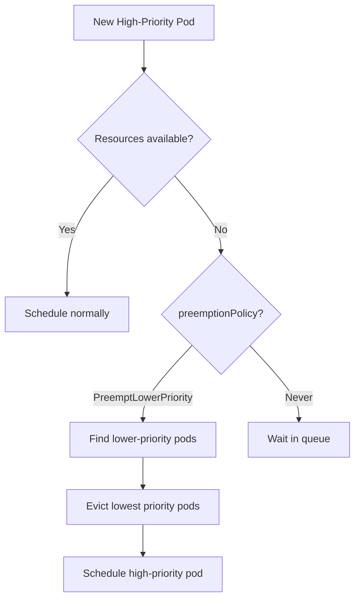

> 💡 **Quick Answer:** "Missing pod priority" means your pod has no `priorityClassName` set — it gets priority 0 (lowest). Create a `PriorityClass` and reference it in your pod spec. Higher priority pods preempt lower ones when resources are scarce.

## The Problem

- Pods are evicted unexpectedly during resource pressure
- Critical workloads get preempted by batch jobs
- Scheduling order seems random
- Warning: "missing pod priority" in events or audit logs

## The Solution

### Create PriorityClasses

```yaml
# High priority for production workloads
apiVersion: scheduling.k8s.io/v1
kind: PriorityClass
metadata:
  name: high-priority
value: 1000000
globalDefault: false
preemptionPolicy: PreemptLowerPriority
description: "Production critical workloads"
---
# Medium priority for staging/internal services
apiVersion: scheduling.k8s.io/v1
kind: PriorityClass
metadata:
  name: medium-priority
value: 100000
globalDefault: false
preemptionPolicy: PreemptLowerPriority
description: "Internal services and staging"
---
# Low priority for batch/dev (can be preempted)
apiVersion: scheduling.k8s.io/v1
kind: PriorityClass
metadata:
  name: low-priority
value: 1000
globalDefault: false
preemptionPolicy: Never  # Won't preempt others
description: "Batch jobs and development workloads"
---
# Default for all pods without explicit priority
apiVersion: scheduling.k8s.io/v1
kind: PriorityClass
metadata:
  name: default-priority
value: 10000
globalDefault: true  # Applied to pods without priorityClassName
description: "Default priority for unclassified workloads"
```

### Assign to Pods

```yaml
apiVersion: apps/v1
kind: Deployment
metadata:
  name: payment-service
spec:
  template:
    spec:
      priorityClassName: high-priority  # ← Assigns priority
      containers:
        - name: app
          image: payment-service:1.0.0
          resources:
            requests:
              cpu: "500m"
              memory: "512Mi"
```

### Built-in System PriorityClasses

```bash
kubectl get priorityclasses
# NAME                      VALUE        GLOBAL-DEFAULT   AGE
# system-cluster-critical   2000000000   false            90d
# system-node-critical      2000001000   false            90d
# high-priority             1000000      false            1d
# default-priority          10000        true             1d
# low-priority              1000         false            1d

# system-node-critical: kubelet, kube-proxy, CNI
# system-cluster-critical: CoreDNS, kube-apiserver components
# Your classes should be BELOW 1000000000
```

### Preemption Behavior



### GPU Workload Priority

```yaml
# Training jobs — can be interrupted
apiVersion: scheduling.k8s.io/v1
kind: PriorityClass
metadata:
  name: gpu-training
value: 50000
preemptionPolicy: Never  # Don't preempt inference
description: "GPU training - preemptible by inference"
---
# Inference — never preempt
apiVersion: scheduling.k8s.io/v1
kind: PriorityClass
metadata:
  name: gpu-inference
value: 900000
preemptionPolicy: PreemptLowerPriority
description: "GPU inference - preempts training if needed"
```

### Check Pod Priority

```bash
# See priority of all pods
kubectl get pods -A -o custom-columns=\
'NAMESPACE:.metadata.namespace,NAME:.metadata.name,PRIORITY:.spec.priority,CLASS:.spec.priorityClassName'

# Find pods with no priority set
kubectl get pods -A -o json | jq '.items[] | select(.spec.priorityClassName == null) | {namespace: .metadata.namespace, name: .metadata.name}'
```

## Common Issues

| Issue | Cause | Fix |
|-------|-------|-----|
| "missing pod priority" warning | No `priorityClassName` on pod | Set `globalDefault: true` on a PriorityClass |
| Critical pod evicted | Lower priority than preemptor | Increase priority value |
| Batch jobs never schedule | Always preempted | Use `preemptionPolicy: Never` on high-priority + dedicated node pool |
| Priority value conflict | Two classes with same value | Use distinct values |
| System pods evicted | Custom class value > system | Keep values below 1,000,000,000 |

## Best Practices

1. **Always set a `globalDefault` PriorityClass** — prevents "missing pod priority" warnings
2. **Use 3-5 priority tiers** — more causes confusion (system > production > default > batch)
3. **Set `preemptionPolicy: Never` for batch** — prevents cascading evictions
4. **Keep values below 1 billion** — reserve space for system-critical classes
5. **Combine with ResourceQuotas** — limit how many high-priority pods a namespace can create

## Key Takeaways

- Pods without `priorityClassName` get priority 0 (or `globalDefault` value)
- Higher numeric value = higher priority = preempts lower priority pods
- `preemptionPolicy: PreemptLowerPriority` (default) enables eviction; `Never` disables it
- System classes (2 billion) should never be used for user workloads
- Set a `globalDefault: true` class to eliminate "missing pod priority" warnings
