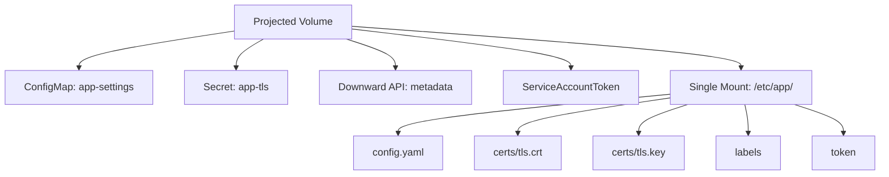

> 💡 **Quick Answer:** Projected volumes combine multiple volume sources (Secrets, ConfigMaps, Downward API, ServiceAccount tokens) into a single directory, reducing volume mounts and simplifying configuration.

## The Problem

Applications often need data from multiple sources mounted together — TLS certs from a Secret, config from a ConfigMap, and pod metadata from the Downward API. Without projected volumes, each requires a separate volume and mount point.

## The Solution

### Combined Configuration Volume

```yaml
apiVersion: v1
kind: Pod
metadata:
  name: app
  labels:
    app: web
spec:
  containers:
    - name: app
      image: myapp:2.0
      volumeMounts:
        - name: app-config
          mountPath: /etc/app
          readOnly: true
  volumes:
    - name: app-config
      projected:
        sources:
          - configMap:
              name: app-settings
              items:
                - key: config.yaml
                  path: config.yaml
          - secret:
              name: app-tls
              items:
                - key: tls.crt
                  path: certs/tls.crt
                - key: tls.key
                  path: certs/tls.key
          - downwardAPI:
              items:
                - path: labels
                  fieldRef:
                    fieldPath: metadata.labels
                - path: annotations
                  fieldRef:
                    fieldPath: metadata.annotations
```

Result inside the container:
```
/etc/app/
├── config.yaml        (from ConfigMap)
├── certs/
│   ├── tls.crt        (from Secret)
│   └── tls.key        (from Secret)
├── labels             (from Downward API)
└── annotations        (from Downward API)
```

### Bound Service Account Token

```yaml
volumes:
  - name: vault-token
    projected:
      sources:
        - serviceAccountToken:
            path: token
            expirationSeconds: 3600
            audience: vault
        - configMap:
            name: vault-config
            items:
              - key: vault-addr
                path: vault-addr
```

### File Permissions

```yaml
volumes:
  - name: secrets
    projected:
      defaultMode: 0400
      sources:
        - secret:
            name: db-credentials
            items:
              - key: password
                path: db-password
                mode: 0400
```



## Common Issues

**Path conflicts between sources**
Two sources writing to the same `path` fail validation. Use unique paths or subdirectories.

**Token not refreshing**
ServiceAccount tokens in projected volumes auto-rotate. Ensure your app re-reads the file periodically (don't cache at startup).

**Permission denied**
Set `defaultMode` or per-item `mode` to match your application's expectations. Secrets default to `0644`.

## Best Practices

- Use projected volumes to reduce volumeMounts count (cleaner pod spec)
- Always set `readOnly: true` on projected volume mounts
- Use short-lived serviceAccountToken with specific audience for external services
- Set restrictive `defaultMode: 0400` for secrets
- Use `items` to control which keys are exposed and their file paths
- Combine related configs that the app reads from the same directory

## Key Takeaways

- Projected volumes merge multiple sources into one mount point
- Supported sources: ConfigMap, Secret, Downward API, ServiceAccountToken
- Each source can select specific keys and remap file paths
- ServiceAccountToken source enables bound tokens with expiry and audience
- File permissions are configurable per-source and per-item
- Changes to ConfigMaps and Secrets propagate automatically (kubelet sync period)
