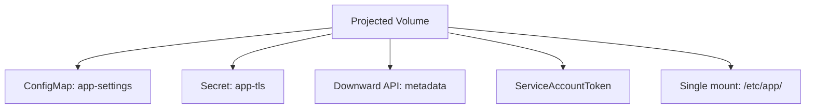

> 💡 **Quick Answer:** A `projected` volume maps several sources — `secret`, `configMap`, `downwardAPI`, `serviceAccountToken` (and `clusterTrustBundle` on recent versions) — into **one directory**. Example: `volumes: [{name: all, projected: {sources: [{secret: {name: creds}}, {configMap: {name: config}}, {serviceAccountToken: {path: token, audience: vault, expirationSeconds: 3600}}]}}]`. Keep every `path` unique across sources.
>
> **Fun fact:** every pod's default API token mount (`kube-api-access-xxxxx` at `/var/run/secrets/kubernetes.io/serviceaccount`) is itself a projected volume: token + `ca.crt` ConfigMap + namespace from the Downward API.

## The Problem

Applications often want TLS certs from a Secret, settings from a ConfigMap, pod metadata and a scoped token in the same config directory. With plain volumes that's four volumes and four mount points, and some apps can only read from one directory.

## Combine Multiple Sources

```yaml
apiVersion: v1
kind: Pod
metadata:
  name: app
  labels:
    app: web
spec:
  containers:
    - name: app
      image: myapp:2.0
      volumeMounts:
        - name: app-config
          mountPath: /etc/app
          readOnly: true
  volumes:
    - name: app-config
      projected:
        sources:
          - configMap:
              name: app-settings
              items:
                - key: config.yaml
                  path: config.yaml
          - secret:
              name: app-tls
              items:
                - key: tls.crt
                  path: certs/tls.crt
                - key: tls.key
                  path: certs/tls.key
          - downwardAPI:
              items:
                - path: labels
                  fieldRef:
                    fieldPath: metadata.labels
                - path: cpu-request
                  resourceFieldRef:
                    containerName: app
                    resource: requests.cpu
                    divisor: 1m
          - serviceAccountToken:
              path: token
              audience: api.example.com
              expirationSeconds: 3600
```

```text
/etc/app/
├── config.yaml        (ConfigMap)
├── certs/
│   ├── tls.crt        (Secret)
│   └── tls.key        (Secret)
├── labels             (Downward API)
├── cpu-request        (Downward API, in millicores)
└── token              (bound ServiceAccount token)
```

Omit `items` to project every key of a Secret/ConfigMap. Add `optional: true` to a source so the pod starts even if that Secret or ConfigMap doesn't exist.

## Bound ServiceAccount Token

```yaml
volumes:
  - name: vault-token
    projected:
      sources:
        - serviceAccountToken:
            path: token
            expirationSeconds: 600     # Minimum 600s; default 3600
            audience: vault            # aud claim — only Vault should accept it
        - configMap:
            name: vault-config
            items:
              - key: vault-addr
                path: vault-addr
```

The kubelet requests the token through the TokenRequest API and refreshes it at 80% of its lifetime (or after 24h). It's bound to the pod and invalid once the pod is deleted. The app must **re-read the file**, not cache it at startup. Use this for Vault Kubernetes auth, cloud workload identity (IRSA, GKE/AKS workload identity) and service-to-service auth instead of long-lived Secret-based tokens.

## Downward API Fields in Volumes

Volumes support fewer fields than environment variables:

| Source | Allowed in a volume |
|--------|--------------------|
| `fieldRef` | `metadata.name`, `metadata.namespace`, `metadata.uid`, `metadata.labels`, `metadata.annotations`, `metadata.labels['key']`, `metadata.annotations['key']` |
| `resourceFieldRef` | `requests.cpu`, `limits.cpu`, `requests.memory`, `limits.memory`, `requests.ephemeral-storage`, `limits.ephemeral-storage` (needs `containerName`) |

`spec.nodeName`, `spec.serviceAccountName`, `status.podIP` and `status.hostIP` are **only** available as environment variables. The advantage of the volume form: label and annotation files update when metadata changes; env vars never do.

## File Permissions

```yaml
volumes:
  - name: secure-config
    projected:
      defaultMode: 0440            # Applies to every projected file
      sources:
        - secret:
            name: tls-cert
            items:
              - key: tls.key
                path: tls.key
                mode: 0400         # Per-file override
              - key: tls.crt
                path: tls.crt
                mode: 0444
```

The default mode is `0644`. Combine with `securityContext.fsGroup` so a non-root container can read group-readable files.


```mermaid
graph TD
    PV[Projected Volume] --> CM[ConfigMap: app-settings]
    PV --> S[Secret: app-tls]
    PV --> DA[Downward API: metadata]
    PV --> SA[ServiceAccountToken]
    PV --> M[Single mount: /etc/app/]
```

## Common Issues

| Issue | Cause | Fix |
|-------|-------|-----|
| Files missing or one source overwrites another | Two sources use the same `path` | Keep paths unique; use subdirectories |
| Pod stuck `ContainerCreating` | Referenced Secret/ConfigMap missing | Create it, or set `optional: true` |
| `spec.nodeName` rejected in volume | Field not supported in downwardAPI volumes | Use an env var with `fieldRef` |
| Token rejected after an hour | App cached the token at startup | Re-read the file on each use or on a timer |
| ConfigMap change not visible | Mounted with `subPath`, or source is `immutable: true` | Mount the whole directory; updates arrive within the kubelet sync period (~1 min) |
| Permission denied | Mode too strict for the container user | Adjust `defaultMode`/`mode` or `fsGroup` |

## Best Practices

- Mount projected volumes `readOnly: true`
- Use `items` to expose only the keys the app needs
- Use short-lived, audience-scoped `serviceAccountToken` sources for anything external
- Set restrictive modes (`0400`/`0440`) for private keys and credentials
- Group sources the app reads from one directory; keep unrelated config in separate volumes

## Frequently Asked Questions

### What is a projected volume in Kubernetes?

A volume type that projects several existing sources — Secrets, ConfigMaps, Downward API data, ServiceAccount tokens and cluster trust bundles — into a single directory, with per-source key selection, path remapping and file modes.

### What sources can a projected volume combine?

`secret`, `configMap`, `downwardAPI`, `serviceAccountToken`, and `clusterTrustBundle` (feature-gated; beta in recent releases). Other volume types like PVCs or `emptyDir` can't be projected.

### Do projected volumes update automatically?

Yes for Secret, ConfigMap and Downward API sources (within about a minute, via the kubelet's sync) and for tokens (rotated before expiry) — unless the volume is mounted with `subPath` or the Secret/ConfigMap is immutable.

### How is a projected ServiceAccount token different from a Secret-based token?

It's short-lived, has an explicit audience, is bound to the pod's lifetime and is never stored in etcd. Legacy Secret-based tokens don't expire and are no longer auto-created since Kubernetes 1.24.
