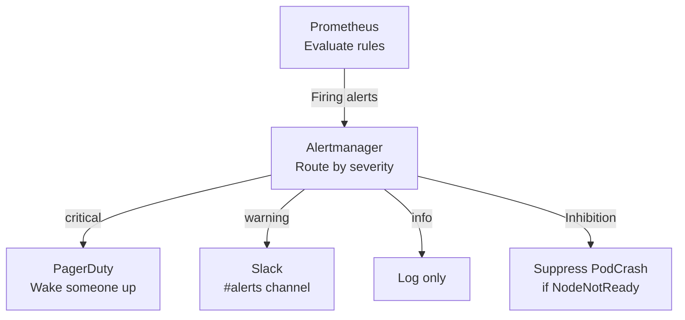

> 💡 **Quick Answer:** Create `PrometheusRule` resources with meaningful alerts. Use recording rules for expensive queries, route alerts through Alertmanager with severity-based routing, and implement inhibition rules to prevent alert storms. Start with the 5 essential K8s alerts: PodCrashing, NodeNotReady, PVCFull, CertExpiring, and HighErrorRate.

## The Problem

Default Prometheus installations come with hundreds of alerts — most teams disable them all because of alert fatigue. The result: no alerts at all, and issues are discovered by users. You need a curated set of actionable alerts with proper routing and severity.

## The Solution

### Essential Kubernetes Alerts

```yaml
apiVersion: monitoring.coreos.com/v1
kind: PrometheusRule
metadata:
  name: kubernetes-essential
  namespace: monitoring
spec:
  groups:
    - name: kubernetes.essential
      rules:
        - alert: PodCrashLooping
          expr: rate(kube_pod_container_status_restarts_total[15m]) > 0
          for: 1h
          labels:
            severity: warning
          annotations:
            summary: "Pod {{ $labels.namespace }}/{{ $labels.pod }} is crash looping"
            
        - alert: NodeNotReady
          expr: kube_node_status_condition{condition="Ready",status="true"} == 0
          for: 5m
          labels:
            severity: critical
          annotations:
            summary: "Node {{ $labels.node }} is not ready"
            
        - alert: PVCNearlyFull
          expr: kubelet_volume_stats_used_bytes / kubelet_volume_stats_capacity_bytes > 0.85
          for: 15m
          labels:
            severity: warning
          annotations:
            summary: "PVC {{ $labels.persistentvolumeclaim }} is {{ $value | humanizePercentage }} full"
            
        - alert: HighErrorRate
          expr: |
            sum(rate(http_requests_total{status=~"5.."}[5m])) by (service)
            / sum(rate(http_requests_total[5m])) by (service) > 0.05
          for: 10m
          labels:
            severity: critical
          annotations:
            summary: "{{ $labels.service }} has {{ $value | humanizePercentage }} error rate"
            
        - alert: CertificateExpiringSoon
          expr: certmanager_certificate_expiration_timestamp_seconds - time() < 7 * 86400
          labels:
            severity: warning
```

### Alertmanager Routing

```yaml
apiVersion: monitoring.coreos.com/v1alpha1
kind: AlertmanagerConfig
metadata:
  name: routing
spec:
  route:
    groupBy: ['alertname', 'namespace']
    groupWait: 30s
    groupInterval: 5m
    repeatInterval: 12h
    receiver: default
    routes:
      - matchers:
          - name: severity
            value: critical
        receiver: pagerduty
      - matchers:
          - name: severity
            value: warning
        receiver: slack
  receivers:
    - name: pagerduty
      pagerdutyConfigs:
        - routingKey:
            name: pagerduty-secret
            key: routing-key
    - name: slack
      slackConfigs:
        - channel: '#alerts'
          apiURL:
            name: slack-secret
            key: webhook-url
```



## Common Issues

**Alert fatigue — too many alerts**: Start with 5-10 essential alerts. Every alert must have a clear action. If the response is 'look at it later,' it should be a warning, not critical.

**Alerts firing during maintenance**: Use Alertmanager silences: `amtool silence add alertname=NodeNotReady --duration=2h`.

## Best Practices

- **Every alert must have a runbook** — link in annotation
- **Critical = wake someone up** — use sparingly
- **Warning = investigate during business hours**
- **Group by namespace** — reduces alert spam
- **Inhibition: NodeNotReady suppresses pod alerts** on that node

## Key Takeaways

- Start with 5 essential alerts: PodCrashing, NodeNotReady, PVCFull, CertExpiring, HighErrorRate
- Route critical alerts to PagerDuty, warnings to Slack
- Inhibition rules prevent cascading alert storms
- Every alert must have a clear action — if you can't act on it, delete it
- Group alerts by namespace and alertname to reduce noise
