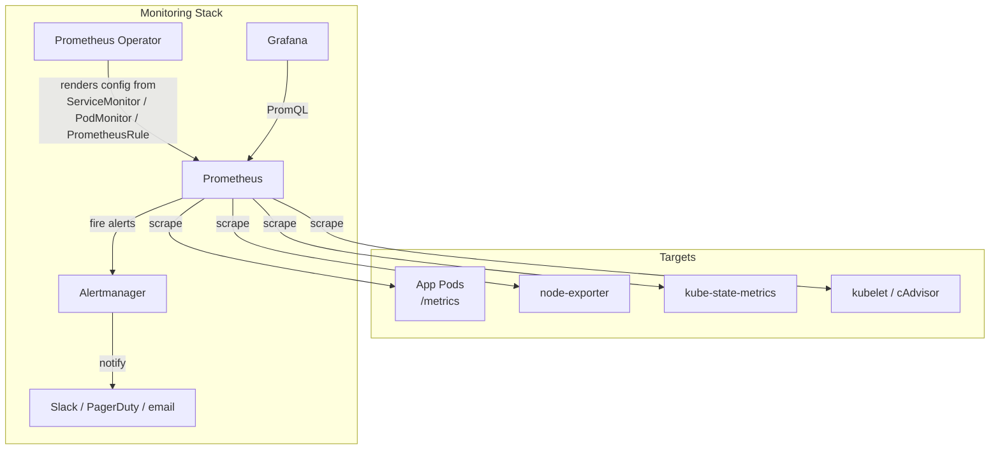

> 💡 **Quick Answer:** Deploy the full monitoring stack: `helm install prometheus prometheus-community/kube-prometheus-stack -n monitoring --create-namespace`. Includes Prometheus, Grafana, Alertmanager, node-exporter, and kube-state-metrics. Create `ServiceMonitor` to scrape your apps. Create `PrometheusRule` for alerts. Access Grafana: `kubectl port-forward svc/prometheus-grafana 3000:80 -n monitoring` (admin/prom-operator).
>
> **Gotcha:** By default the chart's Prometheus only picks up ServiceMonitors/PodMonitors/PrometheusRules labelled `release: <helm-release-name>`. Label them, or install with `--set prometheus.prometheusSpec.serviceMonitorSelectorNilUsesHelmValues=false` (and the `podMonitor…`/`rule…` equivalents) to select all.

## The Problem

You need visibility into your Kubernetes cluster:

- Are nodes healthy? CPU/memory/disk usage?
- Are pods running? Restart counts?
- Application-specific metrics (request rate, error rate, latency)
- Alerting when things go wrong
- Historical data for capacity planning

## The Solution

### Install kube-prometheus-stack

```bash
helm repo add prometheus-community https://prometheus-community.github.io/helm-charts
helm install prometheus prometheus-community/kube-prometheus-stack \
  -n monitoring --create-namespace \
  --set grafana.adminPassword='change-me' \
  --set prometheus.prometheusSpec.retention=30d \
  --set prometheus.prometheusSpec.storageSpec.volumeClaimTemplate.spec.resources.requests.storage=50Gi

# What you get:
# - Prometheus (metrics collection)
# - Grafana (dashboards)
# - Alertmanager (alert routing)
# - node-exporter (node metrics)
# - kube-state-metrics (K8s object metrics)
# - Pre-built dashboards and alerting rules

# Access Grafana
kubectl port-forward svc/prometheus-grafana 3000:80 -n monitoring
# http://localhost:3000 → admin / change-me

# Prometheus UI (targets, rules, TSDB status)
kubectl port-forward svc/prometheus-kube-prometheus-prometheus 9090 -n monitoring
```

On OpenShift, Prometheus, Alertmanager and Grafana-less console dashboards are built in (`openshift-monitoring`); enable **user workload monitoring** and create ServiceMonitors in your namespace instead of installing this chart.



### ServiceMonitor (Scrape Your Apps)

```yaml
# Your app exposes /metrics on port 8080
apiVersion: monitoring.coreos.com/v1
kind: ServiceMonitor
metadata:
  name: my-app
  namespace: monitoring
  labels:
    release: prometheus          # Must match Prometheus selector
spec:
  namespaceSelector:
    matchNames:
    - production
  selector:
    matchLabels:
      app: my-app
  endpoints:
  - port: http-metrics           # Service port name
    path: /metrics
    interval: 30s
    scrapeTimeout: 10s
```

```yaml
# App Service (must have named port)
apiVersion: v1
kind: Service
metadata:
  name: my-app
  namespace: production
  labels:
    app: my-app
spec:
  ports:
  - name: http-metrics           # Referenced by ServiceMonitor
    port: 8080
  selector:
    app: my-app
```

### PodMonitor (For Pods Without Service)

```yaml
apiVersion: monitoring.coreos.com/v1
kind: PodMonitor
metadata:
  name: batch-jobs
  namespace: monitoring
  labels:
    release: prometheus
spec:
  namespaceSelector:
    matchNames:
    - batch
  selector:
    matchLabels:
      app: batch-processor
  podMetricsEndpoints:
  - port: metrics
    interval: 60s
```

### PrometheusRule (Alerting)

```yaml
apiVersion: monitoring.coreos.com/v1
kind: PrometheusRule
metadata:
  name: app-alerts
  namespace: monitoring
  labels:
    release: prometheus
spec:
  groups:
  - name: app.rules
    rules:
    # High error rate
    - alert: HighErrorRate
      expr: |
        sum(rate(http_requests_total{status=~"5.."}[5m]))
        /
        sum(rate(http_requests_total[5m]))
        > 0.05
      for: 5m
      labels:
        severity: critical
      annotations:
        summary: "High error rate ({{ $value | humanizePercentage }})"
        description: "Error rate above 5% for 5 minutes"
    
    # Pod restarts
    - alert: PodCrashLooping
      expr: rate(kube_pod_container_status_restarts_total[15m]) * 60 * 15 > 0
      for: 15m
      labels:
        severity: warning
      annotations:
        summary: "Pod {{ $labels.namespace }}/{{ $labels.pod }} restarting"
    
    # High memory usage
    - alert: HighMemoryUsage
      expr: |
        container_memory_working_set_bytes{container!=""}
        /
        container_spec_memory_limit_bytes{container!=""}
        > 0.9
      for: 10m
      labels:
        severity: warning
      annotations:
        summary: "Container {{ $labels.container }} using >90% memory"
    
    # Node disk pressure
    - alert: NodeDiskPressure
      expr: |
        (node_filesystem_avail_bytes{mountpoint="/"} / node_filesystem_size_bytes{mountpoint="/"}) < 0.1
      for: 5m
      labels:
        severity: critical
      annotations:
        summary: "Node {{ $labels.instance }} disk <10% free"
```

### Alertmanager Configuration

An `AlertmanagerConfig` only matches alerts whose `namespace` label equals the namespace the object lives in — the operator injects that matcher. Put team configs in the team's namespace, or configure global routing in Helm values (`alertmanager.config`). Full routing/receiver/inhibition examples: [Alertmanager configuration](/recipes/observability/alertmanager-configuration/).

```yaml
# In Helm values or AlertmanagerConfig CRD
apiVersion: monitoring.coreos.com/v1alpha1
kind: AlertmanagerConfig
metadata:
  name: slack-alerts
  namespace: monitoring
spec:
  route:
    groupBy: ['alertname', 'namespace']
    groupWait: 30s
    groupInterval: 5m
    repeatInterval: 4h
    receiver: slack-critical
    routes:
    - matchers:
      - name: severity
        value: critical
      receiver: slack-critical
    - matchers:
      - name: severity
        value: warning
      receiver: slack-warning
  
  receivers:
  - name: slack-critical
    slackConfigs:
    - apiURL:
        name: slack-webhook
        key: url
      channel: '#alerts-critical'
      title: '🔴 {{ .GroupLabels.alertname }}'
      text: '{{ range .Alerts }}{{ .Annotations.summary }}{{ end }}'
  
  - name: slack-warning
    slackConfigs:
    - apiURL:
        name: slack-webhook
        key: url
      channel: '#alerts-warning'
```

### Essential PromQL Queries

```promql
# CPU usage by pod
sum(rate(container_cpu_usage_seconds_total{container!=""}[5m])) by (pod)

# Memory usage by namespace
sum(container_memory_working_set_bytes{container!=""}) by (namespace)

# Request rate by service
sum(rate(http_requests_total[5m])) by (service)

# P99 latency
histogram_quantile(0.99, sum(rate(http_request_duration_seconds_bucket[5m])) by (le))

# Error rate
sum(rate(http_requests_total{status=~"5.."}[5m])) / sum(rate(http_requests_total[5m]))

# Pod restart count (last hour)
increase(kube_pod_container_status_restarts_total[1h])

# Node CPU utilization
100 - (avg by(instance) (rate(node_cpu_seconds_total{mode="idle"}[5m])) * 100)

# Disk usage percentage
(1 - node_filesystem_avail_bytes/node_filesystem_size_bytes) * 100

# Top 10 pods by CPU
topk(10, sum(rate(container_cpu_usage_seconds_total{container!=""}[5m])) by (pod))
```

### Instrument Your App

```python
from flask import Flask, Response
from prometheus_client import Counter, Histogram, generate_latest, CONTENT_TYPE_LATEST

app = Flask(__name__)
REQUEST_COUNT = Counter('http_requests_total', 'Total HTTP requests', ['method', 'endpoint', 'status'])
REQUEST_LATENCY = Histogram('http_request_duration_seconds', 'HTTP request latency', ['method', 'endpoint'])

@app.route('/api/data')
def get_data():
    with REQUEST_LATENCY.labels('GET', '/api/data').time():
        result = process_data()
    REQUEST_COUNT.labels('GET', '/api/data', '200').inc()
    return result

@app.route('/metrics')
def metrics():
    return Response(generate_latest(), mimetype=CONTENT_TYPE_LATEST)
```

Keep label values bounded (route templates, not raw URLs or user IDs).

### Recording Rules (Pre-Compute Expensive Queries)

```yaml
apiVersion: monitoring.coreos.com/v1
kind: PrometheusRule
metadata:
  name: recording-rules
  namespace: monitoring
  labels:
    release: prometheus
spec:
  groups:
    - name: aggregations
      interval: 30s
      rules:
        - record: job:http_requests_total:rate5m
          expr: sum(rate(http_requests_total[5m])) by (job)
        - record: job:http_request_duration_seconds:p99
          expr: histogram_quantile(0.99, sum(rate(http_request_duration_seconds_bucket[5m])) by (job, le))
```

Dashboards and alerts then query the cheap `job:...` series instead of re-aggregating raw data on every refresh.

## Common Issues

**ServiceMonitor not discovered**

Missing `release: prometheus` label (or whatever the Prometheus CR selects). Check: `kubectl get prometheus -n monitoring -o jsonpath='{.items[0].spec.serviceMonitorSelector}'` and `...serviceMonitorNamespaceSelector`.

**"0 active targets" for custom metrics**

Service port name doesn't match ServiceMonitor `endpoints.port`. Must use port name, not number.

**Prometheus OOM killed**

Too many active series (high-cardinality labels) more than retention. Find offenders in *Status → TSDB Status*, drop labels with `metricRelabelings` on the ServiceMonitor endpoint, pre-aggregate with recording rules, and move long-term storage to Thanos/Mimir.

**Grafana shows "No data"**

Wrong data source URL (in-cluster default: `http://prometheus-kube-prometheus-prometheus.monitoring:9090`) or the target is down — check *Status → Targets* in Prometheus.

**kube-controller-manager / kube-scheduler / etcd targets down**

Managed control planes (EKS, GKE, AKS) don't expose them; disable those scrapes in values (`kubeControllerManager.enabled=false` etc.). On kubeadm, bind them to `0.0.0.0` or scrape via the node IP.

## Best Practices

- **kube-prometheus-stack** for one-command full monitoring
- **ServiceMonitor per app** — not global scrape configs
- **Alert on symptoms** (error rate, latency) not causes (CPU, memory)
- **Use recording rules** for expensive queries
- **Grafana dashboards per team** — don't overload a single dashboard

## Key Takeaways

- kube-prometheus-stack = Prometheus + Grafana + Alertmanager + exporters
- ServiceMonitor CRD tells Prometheus what to scrape
- PrometheusRule CRD defines alerting rules
- PromQL for querying — learn the key patterns (rate, sum, histogram_quantile)
- Instrument your apps with /metrics endpoint for custom metrics

## Frequently Asked Questions

### What is kube-prometheus-stack?

A Helm chart that installs the Prometheus Operator, Prometheus, Alertmanager, Grafana, node-exporter and kube-state-metrics, plus ~100 alerting rules and dashboards from the kubernetes-mixin. It is the standard way to get full Kubernetes monitoring in one release.

### ServiceMonitor vs PodMonitor?

A ServiceMonitor scrapes the endpoints behind a Service (selected by Service labels, named port). A PodMonitor selects pods directly — useful for Jobs, DaemonSets or sidecars without a Service. Both are rendered into Prometheus scrape config by the operator.

### How long should Prometheus retain data?

15–30 days locally is typical; size storage at roughly `ingested samples/s × 2 bytes × retention seconds`. For months or years, use remote write to Thanos, Mimir or a managed service.

### Why alert on symptoms instead of CPU?

High CPU is often harmless; users feel errors and latency. Page on SLO symptoms (error rate, p99 latency, availability) and keep resource alerts as warnings or capacity signals.
