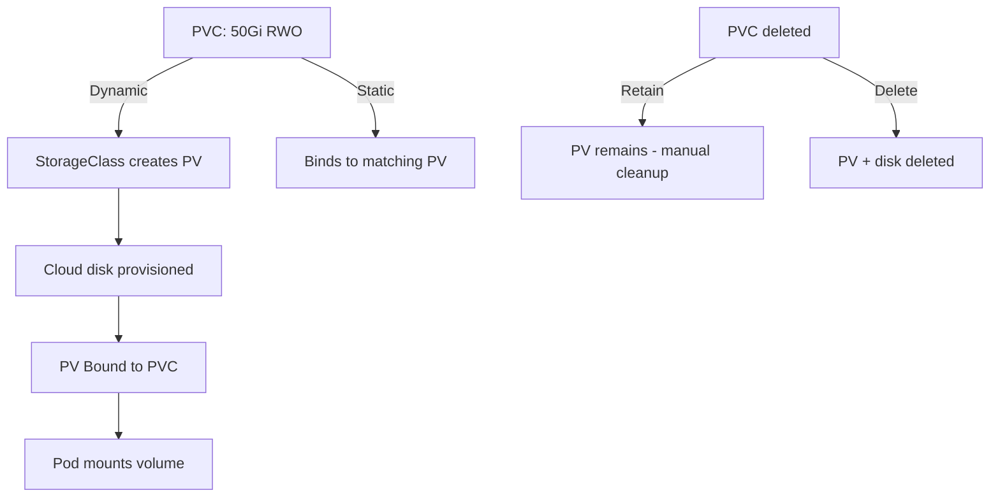

> 💡 **Quick Answer:** storage

## The Problem

This is one of the most searched Kubernetes topics with thousands of monthly searches. A comprehensive, production-ready guide prevents hours of trial and error.

## The Solution

### Dynamic Provisioning (Recommended)

```yaml
# StorageClass (usually pre-configured by cloud provider)
apiVersion: storage.k8s.io/v1
kind: StorageClass
metadata:
  name: fast-ssd
provisioner: ebs.csi.aws.com
parameters:
  type: gp3
  iops: "3000"
allowVolumeExpansion: true
reclaimPolicy: Retain
volumeBindingMode: WaitForFirstConsumer
---
# PVC — automatically creates PV
apiVersion: v1
kind: PersistentVolumeClaim
metadata:
  name: postgres-data
spec:
  accessModes:
    - ReadWriteOnce
  storageClassName: fast-ssd
  resources:
    requests:
      storage: 50Gi
---
# Use in Pod
apiVersion: v1
kind: Pod
metadata:
  name: postgres
spec:
  containers:
    - name: postgres
      image: postgres:16
      volumeMounts:
        - name: data
          mountPath: /var/lib/postgresql/data
  volumes:
    - name: data
      persistentVolumeClaim:
        claimName: postgres-data
```

### Access Modes

| Mode | Short | Description |
|------|-------|-------------|
| ReadWriteOnce | RWO | Single node read-write |
| ReadOnlyMany | ROX | Multiple nodes read-only |
| ReadWriteMany | RWX | Multiple nodes read-write |
| ReadWriteOncePod | RWOP | Single pod read-write (K8s 1.27+) |

### Static Provisioning

```yaml
# Pre-create PV (NFS, hostPath, existing disk)
apiVersion: v1
kind: PersistentVolume
metadata:
  name: nfs-data
spec:
  capacity:
    storage: 100Gi
  accessModes:
    - ReadWriteMany
  nfs:
    server: nfs.example.com
    path: /exports/data
  persistentVolumeReclaimPolicy: Retain
---
# PVC binds to matching PV
apiVersion: v1
kind: PersistentVolumeClaim
metadata:
  name: shared-data
spec:
  accessModes: [ReadWriteMany]
  resources:
    requests:
      storage: 100Gi
  storageClassName: ""   # Empty = static binding
```

### Common Operations

```bash
# List PVCs and PVs
kubectl get pvc
kubectl get pv

# Expand PVC (StorageClass must have allowVolumeExpansion: true)
kubectl patch pvc postgres-data -p '{"spec":{"resources":{"requests":{"storage":"100Gi"}}}}'

# Check binding
kubectl describe pvc postgres-data
```

| Reclaim Policy | When PVC deleted |
|---------------|------------------|
| `Retain` | PV kept (manual cleanup) |
| `Delete` | PV and underlying storage deleted |
| `Recycle` | Deprecated — don't use |



## Frequently Asked Questions

### PV vs PVC?

**PV** is the actual storage resource (like a disk). **PVC** is a request for storage (like an order). Dynamic provisioning creates PVs automatically when you create PVCs.

### PVC stuck in Pending?

Check: StorageClass exists? Cloud credentials? Available capacity? Node in same zone? Use `kubectl describe pvc` — the Events section tells you why.

## Best Practices

- Start with the simplest configuration that solves your problem
- Test in staging before production
- Use `kubectl describe` and events for troubleshooting
- Document team conventions for consistency

## Key Takeaways

- This is fundamental Kubernetes operational knowledge
- Follow established conventions and recommended labels
- Monitor and iterate based on real production behavior
- Automate repetitive tasks to reduce human error
