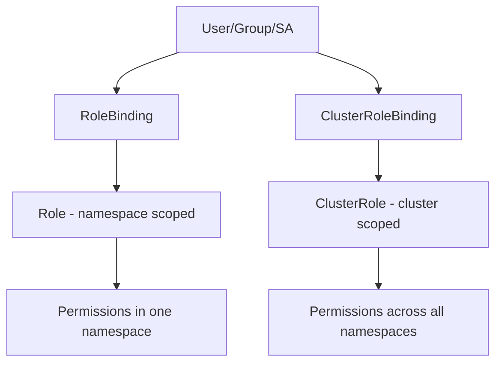

> 💡 **Quick Answer:** Configure Kubernetes RBAC with Roles, ClusterRoles, RoleBindings, and service accounts. Least privilege access control for users, groups, and applications.

## The Problem

This is one of the most searched Kubernetes topics. A comprehensive, well-structured guide helps engineers of all levels quickly find actionable solutions.

## The Solution

Detailed implementation with production-ready examples below.


### RBAC Components

```yaml
# Role — namespace-scoped permissions
apiVersion: rbac.authorization.k8s.io/v1
kind: Role
metadata:
  name: pod-reader
  namespace: default
rules:
  - apiGroups: [""]
    resources: ["pods", "pods/log"]
    verbs: ["get", "list", "watch"]
  - apiGroups: ["apps"]
    resources: ["deployments"]
    verbs: ["get", "list"]
---
# RoleBinding — grants Role to user/group/SA
apiVersion: rbac.authorization.k8s.io/v1
kind: RoleBinding
metadata:
  name: read-pods
  namespace: default
subjects:
  - kind: User
    name: jane
    apiGroup: rbac.authorization.k8s.io
  - kind: Group
    name: developers
    apiGroup: rbac.authorization.k8s.io
  - kind: ServiceAccount
    name: my-app
    namespace: default
roleRef:
  kind: Role
  name: pod-reader
  apiGroup: rbac.authorization.k8s.io
---
# ClusterRole — cluster-wide permissions
apiVersion: rbac.authorization.k8s.io/v1
kind: ClusterRole
metadata:
  name: secret-reader
rules:
  - apiGroups: [""]
    resources: ["secrets"]
    verbs: ["get", "list"]
  - apiGroups: [""]
    resources: ["namespaces"]
    verbs: ["get", "list"]
---
# ClusterRoleBinding
apiVersion: rbac.authorization.k8s.io/v1
kind: ClusterRoleBinding
metadata:
  name: read-secrets-global
subjects:
  - kind: Group
    name: sre-team
    apiGroup: rbac.authorization.k8s.io
roleRef:
  kind: ClusterRole
  name: secret-reader
  apiGroup: rbac.authorization.k8s.io
```

### Test Permissions

```bash
# Check what you can do
kubectl auth can-i create deployments
kubectl auth can-i delete pods --namespace production

# Check as another user
kubectl auth can-i get secrets --as jane
kubectl auth can-i get secrets --as system:serviceaccount:default:my-app

# List all permissions
kubectl auth can-i --list
kubectl auth can-i --list --as jane --namespace default
```

### Common RBAC Patterns

| Pattern | Role Type | Scope |
|---------|-----------|-------|
| Dev read-only | Role | Per namespace |
| Dev deploy access | Role | Per namespace |
| SRE full access | ClusterRole | Cluster-wide |
| CI/CD deploy | Role + SA | Per namespace |
| Monitoring | ClusterRole | Read pods/nodes cluster-wide |



## Frequently Asked Questions

### Role vs ClusterRole?

**Role** grants permissions in a single namespace. **ClusterRole** grants permissions cluster-wide or across all namespaces. Use ClusterRole + RoleBinding to reuse a ClusterRole in a specific namespace.

### How do I debug RBAC denied errors?

Check the API server audit log or run `kubectl auth can-i` as the failing identity. Common issue: forgot to create the RoleBinding (Role alone does nothing).

## Common Issues

Check `kubectl describe` and `kubectl get events` first — most issues have clear error messages pointing to the root cause.

## Best Practices

- **Follow least privilege** — only grant the access that's needed
- **Test in staging** before applying to production
- **Monitor and alert** on key metrics
- **Document your runbooks** for the team

## Key Takeaways

- Essential knowledge for Kubernetes operations
- Start simple and evolve your approach
- Automation reduces human error
- Share knowledge with your team
