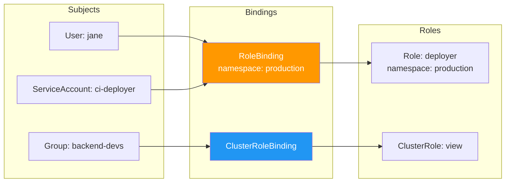

> 💡 **Quick Answer:** RBAC (Role-Based Access Control) uses four objects: `Role` (namespace-scoped permissions), `ClusterRole` (cluster-wide permissions), `RoleBinding` (grants Role to user/group in a namespace), and `ClusterRoleBinding` (grants ClusterRole cluster-wide). Start with built-in ClusterRoles: `view` (read-only), `edit` (read-write), `admin` (full namespace), `cluster-admin` (everything).

## The Problem

Without RBAC:

- Every user and service account has full cluster access
- Developers can accidentally delete production namespaces
- CI/CD pipelines have more access than needed
- No audit trail of who can do what
- Compliance requirements (SOC2, HIPAA) unmet

## The Solution

### Role (Namespace-Scoped)

```yaml
apiVersion: rbac.authorization.k8s.io/v1
kind: Role
metadata:
  name: pod-reader
  namespace: team-backend
rules:
- apiGroups: [""]
  resources: ["pods", "pods/log"]
  verbs: ["get", "list", "watch"]
- apiGroups: [""]
  resources: ["configmaps"]
  verbs: ["get", "list"]
```

### ClusterRole (Cluster-Wide)

```yaml
apiVersion: rbac.authorization.k8s.io/v1
kind: ClusterRole
metadata:
  name: node-viewer
rules:
- apiGroups: [""]
  resources: ["nodes"]
  verbs: ["get", "list", "watch"]
- apiGroups: ["metrics.k8s.io"]
  resources: ["nodes"]
  verbs: ["get", "list"]
```

### RoleBinding

```yaml
apiVersion: rbac.authorization.k8s.io/v1
kind: RoleBinding
metadata:
  name: backend-devs-edit
  namespace: team-backend
subjects:
# Group (from OIDC/LDAP)
- kind: Group
  name: backend-developers
  apiGroup: rbac.authorization.k8s.io
# Individual user
- kind: User
  name: jane@example.com
  apiGroup: rbac.authorization.k8s.io
# Service account
- kind: ServiceAccount
  name: ci-deployer
  namespace: ci-system
roleRef:
  kind: ClusterRole      # Can reference ClusterRole but scoped to namespace
  name: edit
  apiGroup: rbac.authorization.k8s.io
```

### ClusterRoleBinding

```yaml
apiVersion: rbac.authorization.k8s.io/v1
kind: ClusterRoleBinding
metadata:
  name: global-readers
subjects:
- kind: Group
  name: all-developers
  apiGroup: rbac.authorization.k8s.io
roleRef:
  kind: ClusterRole
  name: view
  apiGroup: rbac.authorization.k8s.io
```

### Built-in ClusterRoles

| ClusterRole | Permissions |
|------------|-------------|
| `view` | Read-only: pods, services, configmaps, etc. (no secrets) |
| `edit` | Read-write: deployments, services, configmaps, secrets |
| `admin` | Full namespace control + RoleBindings |
| `cluster-admin` | Everything everywhere (superuser) |

### CI/CD Service Account

```yaml
# Minimal permissions for a deployment pipeline
apiVersion: v1
kind: ServiceAccount
metadata:
  name: ci-deployer
  namespace: production
---
apiVersion: rbac.authorization.k8s.io/v1
kind: Role
metadata:
  name: deployer
  namespace: production
rules:
- apiGroups: ["apps"]
  resources: ["deployments"]
  verbs: ["get", "list", "patch", "update"]
- apiGroups: [""]
  resources: ["configmaps", "secrets"]
  verbs: ["get", "list", "create", "update"]
- apiGroups: [""]
  resources: ["pods"]
  verbs: ["get", "list", "watch"]
---
apiVersion: rbac.authorization.k8s.io/v1
kind: RoleBinding
metadata:
  name: ci-deployer-binding
  namespace: production
subjects:
- kind: ServiceAccount
  name: ci-deployer
  namespace: production
roleRef:
  kind: Role
  name: deployer
  apiGroup: rbac.authorization.k8s.io
```

### Audit Who Can Do What

```bash
# Check if you can perform an action
kubectl auth can-i create deployments -n production
kubectl auth can-i delete pods -n kube-system

# Check as another user
kubectl auth can-i get secrets -n production --as=jane@example.com

# Check as service account
kubectl auth can-i list pods --as=system:serviceaccount:ci-system:ci-deployer

# List all roles/bindings in namespace
kubectl get roles,rolebindings -n team-backend

# Who can do what (requires rbac-lookup or similar)
kubectl get clusterrolebindings -o wide | grep cluster-admin
```



## Common Issues

**"forbidden: User cannot list resource"**

Missing RoleBinding or ClusterRoleBinding. Use `kubectl auth can-i` to debug, then create the appropriate binding.

**ClusterRoleBinding gives too much access**

A ClusterRoleBinding with `edit` role gives edit access in ALL namespaces. Use RoleBinding per namespace to scope access.

**Service account can't access resources in other namespace**

Service accounts are namespace-scoped. The RoleBinding must explicitly reference the SA's namespace in the `subjects` field.

## Best Practices

- **Least privilege always** — start with `view`, escalate to `edit` only when needed
- **Never use `cluster-admin` for applications** — create specific Roles
- **Use Groups over individual Users** — map from OIDC/LDAP groups
- **RoleBinding over ClusterRoleBinding** — scope access per namespace
- **Audit regularly** — review who has `cluster-admin` quarterly
- **Bind built-in ClusterRoles to namespaces** — `edit` via RoleBinding = namespaced edit

## Key Takeaways

- Four RBAC objects: Role, ClusterRole, RoleBinding, ClusterRoleBinding
- Use built-in ClusterRoles (view/edit/admin) — don't reinvent unless needed
- RoleBindings scope even ClusterRoles to a single namespace
- `kubectl auth can-i` is your debugging tool for access issues
- Least privilege: specific Roles for CI/CD, Groups for human access
