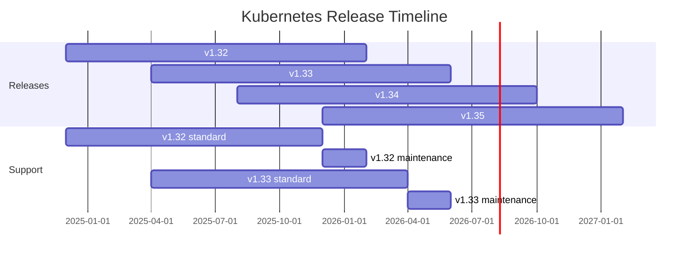

> 💡 **Quick Answer:** Kubernetes releases 3 minor versions per year (~every 4 months). Each version is supported for **14 months** (12 months standard + 2 months maintenance). You can skip at most one minor version during upgrades (e.g., 1.29 → 1.31, but not 1.29 → 1.32).

## The Problem

You need to plan:
- When to upgrade your cluster
- How long your current version is supported
- Which versions are safe to skip
- How version skew between components works

## The Solution

### Release Schedule (2025-2026)

| Version | Release Date | End of Standard Support | End of Life |
|---------|-------------|------------------------|-------------|
| 1.28 | Aug 2023 | Aug 2024 | Oct 2024 |
| 1.29 | Dec 2023 | Dec 2024 | Feb 2025 |
| 1.30 | Apr 2024 | Apr 2025 | Jun 2025 |
| 1.31 | Aug 2024 | Aug 2025 | Oct 2025 |
| 1.32 | Dec 2024 | Dec 2025 | Feb 2026 |
| 1.33 | Apr 2025 | Apr 2026 | Jun 2026 |
| 1.34 | Aug 2025 | Aug 2026 | Oct 2026 |
| 1.35 | Dec 2025 | Dec 2026 | Feb 2027 |

### Release Cadence



### Support Phases

```
Release → Standard Support (12 months) → Maintenance (2 months) → EOL
           ↓                               ↓                        ↓
  Bug fixes + security patches    Critical security only       No patches
```

### Version Skew Policy

```bash
# kube-apiserver: must be within 1 minor version of each other (HA)
# Node 1: apiserver v1.33, Node 2: apiserver v1.33 ✓
# Node 1: apiserver v1.33, Node 2: apiserver v1.32 ✓

# kubelet: can be up to 3 minor versions behind apiserver
# apiserver v1.33, kubelet v1.33 ✓
# apiserver v1.33, kubelet v1.32 ✓
# apiserver v1.33, kubelet v1.31 ✓
# apiserver v1.33, kubelet v1.30 ✓
# apiserver v1.33, kubelet v1.29 ✗ (too old)

# kubectl: within 1 minor version (older or newer) of apiserver
# apiserver v1.33, kubectl v1.34 ✓
# apiserver v1.33, kubectl v1.33 ✓
# apiserver v1.33, kubectl v1.32 ✓
# apiserver v1.33, kubectl v1.31 ✗

# Upgrade order: apiserver → controller-manager → scheduler → kubelet → kubectl
```

### Patch Release Cadence

```bash
# Patch releases (~monthly) for supported versions
# Example: v1.33.0 → v1.33.1 → v1.33.2 → ...

# Check current latest patches
curl -s https://dl.k8s.io/release/stable.txt
# v1.33.4

# Check specific version stream
curl -s https://dl.k8s.io/release/stable-1.32.txt
# v1.32.8
```

### Upgrade Path Planning

```bash
# ✓ Valid upgrade paths (sequential or skip-one):
# v1.30 → v1.31 (sequential)
# v1.30 → v1.31 → v1.32 (two steps)
# v1.30 → v1.32 (skip one — allowed since v1.28)

# ✗ Invalid:
# v1.30 → v1.33 (skip two — NOT supported)

# Check your current version
kubectl version --short
# Client: v1.33.2
# Server: v1.32.5  ← need to plan upgrade to v1.33

# Check available versions (managed clusters)
# EKS: aws eks describe-addon-versions
# GKE: gcloud container get-server-config
# AKS: az aks get-versions --location eastus
```

### Deprecation Policy

```yaml
# GA APIs: maintained indefinitely after going GA
# Beta APIs: minimum 9 months / 3 releases after deprecation
# Alpha APIs: can be removed in any release (no guarantee)

# Check deprecations before upgrade:
# kubectl convert --help (deprecated, use kubectl-convert plugin)

# Common deprecation gotchas:
# - PodSecurityPolicy removed in v1.25
# - FlowSchema v1beta3 → v1 in v1.29
# - CronJob batch/v1beta1 → batch/v1 since v1.21
```

### Planning Checklist

```bash
# Before upgrading:
# 1. Check deprecated APIs
kubectl get --raw /apis | jq '.groups[].versions[].groupVersion'
# Or use pluto/kubent for deprecation scanning
kubent

# 2. Review changelog
# https://github.com/kubernetes/kubernetes/blob/master/CHANGELOG/CHANGELOG-1.33.md

# 3. Test in staging first
# 4. Backup etcd
etcdctl snapshot save /backup/etcd-pre-upgrade.db

# 5. Upgrade control plane
# 6. Upgrade nodes (rolling)
# 7. Verify
kubectl get nodes
kubectl get pods -A | grep -v Running
```

## Common Issues

| Issue | Cause | Fix |
|-------|-------|-----|
| API removed after upgrade | Using deprecated beta API | Migrate to stable API before upgrade |
| kubelet won't start | Version skew >3 | Upgrade sequentially |
| Webhook failures | Admission webhook incompatible | Update webhook before cluster |
| CRD version mismatch | Operator needs newer K8s | Upgrade operator first |
| etcd incompatibility | Skipped too many versions | Follow sequential upgrade path |

## Best Practices

1. **Upgrade within 4 months of a new release** — stay in support window
2. **Always upgrade patch versions immediately** — security fixes only
3. **Test upgrades in staging** — same config, smaller scale
4. **Skip-one is OK, skip-two is not** — plan multi-hop if behind
5. **Subscribe to kubernetes-announce** — early warning for CVEs and deprecations

## Key Takeaways

- 3 releases per year, each supported 14 months (12 + 2 maintenance)
- Upgrade path: sequential or skip one minor version (since v1.28)
- kubelet can be up to 3 versions behind apiserver
- Always check deprecated APIs before upgrading (use kubent/pluto)
- Patch releases monthly — apply these immediately for security
