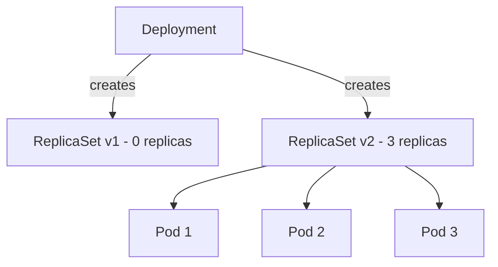

> 💡 **Quick Answer:** Understand ReplicaSets in Kubernetes for maintaining pod replicas. Covers selectors, scaling, ownership, and why you should use Deployments instead.

## The Problem

This is one of the most searched Kubernetes topics. A comprehensive, well-structured guide helps engineers of all levels quickly find actionable solutions.

## The Solution

Detailed implementation with production-ready examples below.


### ReplicaSet Basics

```yaml
apiVersion: apps/v1
kind: ReplicaSet
metadata:
  name: nginx-rs
spec:
  replicas: 3
  selector:
    matchLabels:
      app: nginx
  template:
    metadata:
      labels:
        app: nginx
    spec:
      containers:
        - name: nginx
          image: nginx:1.25
```

```bash
# Check ReplicaSets
kubectl get rs
kubectl describe rs nginx-rs

# Scale directly (but prefer scaling the Deployment)
kubectl scale rs nginx-rs --replicas=5
```

### Why Use Deployments Instead

```bash
# Deployments manage ReplicaSets for you
kubectl get rs -l app=web
# NAME                    DESIRED   CURRENT   READY
# web-app-7d9f5b6c4      3         3         3       ← current
# web-app-5c8d4e3b2      0         0         0       ← previous (rollback target)
```

A Deployment creates a new ReplicaSet on each update and scales down the old one. This gives you:
- Rolling updates
- Rollback history
- Declarative update strategy



## Frequently Asked Questions

### Should I create ReplicaSets directly?

Almost never. Use a Deployment instead — it manages ReplicaSets and adds rolling updates + rollback. Direct ReplicaSets are only for rare cases where you need custom update orchestration.

## Common Issues

Check `kubectl describe` and `kubectl get events` first — most issues have clear error messages pointing to the root cause.

## Best Practices

- **Follow least privilege** — only grant the access that's needed
- **Test in staging** before applying to production
- **Monitor and alert** on key metrics
- **Document your runbooks** for the team

## Key Takeaways

- Essential knowledge for Kubernetes operations
- Start simple and evolve your approach
- Automation reduces human error
- Share knowledge with your team
