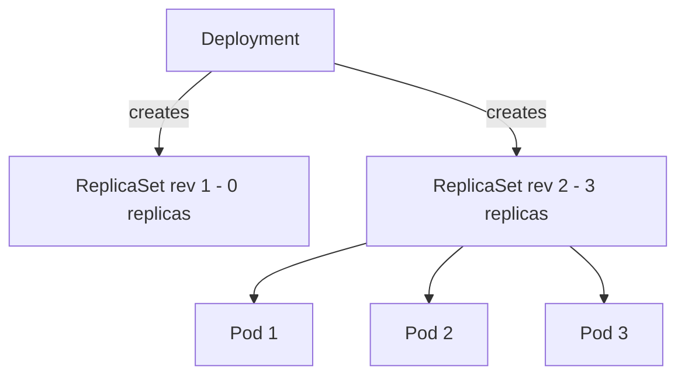

> 💡 **Quick Answer:** A ReplicaSet maintains a stable set of replica pods running at any given time. If a pod dies, the ReplicaSet creates a new one. In practice, you rarely create ReplicaSets directly — use Deployments instead, which manage ReplicaSets and provide rolling updates. ReplicaSets use label selectors to identify pods they own.

## The Problem

Pods are ephemeral — they can crash, get evicted, or be deleted:

- No automatic replacement when a pod dies
- No way to maintain a desired pod count
- Manual scaling requires creating/deleting individual pods
- No self-healing for application availability

## The Solution

### ReplicaSet Basics

```yaml
apiVersion: apps/v1
kind: ReplicaSet
metadata:
  name: nginx-rs
spec:
  replicas: 3
  selector:
    matchLabels:
      app: nginx
  template:
    metadata:
      labels:
        app: nginx    # Must match selector
    spec:
      containers:
      - name: nginx
        image: nginx:1.27
        ports:
        - containerPort: 80
        resources:
          requests:
            cpu: 100m
            memory: 128Mi
```

```bash
# Create
kubectl apply -f replicaset.yaml

# Check status
kubectl get replicaset nginx-rs
# NAME       DESIRED   CURRENT   READY   AGE
# nginx-rs   3         3         3       1m

# Delete a pod — ReplicaSet recreates it
kubectl delete pod nginx-rs-xxxxx
kubectl get pods -l app=nginx
# Still 3 pods (new one created automatically)

# Scale
kubectl scale replicaset nginx-rs --replicas=5
```

### How ReplicaSet Works

```
ReplicaSet Controller Loop:
1. Watch pods matching selector labels
2. Count current matching pods
3. If count < desired → create new pods
4. If count > desired → delete excess pods
5. Repeat continuously

Pod Ownership:
- ReplicaSet sets ownerReferences on pods it creates
- Orphan pods matching the selector get adopted
- Deleting a ReplicaSet with --cascade=orphan leaves pods running
```

### ReplicaSet vs Deployment

```yaml
# DON'T use ReplicaSet directly (usually)
# DO use Deployment — it manages ReplicaSets for you

apiVersion: apps/v1
kind: Deployment          # ← Use this
metadata:
  name: nginx
spec:
  replicas: 3
  selector:
    matchLabels:
      app: nginx
  template:
    metadata:
      labels:
        app: nginx
    spec:
      containers:
      - name: nginx
        image: nginx:1.27

# Deployment creates ReplicaSet automatically:
# kubectl get replicaset
# nginx-5d5dd5db49   3   3   3   (managed by Deployment)
# The suffix is the pod-template-hash label, added to the RS selector and its pods
# so ReplicaSets of different revisions never select each other's pods.

# Deployment adds:
# - Rolling updates (zero-downtime)
# - Rollback history
# - Pause/resume deployments
# - Update strategies (RollingUpdate, Recreate)
```



Each template change creates a new ReplicaSet; the old one is scaled to 0 and kept as a rollback target. `spec.revisionHistoryLimit` (default 10) caps how many old ReplicaSets remain.

### Label Selector Types

```yaml
# matchLabels — exact match (AND logic)
selector:
  matchLabels:
    app: nginx
    tier: frontend

# matchExpressions — set-based (more flexible)
selector:
  matchExpressions:
  - key: app
    operator: In
    values: ["nginx", "apache"]
  - key: environment
    operator: NotIn
    values: ["test"]
  - key: tier
    operator: Exists

# Operators: In, NotIn, Exists, DoesNotExist
```

### Scaling Patterns

```bash
# Imperative scaling
kubectl scale rs nginx-rs --replicas=5

# Autoscaling (via HPA targeting the Deployment, not RS)
kubectl autoscale deployment nginx --min=2 --max=10 --cpu-percent=70

# Scale to zero (pause workload)
kubectl scale rs nginx-rs --replicas=0
```

### Inspect ReplicaSet

```bash
# Describe (shows events, conditions)
kubectl describe rs nginx-rs

# See which pods belong to this RS
kubectl get pods -l app=nginx -o wide

# Check owner references
kubectl get pod nginx-rs-xxxxx -o jsonpath='{.metadata.ownerReferences[0].name}'
# nginx-rs

# See RS created by a Deployment
kubectl get rs -l app=nginx
# NAME                DESIRED   CURRENT   READY
# nginx-5d5dd5db49    3         3         3        ← current
# nginx-7b4c8d9f12    0         0         0        ← previous (rollback available)
```

## Common Issues

**ReplicaSet deletes pods you created, or runs fewer new pods than expected**

Bare pods whose labels match the selector are adopted and counted toward `replicas`, so the RS deletes the excess. Check `kubectl get pods -l <selector>` and make selectors specific (Deployments avoid this via `pod-template-hash`).

**Pods not being replaced after deletion**

Label selector mismatch — pod labels don't match RS selector. Verify: `kubectl describe rs <name>`.

**Can't update pod template in ReplicaSet**

ReplicaSets don't do rolling updates. Change the template and existing pods keep old spec — only new pods get the update. Use Deployments for this.

## Best Practices

- **Use Deployments** — they manage ReplicaSets and add rolling updates
- **Don't modify ReplicaSets managed by Deployments** — let the Deployment controller handle it
- **Label selectors must match template labels** — mismatches cause creation failures
- **Set resource requests** on pod templates — scheduler needs them for placement
- **Use ReplicaSets directly only** for bare pods that never need updates

## Key Takeaways

- ReplicaSets ensure a desired number of pod replicas are running
- Automatically replace failed pods using label selector matching
- Deployments manage ReplicaSets — use Deployments in practice
- ReplicaSets don't support rolling updates (Deployments do)
- CKA exam tests understanding of RS→Deployment→Pod ownership chain

## Frequently Asked Questions

### What is a ReplicaSet in Kubernetes?

A controller (`apps/v1`) that keeps a specified number of identical pods running. It finds its pods by label selector, creates replacements when pods die, and deletes extras when there are too many.

### What is the difference between a ReplicaSet and a Deployment?

A Deployment manages ReplicaSets. It creates a new ReplicaSet per template revision and shifts replicas between them, which gives you rolling updates, rollback (`kubectl rollout undo`) and pause/resume. A bare ReplicaSet never updates existing pods.

### Should I create ReplicaSets directly?

Almost never. Use a Deployment. Direct ReplicaSets only make sense when a custom controller does its own update orchestration.

### ReplicaSet vs ReplicationController?

ReplicationController is the legacy `v1` predecessor and supports only equality-based selectors. ReplicaSet adds set-based `matchExpressions`. Don't create new ReplicationControllers.

### Why are there old ReplicaSets with 0 replicas?

They are previous Deployment revisions kept for rollback. Limit them with `spec.revisionHistoryLimit` on the Deployment; don't delete them by hand unless you don't need rollback.
