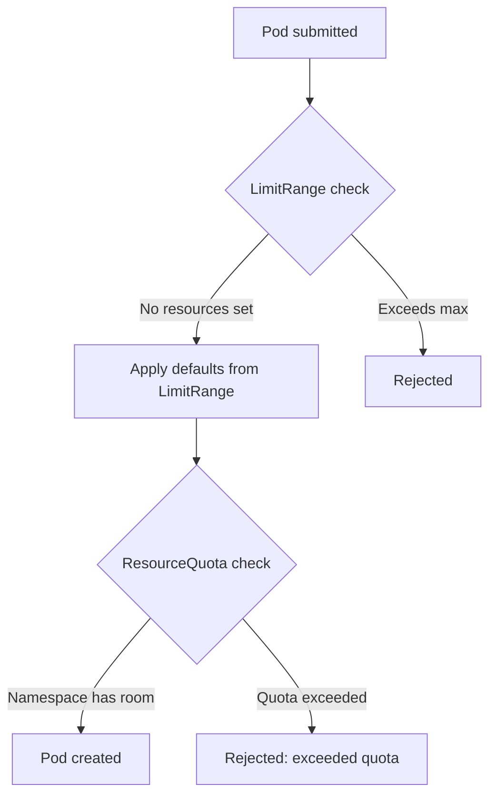

> 💡 **Quick Answer:** configuration

## The Problem

This is a fundamental Kubernetes topic that engineers search for frequently. A comprehensive reference with production-ready examples saves hours of trial and error.

## The Solution

### LimitRange — Per-Pod Defaults and Limits

```yaml
apiVersion: v1
kind: LimitRange
metadata:
  name: default-limits
  namespace: production
spec:
  limits:
    - type: Container
      default:               # Applied if no limits set
        cpu: 500m
        memory: 256Mi
      defaultRequest:        # Applied if no requests set
        cpu: 100m
        memory: 128Mi
      max:                   # Maximum allowed
        cpu: "4"
        memory: 8Gi
      min:                   # Minimum required
        cpu: 50m
        memory: 64Mi
    - type: Pod
      max:
        cpu: "8"
        memory: 16Gi
    - type: PersistentVolumeClaim
      max:
        storage: 100Gi
      min:
        storage: 1Gi
```

### ResourceQuota — Namespace-Wide Totals

```yaml
apiVersion: v1
kind: ResourceQuota
metadata:
  name: compute-quota
  namespace: production
spec:
  hard:
    requests.cpu: "20"
    requests.memory: 40Gi
    limits.cpu: "40"
    limits.memory: 80Gi
    pods: "100"
    services: "20"
    services.loadbalancers: "2"
    persistentvolumeclaims: "30"
    requests.storage: 500Gi
    count/deployments.apps: "20"
    count/secrets: "50"
```

```bash
# Check quota usage
kubectl describe resourcequota compute-quota -n production
# Used: requests.cpu=8, requests.memory=16Gi
# Hard: requests.cpu=20, requests.memory=40Gi
```

| Resource | LimitRange | ResourceQuota |
|----------|-----------|---------------|
| Scope | Per container/pod | Entire namespace |
| Purpose | Defaults + min/max per pod | Total namespace budget |
| Effect | Reject oversized pods | Reject when quota full |



## Frequently Asked Questions

### LimitRange vs ResourceQuota?

**LimitRange** sets per-pod defaults and boundaries (every pod gets at least X, no pod gets more than Y). **ResourceQuota** caps the total namespace consumption (all pods together can't exceed Z). Use both together.

## Best Practices

- Start with the simplest configuration that meets your needs
- Test changes in staging before production
- Use `kubectl describe` and events for troubleshooting
- Document your decisions for the team

## Key Takeaways

- This is essential Kubernetes knowledge for production operations
- Follow the principle of least privilege and minimal configuration
- Monitor and iterate based on real-world behavior
- Automation reduces human error and improves consistency
