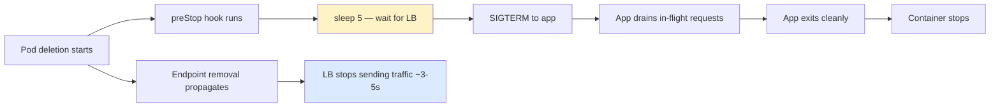

> 💡 **Quick Answer:** Resilient Kubernetes apps need 6 patterns: (1) PodDisruptionBudgets to survive maintenance, (2) topology spread across zones, (3) pod anti-affinity to prevent co-location, (4) proper health probes (liveness ≠ readiness ≠ startup), (5) graceful shutdown with preStop hooks, (6) resource requests/limits for predictable scheduling.

## The Problem

Your application works fine until something goes wrong — a node fails, a zone has an outage, a rolling update cascades, or a drain evicts critical pods. Without resiliency patterns, single points of failure are everywhere. One bad node can take down your entire service.

## The Solution

### Pattern 1: PodDisruptionBudgets (PDBs)

PDBs tell Kubernetes how many pods you can afford to lose during voluntary disruptions (drains, upgrades).

```yaml
# Guarantee at least 2 pods always running (for 3-replica deployment)
apiVersion: policy/v1
kind: PodDisruptionBudget
metadata:
  name: myapp-pdb
  namespace: production
spec:
  minAvailable: 2               # At least 2 pods must be available
  # OR: maxUnavailable: 1       # At most 1 pod can be down
  selector:
    matchLabels:
      app: myapp
```

**When to use which:**

| Setting | Use Case |
|---------|----------|
| `minAvailable: 1` | Minimum — at least one pod always up |
| `minAvailable: "50%"` | Half the fleet survives any disruption |
| `maxUnavailable: 1` | Allow one pod down at a time (best for rolling updates) |
| `maxUnavailable: 0` | **Never use** — blocks all drains and upgrades |

### Pattern 2: Topology Spread Across Zones

Spread pods across failure domains so a zone outage doesn't kill your service.

```yaml
apiVersion: apps/v1
kind: Deployment
metadata:
  name: myapp
spec:
  replicas: 6
  template:
    spec:
      topologySpreadConstraints:
        # Spread across zones
        - maxSkew: 1
          topologyKey: topology.kubernetes.io/zone
          whenUnsatisfiable: DoNotSchedule
          labelSelector:
            matchLabels:
              app: myapp
        # Also spread across nodes within each zone
        - maxSkew: 1
          topologyKey: kubernetes.io/hostname
          whenUnsatisfiable: ScheduleAnyway    # Soft constraint for nodes
          labelSelector:
            matchLabels:
              app: myapp
```

**Result with 6 replicas across 3 zones:**
```
zone-a: myapp-1, myapp-2
zone-b: myapp-3, myapp-4
zone-c: myapp-5, myapp-6
```

If `zone-b` fails → 4 of 6 pods still running across zones a and c.

### Pattern 3: Pod Anti-Affinity

Prevent multiple replicas from landing on the same node.

```yaml
spec:
  template:
    spec:
      affinity:
        podAntiAffinity:
          # Hard rule: never co-locate on same node
          requiredDuringSchedulingIgnoredDuringExecution:
            - labelSelector:
                matchExpressions:
                  - key: app
                    operator: In
                    values: ["myapp"]
              topologyKey: kubernetes.io/hostname
          # Soft rule: prefer different zones
          preferredDuringSchedulingIgnoredDuringExecution:
            - weight: 100
              podAffinityTerm:
                labelSelector:
                  matchExpressions:
                    - key: app
                      operator: In
                      values: ["myapp"]
                topologyKey: topology.kubernetes.io/zone
```

### Pattern 4: Health Probes — The Right Way

Three different probes for three different purposes:

```yaml
containers:
  - name: app
    # STARTUP probe — wait for slow-starting apps
    # Only runs at container start, then hands off to liveness/readiness
    startupProbe:
      httpGet:
        path: /healthz
        port: 8080
      failureThreshold: 30      # 30 × 10s = 5 min max startup time
      periodSeconds: 10

    # LIVENESS probe — is the process alive?
    # Failure = container restart (use carefully!)
    livenessProbe:
      httpGet:
        path: /healthz
        port: 8080
      initialDelaySeconds: 0     # startupProbe handles initial wait
      periodSeconds: 15
      timeoutSeconds: 5
      failureThreshold: 3        # Restart after 3 consecutive failures (45s)

    # READINESS probe — can this pod serve traffic?
    # Failure = removed from Service endpoints (no restart)
    readinessProbe:
      httpGet:
        path: /ready
        port: 8080
      periodSeconds: 5
      timeoutSeconds: 3
      failureThreshold: 2        # Remove from LB after 10s of failures
      successThreshold: 1
```

**Critical rules:**
- Liveness `/healthz` → simple "am I alive" check (NOT dependency checks)
- Readiness `/ready` → "can I serve requests" (include dependency checks here)
- **Never check databases in liveness** — if the DB is down, restarting your app won't fix it

```go
// Go example: separate health and ready endpoints
func healthHandler(w http.ResponseWriter, r *http.Request) {
    // Liveness: is the process OK?
    w.WriteHeader(http.StatusOK)
    w.Write([]byte("ok"))
}

func readyHandler(w http.ResponseWriter, r *http.Request) {
    // Readiness: can we serve traffic?
    if err := db.Ping(); err != nil {
        w.WriteHeader(http.StatusServiceUnavailable)
        w.Write([]byte("database unavailable"))
        return
    }
    if cacheWarming {
        w.WriteHeader(http.StatusServiceUnavailable)
        w.Write([]byte("cache warming"))
        return
    }
    w.WriteHeader(http.StatusOK)
    w.Write([]byte("ready"))
}
```

### Pattern 5: Graceful Shutdown

When Kubernetes sends SIGTERM, your app has `terminationGracePeriodSeconds` (default 30s) to finish in-flight requests.

```yaml
spec:
  terminationGracePeriodSeconds: 60  # Give app 60s to drain
  containers:
    - name: app
      lifecycle:
        preStop:
          exec:
            command:
              - /bin/sh
              - -c
              - |
                # 1. Signal the app to stop accepting new connections
                # 2. Wait for in-flight requests to complete
                # The sleep gives the Service endpoint removal time to propagate
                sleep 5
                kill -SIGTERM 1
                sleep 25
```

**Why `sleep 5` in preStop?**

There's a race condition: Kubernetes removes the pod from Service endpoints AND sends SIGTERM simultaneously. The endpoint removal takes a few seconds to propagate to all kube-proxies and ingress controllers. Without the sleep, your pod stops before all load balancers know it's gone — causing connection errors.



### Pattern 6: Resource Requests and Limits

Without requests, the scheduler can't make intelligent placement decisions. Without limits, a single pod can starve the node.

```yaml
resources:
  requests:
    cpu: "250m"       # Scheduling guarantee — scheduler reserves this
    memory: "512Mi"   # OOM kill if node is under pressure and pod exceeds this
  limits:
    cpu: "1000m"      # Throttled above this (not killed)
    memory: "1Gi"     # OOM killed if exceeded — set ~2x request for burst
```

**Guidelines:**
- **Requests ≈ average usage** — what the app normally consumes
- **Limits ≈ peak usage** — max burst you allow
- **CPU limit/request ratio ≤ 4:1** — too high = noisy neighbor issues
- **Memory limit/request ratio ≤ 2:1** — too high = OOM surprise on busy nodes

### The Complete Resilient Deployment

```yaml
apiVersion: apps/v1
kind: Deployment
metadata:
  name: myapp
  namespace: production
spec:
  replicas: 4
  strategy:
    type: RollingUpdate
    rollingUpdate:
      maxSurge: 1          # Create 1 extra pod during update
      maxUnavailable: 0    # Never reduce below desired count during update
  selector:
    matchLabels:
      app: myapp
  template:
    metadata:
      labels:
        app: myapp
        version: v2.1.0
    spec:
      terminationGracePeriodSeconds: 60
      securityContext:
        runAsNonRoot: true
        runAsUser: 1000
        seccompProfile:
          type: RuntimeDefault
      topologySpreadConstraints:
        - maxSkew: 1
          topologyKey: topology.kubernetes.io/zone
          whenUnsatisfiable: DoNotSchedule
          labelSelector:
            matchLabels:
              app: myapp
      affinity:
        podAntiAffinity:
          requiredDuringSchedulingIgnoredDuringExecution:
            - labelSelector:
                matchLabels:
                  app: myapp
              topologyKey: kubernetes.io/hostname
      containers:
        - name: app
          image: myapp:2.1.0@sha256:abc123...
          ports:
            - containerPort: 8080
              name: http
          resources:
            requests:
              cpu: "250m"
              memory: "512Mi"
            limits:
              cpu: "1000m"
              memory: "1Gi"
          startupProbe:
            httpGet:
              path: /healthz
              port: http
            failureThreshold: 30
            periodSeconds: 10
          livenessProbe:
            httpGet:
              path: /healthz
              port: http
            periodSeconds: 15
            failureThreshold: 3
          readinessProbe:
            httpGet:
              path: /ready
              port: http
            periodSeconds: 5
            failureThreshold: 2
          lifecycle:
            preStop:
              exec:
                command: ["sh", "-c", "sleep 5 && kill -SIGTERM 1"]
          securityContext:
            allowPrivilegeEscalation: false
            readOnlyRootFilesystem: true
            capabilities:
              drop: ["ALL"]
---
apiVersion: policy/v1
kind: PodDisruptionBudget
metadata:
  name: myapp-pdb
  namespace: production
spec:
  maxUnavailable: 1
  selector:
    matchLabels:
      app: myapp
```

## Common Issues

### Anti-Affinity Makes Pods Unschedulable

Hard anti-affinity with more replicas than nodes = Pending pods. Use `preferredDuringScheduling` or add more nodes.

### PDB Blocks Cluster Upgrades

`maxUnavailable: 0` or `minAvailable` equal to replicas blocks ALL drains. Always allow at least 1 disruption.

### Readiness Probe Too Aggressive

Setting `failureThreshold: 1` with `periodSeconds: 1` causes flapping — pods oscillate between ready and not-ready under normal load variance. Use at least `failureThreshold: 2` with `periodSeconds: 5`.

### Liveness Probe Checks Dependencies

If your liveness probe checks the database and the DB goes down, Kubernetes restarts ALL your pods simultaneously. Now you have a thundering herd hitting the recovering database. **Liveness = process health only.**

## Best Practices

- **Always set PDBs** for any Deployment with >1 replica
- **Spread across at least 2 zones** for production workloads
- **Separate liveness and readiness endpoints** — different checks for different purposes
- **PreStop sleep ≥ 5s** to survive endpoint propagation delay
- **Set `maxUnavailable: 0` in rolling update** — never go below desired replica count during deploys
- **Resource requests on every container** — unset requests = unpredictable scheduling
- **Test failure scenarios** — kill nodes, drain zones, simulate network partitions

## Key Takeaways

- Resiliency is not one feature — it's 6 patterns working together
- PDBs protect against maintenance, topology spread protects against zone failures
- Liveness ≠ readiness: liveness restarts, readiness removes from LB
- PreStop sleep solves the endpoint propagation race condition
- `maxSurge: 1` + `maxUnavailable: 0` = zero-downtime rolling updates
- Set resource requests to guarantee scheduling, limits to prevent noisy neighbors
