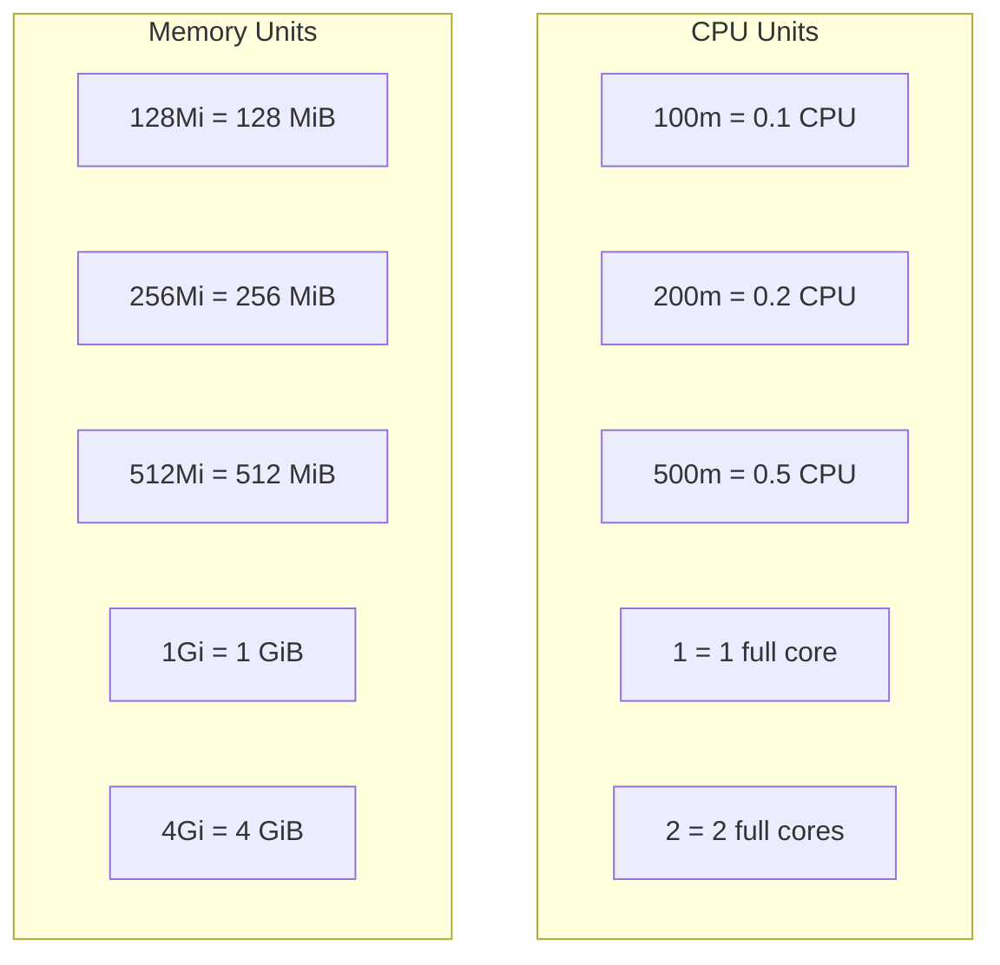

> 💡 **Quick Answer:** CPU is specified in millicores (\`200m\` = 0.2 CPU, \`500m\` = 0.5 CPU, \`1\` = 1 full core). Memory is specified in bytes with suffixes (\`256Mi\` = 256 MiB, \`1Gi\` = 1 GiB). Set both \`requests\` (scheduling guarantee) and \`limits\` (hard cap) for every container.

## The Problem

Kubernetes resource specifications use specific unit formats that are easy to get wrong. Common mistakes include confusing \`Mi\` with \`M\`, using wrong CPU units, or not understanding the difference between requests and limits — leading to OOMKilled pods, CPU throttling, or wasted cluster resources.



## The Solution

### Resource Specification Syntax

```yaml
apiVersion: v1
kind: Pod
metadata:
  name: example
spec:
  containers:
    - name: app
      image: nginx
      resources:
        requests:          # Minimum guaranteed resources
          cpu: "200m"      # 0.2 CPU cores
          memory: "256Mi"  # 256 MiB RAM
        limits:            # Maximum allowed resources
          cpu: "500m"      # 0.5 CPU cores
          memory: "256Mi"  # 256 MiB RAM
```

### CPU Units

| Format | Value | Meaning |
|--------|:-----:|---------|
| \`100m\` | 0.1 | 10% of one CPU core |
| \`200m\` | 0.2 | 20% of one CPU core |
| \`250m\` | 0.25 | 25% of one CPU core |
| \`500m\` | 0.5 | Half a CPU core |
| \`1\` | 1.0 | One full CPU core |
| \`1000m\` | 1.0 | Same as \`1\` (1000 millicores) |
| \`1500m\` | 1.5 | One and a half cores |
| \`2\` | 2.0 | Two full CPU cores |
| \`0.1\` | 0.1 | Same as \`100m\` |

> **Rule:** \`m\` = millicores. 1 CPU = 1000m. Always use \`m\` suffix for consistency.

### Memory Units

| Format | Bytes | Power |
|--------|------:|:-----:|
| \`128Mi\` | 134,217,728 | 2^27 |
| \`256Mi\` | 268,435,456 | 2^28 |
| \`512Mi\` | 536,870,912 | 2^29 |
| \`1Gi\` | 1,073,741,824 | 2^30 |
| \`2Gi\` | 2,147,483,648 | 2^31 |
| \`4Gi\` | 4,294,967,296 | 2^32 |

#### \`Mi\` vs \`M\` (Important!)

| Suffix | Base | Example |
|--------|:----:|---------|
| \`Ki\` | 2^10 = 1,024 | \`256Ki\` = 262,144 bytes |
| \`Mi\` | 2^20 = 1,048,576 | \`256Mi\` = 268,435,456 bytes |
| \`Gi\` | 2^30 = 1,073,741,824 | \`1Gi\` = 1,073,741,824 bytes |
| \`K\` | 10^3 = 1,000 | \`256K\` = 256,000 bytes |
| \`M\` | 10^6 = 1,000,000 | \`256M\` = 256,000,000 bytes |
| \`G\` | 10^9 = 1,000,000,000 | \`1G\` = 1,000,000,000 bytes |

> **Always use \`Mi\`/\`Gi\` (binary).** \`256M\` is ~4.6% less than \`256Mi\` — enough to cause unexpected OOMKilled.

### Requests vs Limits

```yaml
resources:
  requests:        # Scheduling: "I need at least this much"
    cpu: "200m"    # Scheduler finds a node with 200m available
    memory: "256Mi" # Scheduler finds a node with 256Mi available
  limits:          # Hard cap: "Never use more than this"
    cpu: "500m"    # CPU throttled above 500m (not killed)
    memory: "256Mi" # OOMKilled if exceeds 256Mi
```

| Aspect | Requests | Limits |
|--------|----------|--------|
| Purpose | Scheduling guarantee | Hard ceiling |
| CPU behavior | Guaranteed minimum | Throttled above limit |
| Memory behavior | Guaranteed minimum | **OOMKilled** above limit |
| Default if not set | 0 (or LimitRange default) | Unlimited (or LimitRange default) |

### QoS Classes

Kubernetes assigns QoS classes based on how you set requests and limits:

| QoS Class | Condition | Eviction Priority |
|-----------|-----------|:-:|
| **Guaranteed** | requests = limits for ALL containers | Last (safest) |
| **Burstable** | At least one request set, but requests ≠ limits | Middle |
| **BestEffort** | No requests or limits set | First (most likely evicted) |

```yaml
# Guaranteed QoS (recommended for production)
resources:
  requests:
    cpu: "500m"
    memory: "256Mi"
  limits:
    cpu: "500m"       # Same as request
    memory: "256Mi"   # Same as request

# Burstable QoS (allows bursting)
resources:
  requests:
    cpu: "200m"
    memory: "256Mi"
  limits:
    cpu: "500m"       # Higher than request
    memory: "512Mi"   # Higher than request

# BestEffort QoS (NOT recommended)
# No resources block at all
```

### Common Patterns

```yaml
# Web application
resources:
  requests:
    cpu: "200m"
    memory: "256Mi"
  limits:
    cpu: "500m"
    memory: "256Mi"

# API server
resources:
  requests:
    cpu: "500m"
    memory: "512Mi"
  limits:
    cpu: "1"
    memory: "1Gi"

# Database
resources:
  requests:
    cpu: "1"
    memory: "2Gi"
  limits:
    cpu: "2"
    memory: "4Gi"

# GPU workload
resources:
  requests:
    cpu: "4"
    memory: "16Gi"
  limits:
    cpu: "8"
    memory: "32Gi"
    nvidia.com/gpu: 1
```

### Check Resource Usage

```bash
# Current resource requests and limits
kubectl describe pod <pod-name> | grep -A6 "Limits\|Requests"

# Actual resource usage
kubectl top pod <pod-name>
# NAME       CPU(cores)   MEMORY(bytes)
# my-app     145m         189Mi

# Node resource allocation
kubectl describe node <node> | grep -A5 "Allocated"
# CPU Requests: 4200m (52%), CPU Limits: 8000m (100%)
# Memory Requests: 6Gi (40%), Memory Limits: 12Gi (75%)

# Check QoS class
kubectl get pod <pod-name> -o jsonpath='{.status.qosClass}'
# Guaranteed
```

## Common Issues

| Issue | Cause | Fix |
|-------|-------|-----|
| OOMKilled | Memory usage exceeds limit | Increase memory limit or optimize app |
| CPU throttling | CPU usage exceeds limit | Increase CPU limit or optimize app |
| Pod stuck Pending | Requests exceed available node resources | Reduce requests or add nodes |
| \`256M\` vs \`256Mi\` confusion | Decimal vs binary units | Always use \`Mi\`/\`Gi\` (binary) |
| BestEffort eviction | No requests/limits set | Always set at least requests |
| Wasted resources | Limits too high vs actual usage | Use VPA recommendations or \`kubectl top\` |

## Best Practices

- **Always set both requests AND limits** — prevents BestEffort QoS
- **Use \`Mi\`/\`Gi\` not \`M\`/\`G\`** — binary units match how Linux reports memory
- **Set memory requests = limits** for Guaranteed QoS — prevents OOMKilled surprises
- **Allow CPU bursting** — CPU limits > requests lets pods burst during spikes
- **Use VPA for right-sizing** — let Vertical Pod Autoscaler recommend values
- **Quote numeric values** — \`cpu: "1"\` not \`cpu: 1\` to avoid YAML type issues

## Key Takeaways

- CPU: millicores (\`200m\` = 0.2 cores, \`1\` = 1 core, \`1000m\` = 1 core)
- Memory: binary units (\`256Mi\`, \`1Gi\`) — always use \`Mi\`/\`Gi\`, not \`M\`/\`G\`
- Requests = scheduling guarantee, Limits = hard cap
- CPU is throttled above limit, Memory is OOMKilled above limit
- Guaranteed QoS (requests = limits) is safest for production workloads
- Use \`kubectl top\` and VPA to right-size resources based on actual usage
