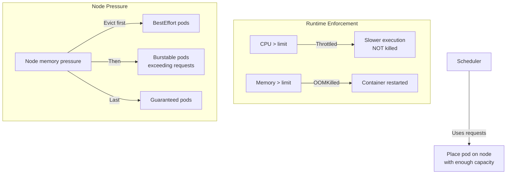

> 💡 **Quick Answer:** Set `requests` equal to expected steady-state usage and `limits` to 2x requests for burstable workloads. For critical services, set `requests == limits` (Guaranteed QoS) to prevent OOMKill during node pressure. Never set CPU limits on latency-sensitive services — CPU throttling causes tail latency spikes.

## The Problem

Pods crash with OOMKilled, or response times spike due to CPU throttling. Developers either over-provision (wasting 50%+ of cluster resources) or under-provision (causing instability). Understanding the difference between requests, limits, and QoS classes is fundamental.

## The Solution

### Requests vs Limits

```yaml
apiVersion: v1
kind: Pod
metadata:
  name: app
spec:
  containers:
    - name: app
      resources:
        requests:
          cpu: 250m
          memory: 256Mi
        limits:
          cpu: "1"
          memory: 512Mi
```

- **Requests**: Guaranteed minimum. Used for scheduling decisions.
- **Limits**: Maximum allowed. CPU is throttled; memory causes OOMKill.

### QoS Classes

| Class | Condition | Eviction Priority |
|-------|-----------|-------------------|
| **Guaranteed** | requests == limits for ALL containers | Last to evict |
| **Burstable** | At least one request or limit set | Middle |
| **BestEffort** | No requests or limits at all | First to evict |

```yaml
# Guaranteed QoS (highest priority)
resources:
  requests:
    cpu: 500m
    memory: 512Mi
  limits:
    cpu: 500m
    memory: 512Mi

# Burstable QoS (most common)
resources:
  requests:
    cpu: 250m
    memory: 256Mi
  limits:
    memory: 512Mi
    # No CPU limit — prevents throttling
```

### CPU Throttling vs Memory OOMKill

```
CPU (compressible):
  Pod exceeds CPU limit → throttled (slower, not killed)
  CFS quota mechanism: 100m = 10ms every 100ms

Memory (incompressible):
  Pod exceeds memory limit → OOMKilled immediately
  Container restarts (if restartPolicy allows)
```



## Common Issues

**OOMKilled but the container only uses 400Mi (limit is 512Mi)**

Check for child processes and memory-mapped files. `kubectl top pod` shows RSS only — actual memory includes page cache and tmpfs.

**CPU throttling causing latency spikes**

Remove CPU limits for latency-sensitive services. CPU throttling activates in 100ms windows — a burst that exceeds quota gets throttled even if average usage is low.

## Best Practices

- **Don't set CPU limits on latency-sensitive services** — throttling causes p99 latency spikes
- **Always set memory limits** — prevents one pod from consuming all node memory
- **Guaranteed QoS for databases and critical services** — requests == limits
- **Burstable for web services** — requests for baseline, limits for peaks
- **Monitor actual usage with VPA** — right-size after 1 week of observation

## Key Takeaways

- Requests are scheduling guarantees; limits are runtime enforcement
- CPU is throttled (compressible); memory is OOMKilled (incompressible)
- Guaranteed QoS (requests==limits) is last to be evicted during node pressure
- Don't set CPU limits on latency-sensitive services — throttling causes p99 spikes
- Always set memory limits — one pod without limits can take down a node
- Use VPA in Off mode to observe actual usage before setting values
