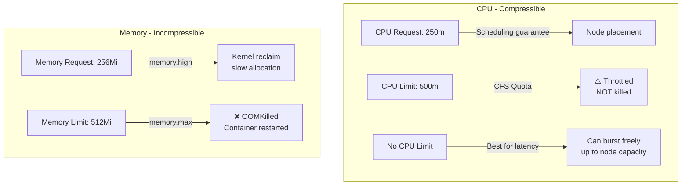

> 💡 **Quick Answer:** Use cgroup v2 `memory.high` (soft limit) for gradual throttling before OOMKill. Remove CPU limits on latency-sensitive services — CFS quota causes 5-10ms throttling bursts even at 30% average utilization. Set `memory.max` equal to memory limit for hard OOMKill protection.

## The Problem

A service using only 30% average CPU gets throttled by CFS quota, causing p99 latency to spike from 5ms to 50ms. Understanding how Linux cgroups enforce Kubernetes resource limits is essential for production tuning.

## The Solution

### CFS Bandwidth Control (CPU Limits)

```
CPU limit: 500m = 50ms every 100ms period

If your service handles a burst of requests using 80ms of CPU in 100ms:
  → CFS throttles for 30ms (80ms used - 50ms quota = 30ms throttled)
  → Requests during throttled period wait 30ms
  → p99 latency spikes by 30ms

With no CPU limit:
  → Service uses 80ms freely
  → No throttling, no latency spike
  → Node-level resource management via requests (scheduling)
```

### Memory: cgroup v2 Behavior

```
memory.max = Kubernetes memory limit (hard limit)
  → Exceeding triggers OOMKill immediately

memory.high = Kubernetes memory request (soft limit, cgroup v2)
  → Exceeding triggers kernel memory reclaim (slow allocation)
  → Acts as early warning before OOMKill

OOMKill scoring:
  oom_score = (memory_usage / memory_limit) * 1000
  Guaranteed QoS: oom_score_adj = -997 (almost never killed)
  BestEffort QoS: oom_score_adj = 1000 (first to die)
```

### Recommended Patterns

```yaml
# Latency-sensitive service: NO CPU limit
resources:
  requests:
    cpu: 250m
    memory: 256Mi
  limits:
    memory: 512Mi
    # NO cpu limit — prevents throttling

# Batch/background service: CPU limit OK
resources:
  requests:
    cpu: "1"
    memory: 1Gi
  limits:
    cpu: "2"
    memory: 2Gi
```

### Monitoring Throttling

```bash
# Check CFS throttling metrics
cat /sys/fs/cgroup/cpu/cpu.stat
# nr_periods 1000
# nr_throttled 150       ← 15% of periods were throttled!
# throttled_time 450000  ← 450ms total throttled time

# Prometheus query for throttling
rate(container_cpu_cfs_throttled_periods_total[5m])
/ rate(container_cpu_cfs_periods_total[5m]) * 100
# Returns: % of periods throttled
```



## Common Issues

**Service throttled at 30% average CPU**

CFS works in 100ms periods. A burst to 80% in one period gets throttled even if the next 9 periods are idle. Remove CPU limits for latency-sensitive services.

**OOMKilled but `kubectl top` shows below limit**

`kubectl top` shows RSS only. Actual memory includes page cache, kernel buffers, and tmpfs. Check cgroup stats: `/sys/fs/cgroup/memory/memory.usage_in_bytes`.

## Best Practices

- **Remove CPU limits for latency-sensitive services** — throttling causes unpredictable latency spikes
- **Always set memory limits** — memory is incompressible, OOMKill is better than node-wide pressure
- **Monitor `container_cpu_cfs_throttled_periods_total`** — >5% throttling rate needs investigation
- **cgroup v2 is preferred** — `memory.high` provides graceful degradation before OOMKill
- **Guaranteed QoS for critical services** — `oom_score_adj: -997` means almost never OOMKilled

## Key Takeaways

- CFS bandwidth control throttles CPU in 100ms windows — causes latency spikes even at low average usage
- Remove CPU limits for latency-sensitive services — use requests for scheduling guarantees
- Memory limits trigger OOMKill (hard); memory requests trigger reclaim (soft, cgroup v2)
- OOM scoring: BestEffort dies first (1000), Guaranteed dies last (-997)
- Monitor CFS throttling: >5% throttled periods indicates CPU limits are too tight
- cgroup v2 `memory.high` (soft limit) provides gradual degradation before hard OOMKill
