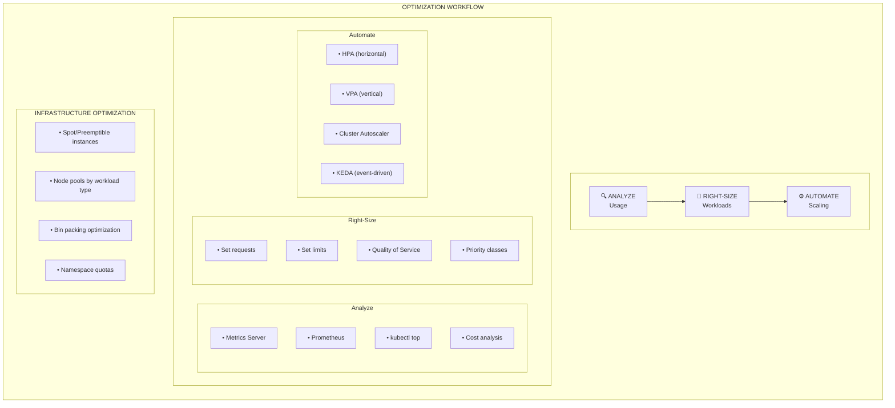

> 💡 **Quick Answer:** Optimize resources: analyze usage with `kubectl top pods`, install **Vertical Pod Autoscaler (VPA)** for recommendations, right-size requests/limits based on actual usage. Use **Goldilocks** dashboard for VPA insights. Target 60-80% utilization for efficient scheduling.
>
> **Key command:** `kubectl top pods --containers` shows actual usage; compare with `kubectl get pods -o custom-columns` for requests.
>
> **Gotcha:** Don't set requests too low (scheduling issues) or limits too tight (OOMKills)—use VPA recommendations as a starting point.

## The Problem

Your Kubernetes cluster is over-provisioned, wasting resources and increasing costs. Pods request more CPU/memory than they use, or worse, have no limits and consume excessive resources.

## The Solution

Implement a comprehensive resource optimization strategy: analyze actual usage, right-size workloads, use autoscalers effectively, and leverage cost-efficient compute options.

## Resource Optimization Overview



## Step 1: Analyze Current Resource Usage

### Install Metrics Server

```bash
kubectl apply -f https://github.com/kubernetes-sigs/metrics-server/releases/latest/download/components.yaml

# Verify metrics are available
kubectl top nodes
kubectl top pods -A
```

### View Resource Usage by Namespace

```bash
# CPU and memory by namespace
kubectl top pods -A --sort-by=cpu | head -20
kubectl top pods -A --sort-by=memory | head -20

# Summary by namespace
for ns in $(kubectl get ns -o jsonpath='{.items[*].metadata.name}'); do
  echo "=== $ns ==="
  kubectl top pods -n $ns 2>/dev/null | tail -n +2 | awk '{cpu+=$2; mem+=$3} END {print "CPU: "cpu"m, Memory: "mem"Mi"}'
done
```

### Compare Requests vs Actual Usage

```bash
# Get requests and limits for all pods
kubectl get pods -A -o custom-columns=\
NAMESPACE:.metadata.namespace,\
NAME:.metadata.name,\
CPU_REQ:.spec.containers[*].resources.requests.cpu,\
CPU_LIM:.spec.containers[*].resources.limits.cpu,\
MEM_REQ:.spec.containers[*].resources.requests.memory,\
MEM_LIM:.spec.containers[*].resources.limits.memory
```

### Resource Efficiency Script

```bash
#!/bin/bash
# resource-efficiency.sh

echo "Pod Resource Efficiency Report"
echo "=============================="

kubectl get pods -A -o json | jq -r '
  .items[] | 
  select(.status.phase == "Running") |
  "\(.metadata.namespace)/\(.metadata.name): CPU Request: \(.spec.containers[0].resources.requests.cpu // "none"), Memory Request: \(.spec.containers[0].resources.requests.memory // "none")"
'
```

### Prometheus Queries for Analysis

```promql
# CPU usage vs requests ratio
sum(rate(container_cpu_usage_seconds_total{container!=""}[5m])) by (namespace, pod)
/
sum(kube_pod_container_resource_requests{resource="cpu"}) by (namespace, pod)

# Memory usage vs requests ratio
sum(container_memory_working_set_bytes{container!=""}) by (namespace, pod)
/
sum(kube_pod_container_resource_requests{resource="memory"}) by (namespace, pod)

# Pods using less than 50% of requested CPU
(
  sum(rate(container_cpu_usage_seconds_total{container!=""}[5m])) by (namespace, pod)
  /
  sum(kube_pod_container_resource_requests{resource="cpu"}) by (namespace, pod)
) < 0.5

# Over-provisioned namespaces
sum(kube_pod_container_resource_requests{resource="cpu"}) by (namespace)
-
sum(rate(container_cpu_usage_seconds_total{container!=""}[5m])) by (namespace)
```

## Step 2: Right-Size Workloads

### Guidelines for Resource Requests

```yaml
apiVersion: apps/v1
kind: Deployment
metadata:
  name: optimized-app
spec:
  replicas: 3
  template:
    spec:
      containers:
        - name: app
          image: myapp:1.0
          resources:
            # Requests: Based on observed average usage + 20% buffer
            requests:
              cpu: "100m"      # Observed avg: 80m
              memory: "128Mi"  # Observed avg: 100Mi
            # Limits: Based on peak usage + 50% buffer  
            limits:
              cpu: "500m"      # Observed peak: 300m
              memory: "256Mi"  # Observed peak: 180Mi
```

### Quality of Service Classes

```yaml
# Guaranteed QoS (requests = limits)
# Best for critical workloads
resources:
  requests:
    cpu: "500m"
    memory: "512Mi"
  limits:
    cpu: "500m"
    memory: "512Mi"

---
# Burstable QoS (requests < limits)
# Good for most workloads
resources:
  requests:
    cpu: "100m"
    memory: "128Mi"
  limits:
    cpu: "500m"
    memory: "512Mi"

---
# BestEffort QoS (no requests or limits)
# Only for non-critical batch jobs
# (Not recommended - first to be evicted)
```

### LimitRange for Defaults

```yaml
apiVersion: v1
kind: LimitRange
metadata:
  name: default-limits
  namespace: production
spec:
  limits:
    - type: Container
      default:
        cpu: "500m"
        memory: "256Mi"
      defaultRequest:
        cpu: "100m"
        memory: "128Mi"
      min:
        cpu: "50m"
        memory: "64Mi"
      max:
        cpu: "2"
        memory: "2Gi"
```

## Step 3: Implement Vertical Pod Autoscaler (VPA)

### Install VPA

```bash
git clone https://github.com/kubernetes/autoscaler.git
cd autoscaler/vertical-pod-autoscaler
./hack/vpa-up.sh

# Verify installation
kubectl get pods -n kube-system | grep vpa
```

### VPA in Recommendation Mode

```yaml
apiVersion: autoscaling.k8s.io/v1
kind: VerticalPodAutoscaler
metadata:
  name: myapp-vpa
  namespace: production
spec:
  targetRef:
    apiVersion: apps/v1
    kind: Deployment
    name: myapp
  updatePolicy:
    updateMode: "Off"  # Only recommendations, no automatic updates
  resourcePolicy:
    containerPolicies:
      - containerName: "*"
        minAllowed:
          cpu: "50m"
          memory: "64Mi"
        maxAllowed:
          cpu: "2"
          memory: "4Gi"
        controlledResources: ["cpu", "memory"]
```

### View VPA Recommendations

```bash
# Get recommendations
kubectl describe vpa myapp-vpa -n production

# Output example:
# Recommendation:
#   Container Recommendations:
#     Container Name: app
#     Lower Bound:
#       Cpu:     50m
#       Memory:  128Mi
#     Target:
#       Cpu:     150m
#       Memory:  256Mi
#     Upper Bound:
#       Cpu:     500m
#       Memory:  512Mi
```

### VPA with Auto Updates

```yaml
apiVersion: autoscaling.k8s.io/v1
kind: VerticalPodAutoscaler
metadata:
  name: myapp-vpa-auto
  namespace: production
spec:
  targetRef:
    apiVersion: apps/v1
    kind: Deployment
    name: myapp
  updatePolicy:
    updateMode: "Auto"  # Automatically update pod resources
    minReplicas: 2      # Keep at least 2 replicas during updates
  resourcePolicy:
    containerPolicies:
      - containerName: app
        minAllowed:
          cpu: "100m"
          memory: "128Mi"
        maxAllowed:
          cpu: "1"
          memory: "2Gi"
```

## Step 4: Namespace Resource Quotas

### Set Namespace Quotas

```yaml
apiVersion: v1
kind: ResourceQuota
metadata:
  name: production-quota
  namespace: production
spec:
  hard:
    requests.cpu: "10"
    requests.memory: "20Gi"
    limits.cpu: "20"
    limits.memory: "40Gi"
    pods: "50"
    services: "20"
    persistentvolumeclaims: "10"
    requests.storage: "100Gi"
```

### Monitor Quota Usage

```bash
# View quota usage
kubectl describe quota production-quota -n production

# Get all quotas
kubectl get resourcequotas -A

# Alert when quota > 80%
kubectl get resourcequota -A -o json | jq -r '
  .items[] | 
  select(.status.used["requests.cpu"] != null) |
  "\(.metadata.namespace): CPU \(.status.used["requests.cpu"])/\(.status.hard["requests.cpu"])"
'
```

## Step 5: Optimize Node Utilization

### Node Pool Strategy

```yaml
# Production node pool - On-demand, reliable
apiVersion: karpenter.sh/v1alpha5
kind: Provisioner
metadata:
  name: production
spec:
  requirements:
    - key: node.kubernetes.io/instance-type
      operator: In
      values: ["m5.large", "m5.xlarge"]
    - key: karpenter.sh/capacity-type
      operator: In
      values: ["on-demand"]
  labels:
    workload-type: production
  taints:
    - key: workload-type
      value: production
      effect: NoSchedule

---
# Batch/Dev node pool - Spot instances, cost-effective
apiVersion: karpenter.sh/v1alpha5
kind: Provisioner
metadata:
  name: spot-batch
spec:
  requirements:
    - key: karpenter.sh/capacity-type
      operator: In
      values: ["spot"]
    - key: node.kubernetes.io/instance-type
      operator: In
      values: ["m5.large", "m5.xlarge", "m5a.large", "m5a.xlarge"]
  labels:
    workload-type: batch
  ttlSecondsAfterEmpty: 300
```

### Schedule Workloads on Appropriate Nodes

```yaml
apiVersion: apps/v1
kind: Deployment
metadata:
  name: batch-job
spec:
  template:
    spec:
      # Use spot instances for batch workloads
      nodeSelector:
        workload-type: batch
      tolerations:
        - key: "kubernetes.azure.com/scalesetpriority"
          operator: "Equal"
          value: "spot"
          effect: "NoSchedule"
      # Handle spot interruption gracefully
      terminationGracePeriodSeconds: 30
      containers:
        - name: batch
          image: batch-processor:1.0
          resources:
            requests:
              cpu: "500m"
              memory: "512Mi"
```

### Bin Packing with Pod Topology

```yaml
apiVersion: apps/v1
kind: Deployment
metadata:
  name: efficient-packing
spec:
  replicas: 10
  template:
    spec:
      # Spread pods but allow multiple per node for efficiency
      topologySpreadConstraints:
        - maxSkew: 3
          topologyKey: kubernetes.io/hostname
          whenUnsatisfiable: ScheduleAnyway
          labelSelector:
            matchLabels:
              app: efficient-packing
```

## Step 6: Cost Monitoring and Alerts

### Deploy Kubecost (Open Source)

```bash
helm repo add kubecost https://kubecost.github.io/cost-analyzer/
helm install kubecost kubecost/cost-analyzer \
  --namespace kubecost --create-namespace \
  --set kubecostToken="<your-token>"

# Access UI
kubectl port-forward -n kubecost svc/kubecost-cost-analyzer 9090:9090
```

### Prometheus Cost Alerts

```yaml
apiVersion: monitoring.coreos.com/v1
kind: PrometheusRule
metadata:
  name: cost-alerts
  namespace: monitoring
spec:
  groups:
    - name: cost-optimization
      rules:
        - alert: HighCPUOverProvisioning
          expr: |
            (
              sum(kube_pod_container_resource_requests{resource="cpu"}) by (namespace)
              -
              sum(rate(container_cpu_usage_seconds_total{container!=""}[1h])) by (namespace)
            )
            /
            sum(kube_pod_container_resource_requests{resource="cpu"}) by (namespace)
            > 0.5
          for: 24h
          labels:
            severity: warning
          annotations:
            summary: "Namespace {{ $labels.namespace }} is over-provisioned by >50%"
            
        - alert: UnderutilizedNodes
          expr: |
            (1 - (sum(rate(container_cpu_usage_seconds_total[5m])) by (node) 
            / sum(kube_node_status_allocatable{resource="cpu"}) by (node))) > 0.7
          for: 6h
          labels:
            severity: warning
          annotations:
            summary: "Node {{ $labels.node }} utilization below 30%"
            
        - alert: PodsWithoutLimits
          expr: |
            count(kube_pod_container_resource_limits{resource="cpu"} == 0) > 0
          for: 1h
          labels:
            severity: info
          annotations:
            summary: "{{ $value }} pods running without CPU limits"
```

## Step 7: Optimization Automation

### Goldilocks for VPA Recommendations

```bash
# Install Goldilocks
helm repo add fairwinds-stable https://charts.fairwinds.com/stable
helm install goldilocks fairwinds-stable/goldilocks --namespace goldilocks --create-namespace

# Enable for namespace
kubectl label ns production goldilocks.fairwinds.com/enabled=true

# Access dashboard
kubectl port-forward -n goldilocks svc/goldilocks-dashboard 8080:80
```

### Right-Sizing Script

```bash
#!/bin/bash
# generate-resource-recommendations.sh

NAMESPACE=$1

echo "Resource Recommendations for namespace: $NAMESPACE"
echo "================================================="

for pod in $(kubectl get pods -n $NAMESPACE -o jsonpath='{.items[*].metadata.name}'); do
  echo -e "\nPod: $pod"
  
  # Get current requests
  CURRENT=$(kubectl get pod -n $NAMESPACE $pod -o jsonpath='{.spec.containers[0].resources.requests}')
  echo "Current requests: $CURRENT"
  
  # Get actual usage (last hour average)
  CPU_USAGE=$(kubectl top pod -n $NAMESPACE $pod --no-headers 2>/dev/null | awk '{print $2}')
  MEM_USAGE=$(kubectl top pod -n $NAMESPACE $pod --no-headers 2>/dev/null | awk '{print $3}')
  
  echo "Current usage: CPU=$CPU_USAGE, Memory=$MEM_USAGE"
  echo "Recommendation: Set requests to ~20% above current usage"
done
```

## Quick Wins Checklist

```markdown
## Immediate Optimizations

- [ ] Set resource requests on all pods
- [ ] Set resource limits on all pods
- [ ] Enable VPA in recommendation mode
- [ ] Remove unused deployments (replicas: 0)
- [ ] Delete orphaned PVCs
- [ ] Review and reduce oversized requests

## Medium-Term Optimizations

- [ ] Implement namespace quotas
- [ ] Use spot instances for non-critical workloads
- [ ] Enable cluster autoscaler with scale-down
- [ ] Consolidate underutilized nodes
- [ ] Right-size based on VPA recommendations

## Long-Term Optimizations

- [ ] Implement FinOps practices
- [ ] Regular resource audits (monthly)
- [ ] Cost allocation by team/project
- [ ] Chargeback/showback reporting
```

## Summary

Resource optimization is an ongoing process. Start by analyzing actual usage, right-size workloads based on data, implement autoscalers (VPA/HPA), and continuously monitor costs. The goal is to balance performance with efficiency—not to under-provision, but to eliminate waste.

---

## 📘 Go Further with Kubernetes Recipes

**Love this recipe? There's so much more!** This is just one of **100+ hands-on recipes** in our comprehensive **[Kubernetes Recipes book](https://amzn.to/3DzC8QA)**.

Inside the book, you'll master:
- ✅ Production-ready deployment strategies
- ✅ Advanced networking and security patterns  
- ✅ Observability, monitoring, and troubleshooting
- ✅ Real-world best practices from industry experts

> *"The practical, recipe-based approach made complex Kubernetes concepts finally click for me."*

**👉 [Get Your Copy Now](https://amzn.to/3DzC8QA)** — Start building production-grade Kubernetes skills today!
