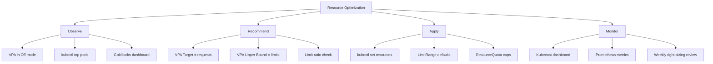

> 💡 **Quick Answer:** Install VPA in recommendation mode (`updateMode: "Off"`), deploy Goldilocks dashboard, then right-size every Deployment's requests/limits based on actual P95 usage. Most clusters are 2-4x over-provisioned — right-sizing saves 40-60% compute cost without risk.

## The Problem

Your cluster is expensive but nodes show only 30-40% actual CPU/memory utilization. Pods are over-provisioned (developers request 1 CPU but use 50m), under-provisioned (OOM kills and throttling), or randomly sized. You're paying for 3x more compute than you need.

## The Solution

### Step 1: Understand Current Waste

```bash
# Compare requested vs actual usage across the cluster
kubectl top pods -A --sort-by=cpu | head -20

# Find the biggest over-provisioners
kubectl get pods -A -o json | jq -r '
  .items[] |
  .metadata.namespace as $ns |
  .metadata.name as $pod |
  .spec.containers[] |
  select(.resources.requests.cpu != null) |
  "\($ns)/\($pod) requested=\(.resources.requests.cpu) limit=\(.resources.limits.cpu // "none")"
' | head -30
```

**Quick waste calculator:**

```bash
#!/bin/bash
echo "=== Cluster Resource Efficiency ==="

# Total allocatable
TOTAL_CPU=$(kubectl get nodes -o json | jq '[.items[].status.allocatable.cpu | rtrimstr("m") | if endswith("") then (tonumber * 1000) else tonumber end] | add')
TOTAL_MEM=$(kubectl get nodes -o json | jq '[.items[].status.allocatable.memory | rtrimstr("Ki") | tonumber] | add')

# Total requested
REQ_CPU=$(kubectl get pods -A -o json | jq '[.items[].spec.containers[].resources.requests.cpu // "0" | rtrimstr("m") | tonumber] | add')
REQ_MEM=$(kubectl get pods -A -o json | jq '[.items[].spec.containers[].resources.requests.memory // "0" | rtrimstr("Mi") | tonumber] | add')

echo "CPU: Requested ${REQ_CPU}m / Allocatable ${TOTAL_CPU}m ($(( REQ_CPU * 100 / TOTAL_CPU ))% allocated)"
echo "Memory: Requested ${REQ_MEM}Mi / Allocatable $((TOTAL_MEM / 1024))Mi"
echo ""
echo "If actual usage is ~40% of requested → ~$(( REQ_CPU * 40 / 100 ))m CPU actually used"
echo "Potential savings: ~$(( (REQ_CPU - REQ_CPU * 40 / 100) * 100 / TOTAL_CPU ))% of cluster cost"
```

### Step 2: Install VPA (Vertical Pod Autoscaler)

VPA observes actual resource consumption and recommends optimal requests/limits.

```bash
# Install VPA
git clone https://github.com/kubernetes/autoscaler.git
cd autoscaler/vertical-pod-autoscaler
./hack/vpa-up.sh

# Verify
kubectl get pods -n kube-system | grep vpa
# vpa-admission-controller-...   Running
# vpa-recommender-...            Running
# vpa-updater-...                Running
```

**Create VPA in recommendation-only mode (safe):**

```yaml
apiVersion: autoscaling.k8s.io/v1
kind: VerticalPodAutoscaler
metadata:
  name: myapp-vpa
  namespace: production
spec:
  targetRef:
    apiVersion: "apps/v1"
    kind: Deployment
    name: myapp
  updatePolicy:
    updateMode: "Off"    # Recommendation only — no auto-scaling
  resourcePolicy:
    containerPolicies:
      - containerName: app
        minAllowed:
          cpu: "50m"
          memory: "64Mi"
        maxAllowed:
          cpu: "2000m"
          memory: "4Gi"
        controlledResources: ["cpu", "memory"]
```

**Read VPA recommendations:**

```bash
kubectl describe vpa myapp-vpa -n production
# Recommendation:
#   Container Recommendations:
#     Container Name: app
#     Lower Bound:    Cpu: 25m,   Memory: 128Mi
#     Target:         Cpu: 100m,  Memory: 256Mi    ← Use this for requests
#     Upper Bound:    Cpu: 500m,  Memory: 1Gi      ← Use this for limits
#     Uncapped Target: Cpu: 100m, Memory: 256Mi
```

### Step 3: Deploy Goldilocks Dashboard

Goldilocks creates VPAs for every Deployment in labeled namespaces and provides a web dashboard.

```bash
# Install Goldilocks
helm repo add fairwinds-stable https://charts.fairwinds.com/stable
helm install goldilocks fairwinds-stable/goldilocks \
  --namespace goldilocks --create-namespace

# Enable for specific namespaces
kubectl label namespace production goldilocks.fairwinds.com/enabled=true
kubectl label namespace staging goldilocks.fairwinds.com/enabled=true

# Access the dashboard
kubectl port-forward -n goldilocks svc/goldilocks-dashboard 8080:80
# Open http://localhost:8080
```

**Goldilocks shows for each Deployment:**
- Current requests/limits
- VPA-recommended requests/limits
- QoS class impact
- Savings if right-sized

### Step 4: Right-Size Based on Recommendations

```bash
# Apply VPA recommendations to a Deployment
kubectl set resources deploy myapp -n production \
  --requests=cpu=100m,memory=256Mi \
  --limits=cpu=500m,memory=1Gi
```

**Right-sizing rules:**
- **Requests = VPA Target** (P50 usage with buffer)
- **Limits = VPA Upper Bound** (P99 usage)
- **CPU limit:request ratio ≤ 4:1** (higher = noisy neighbor)
- **Memory limit:request ratio ≤ 2:1** (higher = OOM risk on busy nodes)

### Step 5: QoS Classes — Use Them Strategically

Kubernetes assigns QoS classes based on resource settings:

```yaml
# Guaranteed — highest priority, last to be evicted
# requests == limits for ALL containers
resources:
  requests:
    cpu: "500m"
    memory: "512Mi"
  limits:
    cpu: "500m"        # Same as request
    memory: "512Mi"    # Same as request

---
# Burstable — medium priority
# requests < limits
resources:
  requests:
    cpu: "100m"
    memory: "256Mi"
  limits:
    cpu: "500m"        # Higher than request
    memory: "1Gi"      # Higher than request

---
# BestEffort — lowest priority, first to be evicted
# NO requests or limits set
resources: {}          # ← Don't do this in production
```

**Strategy:**
| Workload | QoS Class | Why |
|----------|-----------|-----|
| Databases, stateful | Guaranteed | Never evicted under memory pressure |
| Web APIs, microservices | Burstable | Can burst for traffic spikes |
| Batch jobs, dev workloads | Burstable (low) | Acceptable to throttle/evict |

### Step 6: LimitRange Defaults

Protect against pods deployed without resource specs:

```yaml
apiVersion: v1
kind: LimitRange
metadata:
  name: resource-defaults
  namespace: production
spec:
  limits:
    - type: Container
      default:              # Applied as limits if not specified
        cpu: "500m"
        memory: "512Mi"
      defaultRequest:       # Applied as requests if not specified
        cpu: "100m"
        memory: "128Mi"
      min:
        cpu: "50m"
        memory: "64Mi"
      max:
        cpu: "4000m"
        memory: "8Gi"
    - type: Pod
      max:
        cpu: "8000m"
        memory: "16Gi"
```

### Step 7: Cost Monitoring

```bash
# Install kubecost (free tier) for cost visibility
helm repo add kubecost https://kubecost.github.io/cost-analyzer/
helm install kubecost kubecost/cost-analyzer \
  --namespace kubecost --create-namespace \
  --set kubecostToken="free"

# Access dashboard
kubectl port-forward -n kubecost svc/kubecost-cost-analyzer 9090:9090
```

### Optimization Checklist Script

```bash
#!/bin/bash
echo "=== Resource Optimization Checklist ==="

# Pods without requests
NO_REQ=$(kubectl get pods -A -o json | jq '[.items[].spec.containers[] | select(.resources.requests == null or .resources.requests == {})] | length')
echo "❓ Containers without requests: $NO_REQ"

# Pods without limits
NO_LIM=$(kubectl get pods -A -o json | jq '[.items[].spec.containers[] | select(.resources.limits == null or .resources.limits == {})] | length')
echo "❓ Containers without limits: $NO_LIM"

# QoS class distribution
echo ""
echo "=== QoS Distribution ==="
kubectl get pods -A -o json | jq -r '[.items[].status.qosClass] | group_by(.) | .[] | "\(.[0]): \(length)"'

# Guaranteed vs Burstable vs BestEffort
echo ""
echo "=== VPA Coverage ==="
VPA_COUNT=$(kubectl get vpa -A --no-headers 2>/dev/null | wc -l)
DEPLOY_COUNT=$(kubectl get deploy -A --no-headers | wc -l)
echo "VPAs: $VPA_COUNT / $DEPLOY_COUNT deployments ($(( VPA_COUNT * 100 / (DEPLOY_COUNT + 1) ))% coverage)"

echo ""
echo "=== Top Over-Provisioned (CPU request > 500m) ==="
kubectl get pods -A -o json | jq -r '
  .items[] |
  .metadata.namespace as $ns |
  .metadata.name as $pod |
  .spec.containers[] |
  select(.resources.requests.cpu != null) |
  (.resources.requests.cpu | rtrimstr("m") | tonumber) as $cpu |
  select($cpu > 500) |
  "\($ns)/\($pod): \($cpu)m CPU requested"
' | sort -t: -k2 -rn | head -10
```


```mermaid
graph TD
    A[Resource Optimization] --> B[Observe]
    A --> C[Recommend]
    A --> D[Apply]
    A --> E[Monitor]
    
    B --> B1[VPA in Off mode]
    B --> B2[kubectl top pods]
    B --> B3[Goldilocks dashboard]
    
    C --> C1[VPA Target = requests]
    C --> C2[VPA Upper Bound = limits]
    C --> C3[Limit ratio check]
    
    D --> D1[kubectl set resources]
    D --> D2[LimitRange defaults]
    D --> D3[ResourceQuota caps]
    
    E --> E1[Kubecost dashboard]
    E --> E2[Prometheus metrics]
    E --> E3[Weekly right-sizing review]
```

## Common Issues

### VPA and HPA Conflict

VPA changes CPU requests, HPA scales based on CPU utilization. They can fight each other. **Use VPA for memory only** and HPA for CPU scaling:

```yaml
# VPA: only manage memory
resourcePolicy:
  containerPolicies:
    - containerName: app
      controlledResources: ["memory"]    # CPU managed by HPA
```

### Over-Aggressive Right-Sizing Causes OOM

Don't set memory limits exactly at the VPA target — add 20% buffer:
```
request = VPA target
limit = VPA upper bound (or target × 1.5, whichever is higher)
```

### Bursty Workloads Need Headroom

APIs with traffic spikes need higher limits relative to requests. Set CPU limit:request at 4:1 and memory at 2:1.

## Best Practices

- **Start with VPA in `Off` mode** — observe for 7 days before applying recommendations
- **Right-size requests first, limits second** — requests affect scheduling
- **Use Goldilocks in every namespace** — instant visibility into waste
- **Set LimitRange in every namespace** — catch pods with no resources set
- **Review weekly** — usage patterns change with features and traffic
- **Automate with VPA `Auto` mode** for stateless workloads in staging
- **Never use BestEffort in production** — first to die under memory pressure

## Key Takeaways

- Most clusters are 2-4x over-provisioned — right-sizing saves 40-60% cost
- VPA recommendation mode is safe — it just observes and suggests
- Goldilocks gives you a dashboard for every namespace's resource efficiency
- QoS classes determine eviction order: Guaranteed > Burstable > BestEffort
- Requests = scheduling guarantee; limits = burst ceiling
- VPA for memory + HPA for CPU = no conflict, optimal scaling
