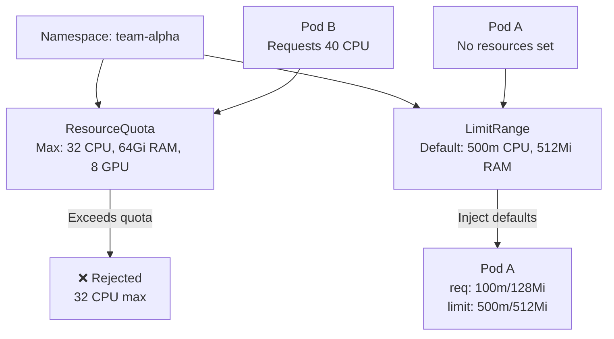

> 💡 **Quick Answer:** Apply `ResourceQuota` to cap total CPU/memory/GPU per namespace, and `LimitRange` to set default container resource requests/limits. Together they prevent resource hogging and ensure every pod has resource bounds.

## The Problem

Without quotas, a single namespace can consume all cluster resources — starving other teams. Without LimitRanges, developers deploy pods with no resource requests, making scheduling unpredictable and causing OOM kills.

## The Solution

### ResourceQuota — Namespace-Level Caps

```yaml
apiVersion: v1
kind: ResourceQuota
metadata:
  name: team-quota
  namespace: team-alpha
spec:
  hard:
    requests.cpu: "32"
    requests.memory: 64Gi
    limits.cpu: "64"
    limits.memory: 128Gi
    requests.nvidia.com/gpu: "8"
    pods: "100"
    persistentvolumeclaims: "20"
    requests.storage: 500Gi
```

### LimitRange — Per-Container Defaults

```yaml
apiVersion: v1
kind: LimitRange
metadata:
  name: default-limits
  namespace: team-alpha
spec:
  limits:
    - type: Container
      default:
        cpu: 500m
        memory: 512Mi
      defaultRequest:
        cpu: 100m
        memory: 128Mi
      min:
        cpu: 50m
        memory: 64Mi
      max:
        cpu: "8"
        memory: 16Gi
    - type: PersistentVolumeClaim
      min:
        storage: 1Gi
      max:
        storage: 100Gi
```

### GPU Namespace Quota

```yaml
apiVersion: v1
kind: ResourceQuota
metadata:
  name: gpu-quota
  namespace: ai-training
spec:
  hard:
    requests.nvidia.com/gpu: "16"
    limits.nvidia.com/gpu: "16"
  scopeSelector:
    matchExpressions:
      - scopeName: PriorityClass
        operator: In
        values: ["high-priority"]
```



## Common Issues

**Pods rejected with "exceeded quota"**

Check current usage: `kubectl describe resourcequota -n team-alpha`. Either increase the quota or reduce running workloads.

**LimitRange doesn't apply to existing pods**

LimitRange only applies to NEW pods. Existing pods keep their original resources. Delete and recreate to pick up new defaults.

**ResourceQuota requires all pods to have resource requests**

When a ResourceQuota for CPU/memory exists, ALL pods in the namespace MUST specify resource requests. LimitRange with `defaultRequest` solves this automatically.

## Best Practices

- **Always pair ResourceQuota with LimitRange** — quota enforces totals, LimitRange sets defaults
- **Set `defaultRequest` in LimitRange** — prevents "must specify resource requests" errors
- **Use scoped quotas** for priority-based allocation (high-priority jobs get more GPU)
- **Monitor with `kubectl describe resourcequota`** — track usage vs limits
- **Set PVC quotas** too — storage is often overlooked

## Key Takeaways

- ResourceQuota caps total resources per namespace — prevents resource hogging
- LimitRange sets per-container defaults and bounds — ensures every pod has resource limits
- When ResourceQuota exists, all pods must have resource requests (LimitRange `defaultRequest` handles this)
- GPU quotas use `requests.nvidia.com/gpu` — same resource name as device plugin
- Scoped quotas allow different limits per PriorityClass
