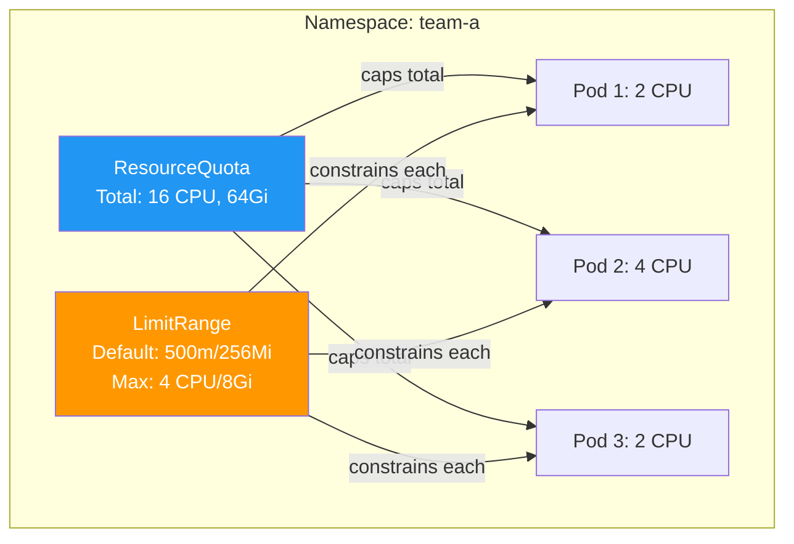

> 💡 **Quick Answer:** `ResourceQuota` caps total resources per namespace (e.g., max 16 CPU, 64Gi memory across all pods). `LimitRange` sets defaults and constraints per individual pod/container (e.g., default 256Mi memory, max 4Gi). Use both together — ResourceQuota prevents namespace sprawl, LimitRange prevents runaway individual pods.

## The Problem

Multi-tenant Kubernetes clusters without resource governance suffer:

- One team consuming all cluster CPU/memory
- Pods without resource limits causing node OOM kills
- Unbounded PVC creation exhausting storage
- Too many objects degrading API server performance
- No default limits means every pod must manually specify resources

## The Solution

### ResourceQuota — Namespace-Level Caps

```yaml
apiVersion: v1
kind: ResourceQuota
metadata:
  name: team-a-quota
  namespace: team-a
spec:
  hard:
    # Compute
    requests.cpu: "16"
    requests.memory: 64Gi
    limits.cpu: "32"
    limits.memory: 128Gi
    
    # Storage
    requests.storage: 500Gi
    persistentvolumeclaims: "20"
    
    # Object counts
    pods: "50"
    services: "20"
    secrets: "100"
    configmaps: "100"
    
    # GPU
    requests.nvidia.com/gpu: "4"
```

```bash
# Check quota usage
kubectl describe resourcequota team-a-quota -n team-a
# Name:                   team-a-quota
# Resource                Used    Hard
# --------                ----    ----
# limits.cpu              8       32
# limits.memory           32Gi    128Gi
# pods                    12      50
# requests.cpu            4       16
```

### LimitRange — Per-Pod/Container Defaults

```yaml
apiVersion: v1
kind: LimitRange
metadata:
  name: default-limits
  namespace: team-a
spec:
  limits:
  # Container defaults
  - type: Container
    default:
      cpu: 500m
      memory: 256Mi
    defaultRequest:
      cpu: 100m
      memory: 128Mi
    max:
      cpu: "4"
      memory: 8Gi
    min:
      cpu: 50m
      memory: 64Mi
  
  # Pod-level limits
  - type: Pod
    max:
      cpu: "8"
      memory: 16Gi
  
  # PVC size limits
  - type: PersistentVolumeClaim
    max:
      storage: 100Gi
    min:
      storage: 1Gi
```

### Storage-Class Specific Quotas

```yaml
apiVersion: v1
kind: ResourceQuota
metadata:
  name: storage-quota
  namespace: team-a
spec:
  hard:
    # Limit fast SSD storage
    fast-ssd.storageclass.storage.k8s.io/requests.storage: 100Gi
    fast-ssd.storageclass.storage.k8s.io/persistentvolumeclaims: "5"
    
    # More generous for standard storage
    standard.storageclass.storage.k8s.io/requests.storage: 500Gi
```

### Priority-Class Scoped Quotas

```yaml
apiVersion: v1
kind: ResourceQuota
metadata:
  name: high-priority-quota
  namespace: team-a
spec:
  hard:
    pods: "10"
    requests.cpu: "8"
  scopeSelector:
    matchExpressions:
    - scopeName: PriorityClass
      operator: In
      values:
      - high-priority
```



## Common Issues

**"forbidden: exceeded quota" when creating pods**

Namespace has hit its ResourceQuota. Check usage with `kubectl describe resourcequota -n <ns>`. Either free resources or increase the quota.

**Pods created without requests/limits despite LimitRange**

LimitRange only applies defaults to NEW pods. Existing pods are unaffected. Also ensure the LimitRange type matches (Container vs Pod).

**Quota enforcement requires resource requests**

When a ResourceQuota exists for CPU/memory, ALL pods in the namespace MUST specify requests/limits. LimitRange defaults solve this by auto-injecting values.

## Best Practices

- **Always pair ResourceQuota with LimitRange** — quota requires requests, LimitRange provides defaults
- **Set LimitRange defaults conservatively** — teams can override up to the max
- **Use storage-class scoped quotas** — prevent expensive storage class abuse
- **Monitor quota usage** — alert at 80% to prevent sudden failures
- **Review quotas quarterly** — adjust as team needs change

## Key Takeaways

- ResourceQuota caps total resource consumption per namespace
- LimitRange sets defaults and per-pod constraints
- Both are essential for multi-tenant governance
- ResourceQuota requires all pods to have resource requests — LimitRange provides defaults
- Storage-class and priority-class scoped quotas enable fine-grained control
