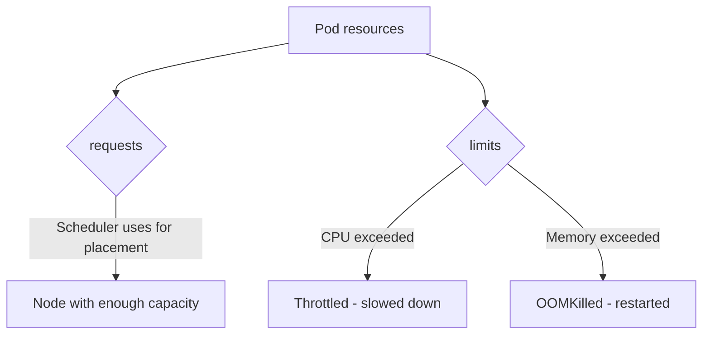

> 💡 **Quick Answer:** Configure CPU and memory requests and limits in Kubernetes. Understand QoS classes, OOMKilled, CPU throttling, and right-sizing with VPA recommendations.

## The Problem

This is one of the most searched Kubernetes topics. Having a comprehensive, well-structured guide helps both beginners and experienced users quickly find what they need.

## The Solution

### Set Requests and Limits

```yaml
apiVersion: v1
kind: Pod
metadata:
  name: my-app
spec:
  containers:
    - name: app
      image: my-app:v1
      resources:
        requests:          # Minimum guaranteed
          cpu: 250m        # 0.25 CPU cores
          memory: 256Mi    # 256 MiB
        limits:            # Maximum allowed
          cpu: "1"         # 1 CPU core
          memory: 512Mi    # 512 MiB - OOMKilled if exceeded
```

### CPU vs Memory Units

| Resource | Units | Examples |
|----------|-------|---------|
| CPU | Millicores (m) | 100m = 0.1 core, 1000m = 1 core, 1.5 = 1500m |
| Memory | Bytes (Mi, Gi) | 128Mi, 1Gi, 512Mi |

### QoS Classes

| Class | Condition | Eviction Priority |
|-------|-----------|-------------------|
| **Guaranteed** | requests == limits for all containers | Last to evict |
| **Burstable** | At least one request set, requests < limits | Middle |
| **BestEffort** | No requests or limits set | First to evict |

```yaml
# Guaranteed QoS — best for production
resources:
  requests:
    cpu: 500m
    memory: 256Mi
  limits:
    cpu: 500m        # Same as request
    memory: 256Mi    # Same as request
```

### What Happens When Limits Are Exceeded?

```bash
# CPU: Throttled (slowed down, not killed)
# Memory: OOMKilled (pod restarted)

# Check for OOM kills
kubectl describe pod <name> | grep -i oom
kubectl get pod <name> -o jsonpath='{.status.containerStatuses[0].lastState.terminated.reason}'
# Output: OOMKilled
```

### Right-Sizing with VPA

```bash
# Install VPA, create VPA object in "Off" mode, then check recommendations
kubectl describe vpa my-app-vpa
# Target:     cpu: 120m, memory: 200Mi  ← use these as your requests
```



## Frequently Asked Questions

### Should I always set limits?

Set **memory limits** always (prevents OOM from affecting other pods). CPU limits are debatable — throttling can cause latency spikes. Some teams set CPU requests only and skip CPU limits.

### What are good defaults?

Start with requests based on actual usage (check `kubectl top pods`). Set memory limit = 2× request. Adjust based on monitoring.

## Best Practices

- **Start simple** — use the basic form first, add complexity as needed
- **Be consistent** — follow naming conventions across your cluster
- **Document your choices** — add annotations explaining why, not just what
- **Monitor and iterate** — review configurations regularly

## Key Takeaways

- This is fundamental Kubernetes knowledge every engineer needs
- Start with the simplest approach that solves your problem
- Use `kubectl explain` and `kubectl describe` when unsure
- Practice in a test cluster before applying to production
