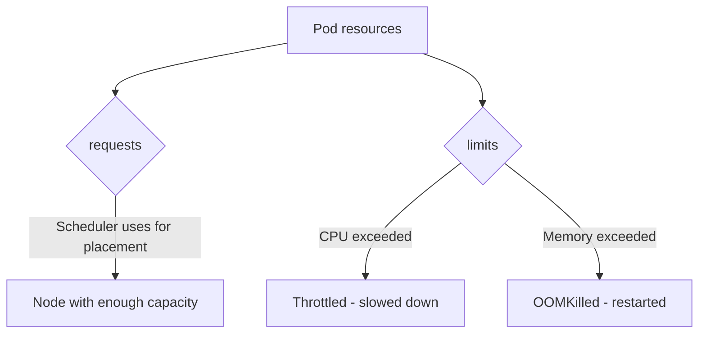

> 💡 **Quick Answer:** Configure CPU and memory requests and limits in Kubernetes. Understand QoS classes, OOMKilled, CPU throttling, and right-sizing with VPA recommendations.

## The Problem

Pods get OOMKilled, throttled, or stuck Pending because requests and limits are missing, mismatched, or copy-pasted without matching the workload's actual usage.

## The Solution

### Set Requests and Limits

```yaml
apiVersion: v1
kind: Pod
metadata:
  name: my-app
spec:
  containers:
    - name: app
      image: my-app:v1
      resources:
        requests:          # Minimum guaranteed
          cpu: 250m        # 0.25 CPU cores
          memory: 256Mi    # 256 MiB
        limits:            # Maximum allowed
          cpu: "1"         # 1 CPU core
          memory: 512Mi    # 512 MiB - OOMKilled if exceeded
```

### CPU vs Memory Units

| Resource | Units | Examples |
|----------|-------|---------|
| CPU | Millicores (m) | 100m = 0.1 core, 1000m = 1 core, 1.5 = 1500m |
| Memory | Bytes (Mi, Gi) | 128Mi, 1Gi, 512Mi |

### QoS Classes

| Class | Condition | Eviction Priority |
|-------|-----------|-------------------|
| **Guaranteed** | requests == limits for all containers | Last to evict |
| **Burstable** | At least one request set, requests < limits | Middle |
| **BestEffort** | No requests or limits set | First to evict |

```yaml
# Guaranteed QoS — best for production
resources:
  requests:
    cpu: 500m
    memory: 256Mi
  limits:
    cpu: 500m        # Same as request
    memory: 256Mi    # Same as request
```

### What Happens When Limits Are Exceeded?

```bash
# CPU: Throttled (slowed down, not killed)
# Memory: OOMKilled (pod restarted)

# Check for OOM kills
kubectl describe pod <name> | grep -i oom
kubectl get pod <name> -o jsonpath='{.status.containerStatuses[0].lastState.terminated.reason}'
# Output: OOMKilled
```

### Right-Sizing with VPA

```bash
# Install VPA, create VPA object in "Off" mode, then check recommendations
kubectl describe vpa my-app-vpa
# Target:     cpu: 120m, memory: 200Mi  ← use these as your requests
```



### Common Mistakes

```yaml
# Memory limit below request — rejected by the API server, not just bad practice
resources:
  requests: {memory: "512Mi"}
  limits: {memory: "256Mi"}    # INVALID: must be >= request
```

```yaml
# No limits at all — this container can consume the entire node's remaining capacity
resources:
  requests: {memory: "128Mi", cpu: "100m"}
  # limits omitted
```

Requests set far above actual usage waste cluster capacity just as much as missing limits risk instability — both show up in a `kubectl top pods` vs. requests comparison.

### Namespace-Level Defaults and Caps

Don't rely on every team remembering to set resources correctly — `LimitRange` fills in defaults and enforces bounds, `ResourceQuota` caps the namespace total:

```yaml
apiVersion: v1
kind: LimitRange
metadata: {name: default-limits, namespace: production}
spec:
  limits:
    - type: Container
      default: {memory: "256Mi", cpu: "500m"}
      defaultRequest: {memory: "128Mi", cpu: "100m"}
      min: {memory: "64Mi", cpu: "50m"}
      max: {memory: "2Gi", cpu: "2"}
```

```yaml
apiVersion: v1
kind: ResourceQuota
metadata: {name: compute-quota, namespace: production}
spec:
  hard: {requests.cpu: "10", requests.memory: "20Gi", limits.cpu: "20", limits.memory: "40Gi", pods: "50"}
```

### Troubleshooting

```bash
# OOMKilled — check for the event, then raise the memory limit or fix the leak
kubectl describe pod myapp | grep -i oom
kubectl get events --field-selector reason=OOMKilled

# Pending — insufficient node capacity for the requested resources
kubectl describe pod myapp | grep -i insufficient

# CPU throttling — read the cgroup stats directly
kubectl exec myapp -- cat /sys/fs/cgroup/cpu.stat
```

## Frequently Asked Questions

### Should I always set limits?

Set **memory limits** always (prevents OOM from affecting other pods). CPU limits are debatable — throttling can cause latency spikes. Some teams set CPU requests only and skip CPU limits.

### What are good defaults?

Start with requests based on actual usage (check `kubectl top pods`). Set memory limit = 2× request. Adjust based on monitoring.

## Best Practices

- **Always set memory limits** — an unbounded container can starve every other pod on the node
- **CPU limits are debatable** — throttling can cause latency spikes; some teams set CPU requests only
- **Use `LimitRange` for namespace defaults** so a forgotten resource block doesn't default to BestEffort
- **Right-size from real data** — `kubectl top pods` or VPA recommendations, not guesses
- **Re-check after workload changes** — a code change that alters memory/CPU profile makes old limits stale

## Key Takeaways

- Requests drive scheduling; limits are enforced at runtime — CPU throttles, memory OOMKills
- Memory limit must be ≥ request or the pod spec is rejected outright
- `LimitRange` sets namespace defaults/bounds; `ResourceQuota` caps the namespace total
- QoS class (Guaranteed/Burstable/BestEffort) is derived automatically and determines eviction order
- Diagnose OOMKilled with `kubectl describe`/events, Pending with insufficient-resource events, throttling via cgroup `cpu.stat`
