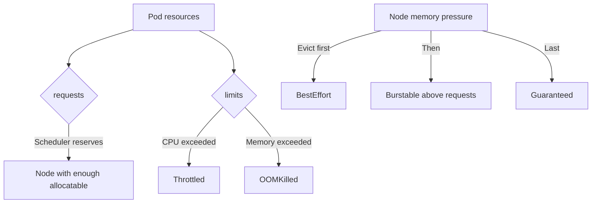

> 💡 **Quick Answer:** `resources.requests` is what the scheduler reserves on a node for the container; `resources.limits` is the runtime ceiling. Exceeding the **CPU** limit throttles the container; exceeding the **memory** limit gets it **OOMKilled**. Requests == limits for every container gives Guaranteed QoS (evicted last). A common production default: always set memory request and limit, set a CPU request, and skip the CPU limit on latency-sensitive services.
>
> **Key command:** `kubectl get pod <pod> -o jsonpath='{.status.qosClass}'`

## The Problem

Pods get OOMKilled, throttled, evicted or stuck Pending because requests and limits are missing, mismatched, or copy-pasted without matching actual usage. Over-requesting wastes capacity just as badly as under-requesting destabilizes nodes.

## Set Requests and Limits

```yaml
apiVersion: v1
kind: Pod
metadata:
  name: my-app
spec:
  containers:
    - name: app
      image: my-app:v1
      resources:
        requests:          # Reserved for scheduling
          cpu: 250m        # 0.25 core
          memory: 256Mi
        limits:            # Enforced at runtime
          cpu: "1"         # Throttled above 1 core
          memory: 512Mi    # OOMKilled above 512Mi
```

| Resource | Units | Examples |
|----------|-------|---------|
| CPU | Cores or millicores | `100m` = 0.1 core, `1` = `1000m`, `1.5` = `1500m` |
| Memory | Bytes with binary (`Ki`, `Mi`, `Gi`) or decimal (`k`, `M`, `G`) suffixes | `256Mi` = 268,435,456 bytes; `256M` = 256,000,000 bytes |

See [CPU 200m / memory 256Mi format](/recipes/configuration/kubernetes-resource-limits-cpu-memory-format/) for unit conversions and the `Mi` vs `M` pitfall.

Defaulting rules:
- Only a limit set → the request defaults to the limit.
- Only a request set → no limit (unless a `LimitRange` supplies one).
- Memory limit lower than request → the API server rejects the pod.

## QoS Classes

| Class | Condition | Eviction order under node pressure |
|-------|-----------|-------------------|
| **Guaranteed** | Every container has CPU and memory requests == limits | Last |
| **Burstable** | Not Guaranteed, but at least one container has a request or limit | Middle (those furthest above requests first) |
| **BestEffort** | No requests or limits on any container | First |

```yaml
# Guaranteed — databases, critical services
resources:
  requests: {cpu: 500m, memory: 512Mi}
  limits:   {cpu: 500m, memory: 512Mi}

# Burstable — typical web service, no CPU limit to avoid throttling
resources:
  requests: {cpu: 250m, memory: 256Mi}
  limits:   {memory: 512Mi}
```

```bash
kubectl get pod my-pod -o jsonpath='{.status.qosClass}'
kubectl describe pod my-pod | grep "QoS Class"
```

## CPU Throttling vs OOMKilled

```text
CPU (compressible):
  Enforced by CFS quota per 100ms period: limit 500m = 50ms of CPU time per 100ms.
  A multi-threaded burst can exhaust the quota early in the period and stall
  for the rest of it — p99 latency spikes even when average usage looks low.

Memory (incompressible):
  Working set above the limit -> kernel OOM killer -> container restarts
  (reason: OOMKilled, exit code 137).
```

```bash
# OOMKilled
kubectl get pod <name> -o jsonpath='{.status.containerStatuses[0].lastState.terminated.reason}'
kubectl describe pod <name> | grep -i -A3 "last state"

# Throttling (cgroup v2)
kubectl exec <pod> -- cat /sys/fs/cgroup/cpu.stat    # nr_throttled, throttled_usec

# Pending on resources
kubectl describe pod <name> | grep -i insufficient
```

`kubectl top pod` shows the working set sampled every ~15s; short spikes, child processes and tmpfs (`emptyDir.medium: Memory`) count against the limit and can OOMKill a container that "only uses 400Mi".


```mermaid
graph TD
    A[Pod resources] --> B{requests}
    B -->|Scheduler reserves| C[Node with enough allocatable]
    A --> D{limits}
    D -->|CPU exceeded| E[Throttled]
    D -->|Memory exceeded| F[OOMKilled]
    G[Node memory pressure] -->|Evict first| H[BestEffort]
    G -->|Then| I[Burstable above requests]
    G -->|Last| J[Guaranteed]
```

## Init Containers, Ephemeral Storage and GPUs

A pod's effective request is `max(largest init container request, sum of app container requests)` per resource — a heavy init container can make a pod unschedulable even if the app is small.

```yaml
resources:
  requests:
    cpu: 500m
    memory: 256Mi
    ephemeral-storage: 1Gi     # Container logs, writable layer, emptyDir
  limits:
    memory: 512Mi
    ephemeral-storage: 2Gi     # Exceeding it evicts the pod
```

Extended resources such as GPUs are integers and can't be overcommitted — set them in `limits` (the request defaults to the same value):

```yaml
resources:
  limits:
    nvidia.com/gpu: 1
    memory: 8Gi
  requests:
    cpu: "2"
    memory: 8Gi
```

## Namespace Defaults and Caps

`LimitRange` fills in defaults and enforces per-container bounds; `ResourceQuota` caps the namespace total:

```yaml
apiVersion: v1
kind: LimitRange
metadata: {name: default-limits, namespace: production}
spec:
  limits:
    - type: Container
      default:        {memory: 256Mi, cpu: 500m}   # Default limits
      defaultRequest: {memory: 128Mi, cpu: 100m}
      min:            {memory: 64Mi,  cpu: 50m}
      max:            {memory: 2Gi,   cpu: "2"}
---
apiVersion: v1
kind: ResourceQuota
metadata: {name: compute-quota, namespace: production}
spec:
  hard: {requests.cpu: "10", requests.memory: 20Gi, limits.cpu: "20", limits.memory: 40Gi, pods: "50"}
```

Once a quota covers `requests.cpu`/`limits.memory` etc., pods without those fields are rejected — pair every quota with a LimitRange.

## Right-Sizing

Start from measured usage, not guesses:

```bash
kubectl top pods -n production --containers
kubectl describe vpa my-app-vpa      # Target: cpu 120m, memory 200Mi -> use as requests
```

```promql
# CPU usage / request per container
sum by (namespace, pod, container) (rate(container_cpu_usage_seconds_total{container!=""}[5m]))
  / sum by (namespace, pod, container) (kube_pod_container_resource_requests{resource="cpu"})

# Memory working set / request
sum by (namespace, pod, container) (container_memory_working_set_bytes{container!=""})
  / sum by (namespace, pod, container) (kube_pod_container_resource_requests{resource="memory"})
```

Ratios consistently below 0.5 mean over-provisioning; memory near 1.0 of the *limit* means OOMKill risk. A [VPA](/recipes/autoscaling/kubernetes-vertical-pod-autoscaler-vpa/) in `Off` mode gives per-container targets.

## Best Practices

- **Always set memory requests and limits** — an unbounded container can starve the node
- **CPU limits are optional** — skip them for latency-sensitive services; keep them for noisy batch jobs or strict multi-tenancy
- **Guaranteed QoS for databases and critical services**
- **LimitRange in every namespace** so a missing resource block doesn't become BestEffort
- **Re-check after code changes** — memory/CPU profiles drift

## Frequently Asked Questions

### What is the difference between requests and limits?

Requests are reserved capacity used by the scheduler to place the pod and by the kubelet to rank eviction. Limits are hard ceilings enforced by the container runtime through cgroups: CPU is throttled, memory triggers an OOM kill.

### Should I always set CPU limits?

Not necessarily. CPU limits cause CFS throttling, which hurts tail latency even at low average usage. Many teams set CPU requests on everything and CPU limits only on batch or untrusted workloads. Memory limits should always be set.

### What happens if I don't set requests?

If no limits are set either, the pod is BestEffort: the scheduler reserves nothing, it's evicted first under pressure, and a LimitRange default (if present) is applied. If only a limit is set, the request defaults to the limit.

### What are good default values?

Base requests on observed steady-state usage (P90 CPU, peak working-set memory) and set the memory limit about 1.5-2× the request for Burstable workloads, or equal to the request for Guaranteed. Refine with monitoring or VPA recommendations.

### Why was my container OOMKilled below its limit in kubectl top?

`kubectl top` samples periodically and misses short spikes; page cache under pressure, child processes and memory-backed `emptyDir` also count against the cgroup limit.
