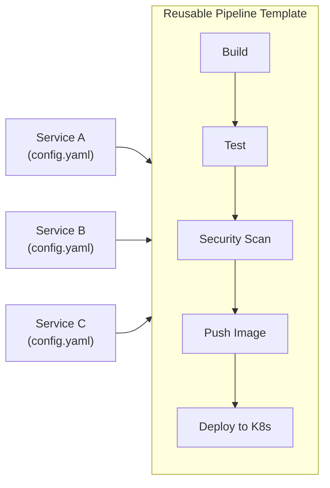

> 💡 **Quick Answer:** Build one CI/CD pipeline template, reuse it across all services. Each new app only needs a small config file (image name, port, replicas) — the pipeline handles build, test, scan, push, and deploy. That's how you go from "provisioning takes days" to "deploy in minutes."

## The Problem

Without standardized pipelines, every team writes their own CI/CD from scratch — different tools, different patterns, different bugs. With a reusable template, new services inherit battle-tested deployment automation for free.



## GitHub Actions: Reusable Workflow

**`.github/workflows/deploy-template.yaml`** (in a shared repo):

```yaml
name: Build and Deploy to Kubernetes
on:
  workflow_call:
    inputs:
      app-name:
        required: true
        type: string
      namespace:
        required: true
        type: string
      port:
        required: false
        type: number
        default: 8080
      replicas:
        required: false
        type: number
        default: 3
    secrets:
      REGISTRY_TOKEN:
        required: true
      KUBECONFIG:
        required: true

jobs:
  build-and-deploy:
    runs-on: ubuntu-latest
    steps:
      - uses: actions/checkout@v4

      - name: Build image
        run: |
          docker build -t registry.example.com/${{ inputs.app-name }}:${{ github.sha }} .
          docker push registry.example.com/${{ inputs.app-name }}:${{ github.sha }}

      - name: Security scan
        uses: aquasecurity/trivy-action@master
        with:
          image-ref: registry.example.com/${{ inputs.app-name }}:${{ github.sha }}
          exit-code: 1
          severity: CRITICAL,HIGH

      - name: Deploy to Kubernetes
        run: |
          kubectl set image deployment/${{ inputs.app-name }} \
            app=registry.example.com/${{ inputs.app-name }}:${{ github.sha }} \
            -n ${{ inputs.namespace }}
          kubectl rollout status deployment/${{ inputs.app-name }} \
            -n ${{ inputs.namespace }} --timeout=300s
```

**Per-service usage** (in each app's repo):

```yaml
# .github/workflows/deploy.yaml
name: Deploy
on:
  push:
    branches: [main]
jobs:
  deploy:
    uses: org/platform-pipelines/.github/workflows/deploy-template.yaml@main
    with:
      app-name: payments-api
      namespace: payments-prod
      port: 8080
      replicas: 5
    secrets:
      REGISTRY_TOKEN: ${{ secrets.REGISTRY_TOKEN }}
      KUBECONFIG: ${{ secrets.KUBECONFIG }}
```

**That's it.** New service? Copy 15 lines. Get build + scan + deploy for free.

## Tekton: Reusable Tasks and Pipelines

```yaml
# ClusterTask: build-and-push (shared across all teams)
apiVersion: tekton.dev/v1
kind: ClusterTask
metadata:
  name: build-and-push
spec:
  params:
    - name: image
    - name: context
      default: "."
  workspaces:
    - name: source
  steps:
    - name: build
      image: gcr.io/kaniko-project/executor:latest
      args:
        - --destination=$(params.image)
        - --context=$(workspaces.source.path)/$(params.context)
        - --cache=true
---
# Reusable Pipeline
apiVersion: tekton.dev/v1
kind: Pipeline
metadata:
  name: standard-deploy
spec:
  params:
    - name: repo-url
    - name: image
    - name: namespace
    - name: app-name
  workspaces:
    - name: shared-workspace
  tasks:
    - name: fetch
      taskRef:
        name: git-clone
        kind: ClusterTask
      params:
        - name: url
          value: $(params.repo-url)
      workspaces:
        - name: output
          workspace: shared-workspace

    - name: build
      runAfter: [fetch]
      taskRef:
        name: build-and-push
        kind: ClusterTask
      params:
        - name: image
          value: $(params.image)
      workspaces:
        - name: source
          workspace: shared-workspace

    - name: deploy
      runAfter: [build]
      taskRef:
        name: kubernetes-deploy
        kind: ClusterTask
      params:
        - name: namespace
          value: $(params.namespace)
        - name: deployment
          value: $(params.app-name)
        - name: image
          value: $(params.image)
```

```bash
# Any team triggers the same pipeline:
tkn pipeline start standard-deploy \
  --param repo-url=https://github.com/org/my-service \
  --param image=registry.example.com/my-service:latest \
  --param namespace=production \
  --param app-name=my-service \
  --workspace name=shared-workspace,claimName=pipeline-pvc
```

## GitLab CI: Include Templates

```yaml
# Shared template (in a templates repo)
# templates/deploy.gitlab-ci.yml
.deploy:
  stage: deploy
  image: bitnami/kubectl:latest
  script:
    - kubectl set image deployment/${APP_NAME} app=${CI_REGISTRY_IMAGE}:${CI_COMMIT_SHA} -n ${NAMESPACE}
    - kubectl rollout status deployment/${APP_NAME} -n ${NAMESPACE} --timeout=300s

.build:
  stage: build
  image: docker:latest
  services: [docker:dind]
  script:
    - docker build -t ${CI_REGISTRY_IMAGE}:${CI_COMMIT_SHA} .
    - docker push ${CI_REGISTRY_IMAGE}:${CI_COMMIT_SHA}
```

```yaml
# Per-service .gitlab-ci.yml (5 lines!)
include:
  - project: 'platform/ci-templates'
    file: 'templates/deploy.gitlab-ci.yml'

variables:
  APP_NAME: payments-api
  NAMESPACE: payments-prod

build:
  extends: .build

deploy:
  extends: .deploy
  only: [main]
```

## The Leverage Math

| Services | Without Templates | With Templates |
|----------|------------------|----------------|
| 1 | 8h (build pipeline from scratch) | 8h (build the template) |
| 2 | 16h | 8h + 15 min |
| 5 | 40h | 8h + 1h |
| 20 | 160h | 8h + 5h |
| 50 | 400h | 8h + 12h |

**Break-even: 2 services.** Everything after that is pure leverage.

## Common Issues

| Issue | Cause | Fix |
|-------|-------|-----|
| Template too rigid | Doesn't handle edge cases | Add optional parameters with sensible defaults |
| Version drift | Teams pinned to old template version | Use `@main` or auto-update dependabot |
| Secrets management | Each team manages differently | Standardize with External Secrets Operator |

## Best Practices

- **Build the template once, invest heavily in it** — it multiplies across every service
- **Sensible defaults** — port 8080, 3 replicas, CPU autoscaling — override only when needed
- **Include security scanning** — every service gets Trivy/Grype for free
- **Version your templates** — breaking changes need migration paths
- **Document with examples** — make it so easy that teams don't need to ask

## Key Takeaways

- One reusable pipeline template = all services get CI/CD for free
- New service deployment: copy 5-15 lines of config, push — done
- Break-even is 2 services; after that it's pure time savings
- The "K8s is complex" argument ignores that complexity is paid once, not per-service
- GitHub Actions `workflow_call`, GitLab `include`, Tekton ClusterTasks — all support this pattern
