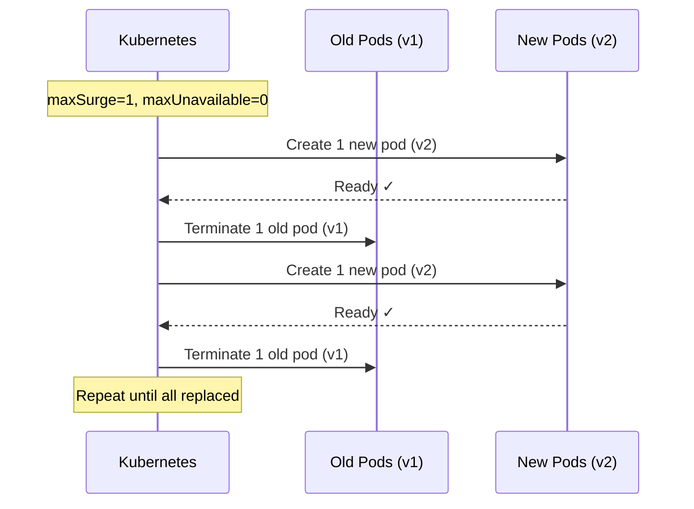

> 💡 **Quick Answer:** Rolling updates replace pods incrementally using `maxSurge` (extra pods during update) and `maxUnavailable` (pods that can be down), enabling zero-downtime deployments.

## The Problem

Deploying a new version of your application without configuration can cause:
- All pods replaced simultaneously (brief outage)
- Too-slow rollouts during incidents requiring quick fixes
- Resource spikes when too many extra pods are created
- Failed rollouts that take down the entire service

## The Solution

### Standard Rolling Update

```yaml
apiVersion: apps/v1
kind: Deployment
metadata:
  name: web-app
spec:
  replicas: 4
  strategy:
    type: RollingUpdate
    rollingUpdate:
      maxSurge: 1
      maxUnavailable: 0
  selector:
    matchLabels:
      app: web-app
  template:
    metadata:
      labels:
        app: web-app
    spec:
      containers:
        - name: app
          image: myapp:2.0.0
          ports:
            - containerPort: 8080
          readinessProbe:
            httpGet:
              path: /healthz
              port: 8080
            initialDelaySeconds: 5
            periodSeconds: 5
```

### Fast Rollout (for hotfixes)

```yaml
strategy:
  type: RollingUpdate
  rollingUpdate:
    maxSurge: "50%"
    maxUnavailable: "25%"
```

### Conservative Rollout (zero downtime)

```yaml
strategy:
  type: RollingUpdate
  rollingUpdate:
    maxSurge: 1
    maxUnavailable: 0
```

### Monitor and Control Rollouts

```bash
# Watch rollout progress
kubectl rollout status deployment/web-app

# Pause a problematic rollout
kubectl rollout pause deployment/web-app

# Resume after investigation
kubectl rollout resume deployment/web-app

# Rollback to previous version
kubectl rollout undo deployment/web-app

# Rollback to specific revision
kubectl rollout undo deployment/web-app --to-revision=3
```



## Common Issues

**Rollout stuck — new pods never become ready**
```bash
# Check pod status
kubectl get pods -l app=web-app
# Check events
kubectl describe deployment web-app
# Set deadline to auto-fail stuck rollouts
```

Add `progressDeadlineSeconds`:
```yaml
spec:
  progressDeadlineSeconds: 300  # Fail after 5 minutes
```

**maxSurge causes resource pressure**
If nodes are near capacity, `maxSurge` pods may stay Pending. Use `maxUnavailable: 1` with `maxSurge: 0` on tight clusters.

**Rollout triggers on every configmap change**
Use checksums in annotations to trigger rollouts only on actual config changes:
```yaml
template:
  metadata:
    annotations:
      checksum/config: {{ sha256sum .Values.config }}
```

## Best Practices

- Always set `readinessProbe` — rolling updates depend on readiness to proceed
- Use `maxSurge: 1, maxUnavailable: 0` for zero-downtime in production
- Use `maxSurge: 50%, maxUnavailable: 25%` for fast rollouts in staging
- Set `progressDeadlineSeconds` to auto-detect stuck rollouts
- Keep `revisionHistoryLimit` reasonable (default 10) for quick rollbacks
- Combine with PDBs to protect during node disruptions
- Use `kubectl rollout pause` to implement canary-like manual gates

## Key Takeaways

- `maxSurge` controls how many extra pods can exist during rollout
- `maxUnavailable` controls how many pods can be down simultaneously  
- Setting `maxUnavailable: 0` guarantees zero capacity loss but slower rollouts
- Percentage values are relative to `replicas` count
- Readiness probes gate the rollout — unhealthy pods block progress
- `progressDeadlineSeconds` prevents rollouts from hanging forever
- `kubectl rollout undo` instantly reverts to the previous ReplicaSet
