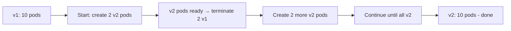

> 💡 **Quick Answer:** Configure rolling update strategies for zero-downtime deployments in Kubernetes. Covers maxSurge, maxUnavailable, rollback, and deployment health checks.

## The Problem

This is one of the most searched Kubernetes topics. Having a comprehensive, well-structured guide helps both beginners and experienced users quickly find what they need.

## The Solution

### Rolling Update Configuration

```yaml
apiVersion: apps/v1
kind: Deployment
metadata:
  name: web-app
spec:
  replicas: 10
  strategy:
    type: RollingUpdate
    rollingUpdate:
      maxSurge: 25%          # Max extra pods during update (2-3 extra)
      maxUnavailable: 25%    # Max pods unavailable during update
  template:
    spec:
      containers:
        - name: app
          image: web-app:v2
          readinessProbe:     # Critical for safe rollouts!
            httpGet:
              path: /ready
              port: 8080
            initialDelaySeconds: 5
            periodSeconds: 5
          livenessProbe:
            httpGet:
              path: /healthz
              port: 8080
            initialDelaySeconds: 15
  minReadySeconds: 10         # Wait 10s after ready before continuing
  revisionHistoryLimit: 10    # Keep 10 ReplicaSets for rollback
```

### Perform a Rolling Update

```bash
# Update image
kubectl set image deployment/web-app app=web-app:v2

# Watch rollout
kubectl rollout status deployment/web-app

# Rollout history
kubectl rollout history deployment/web-app

# Rollback
kubectl rollout undo deployment/web-app
kubectl rollout undo deployment/web-app --to-revision=3

# Pause/resume (canary-like)
kubectl rollout pause deployment/web-app
# Check new pods manually
kubectl rollout resume deployment/web-app
```

### Strategy Comparison

| Strategy | Zero Downtime | Extra Resources | Rollback Speed |
|----------|--------------|-----------------|----------------|
| RollingUpdate | ✅ Yes | 25% extra | Seconds (undo) |
| Recreate | ❌ No | None | Slow (redeploy) |



## Frequently Asked Questions

### What happens if a rolling update fails?

If new pods fail readiness probes, the rollout stalls (doesn't proceed). Existing v1 pods keep serving traffic. Run `kubectl rollout undo` to roll back.

### How do I do blue-green deployments?

Switch the Service selector between v1 and v2 Deployments. Or use Argo Rollouts for automated blue-green with analysis.

## Best Practices

- **Start simple** — use the basic form first, add complexity as needed
- **Be consistent** — follow naming conventions across your cluster
- **Document your choices** — add annotations explaining why, not just what
- **Monitor and iterate** — review configurations regularly

## Key Takeaways

- This is fundamental Kubernetes knowledge every engineer needs
- Start with the simplest approach that solves your problem
- Use `kubectl explain` and `kubectl describe` when unsure
- Practice in a test cluster before applying to production
