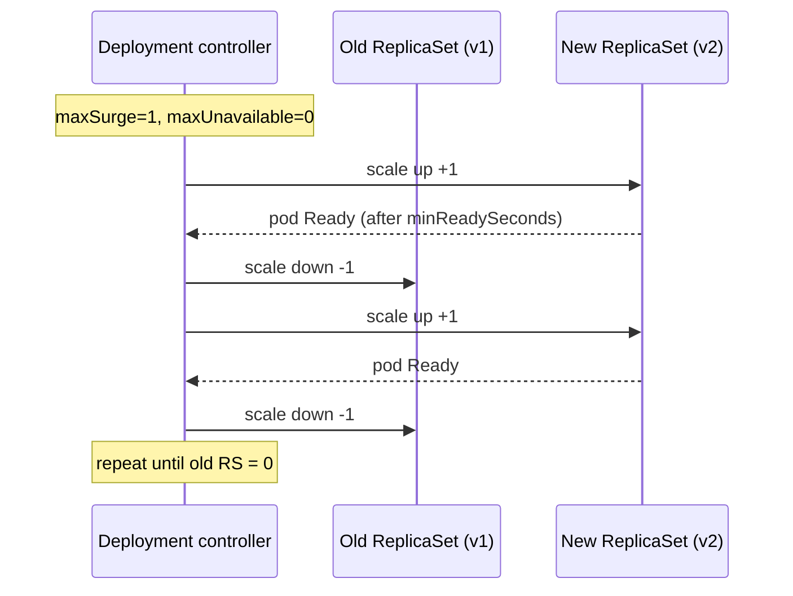

> 💡 **Quick Answer:** `RollingUpdate` is the default Deployment strategy: `maxSurge: 25%` (extra pods allowed above `replicas`) and `maxUnavailable: 25%` (pods allowed below `replicas`). For zero capacity loss use `maxSurge: 1, maxUnavailable: 0` plus a readiness probe and a `preStop` sleep. Trigger with `kubectl set image deployment/web web=myapp:v2`, watch with `kubectl rollout status deployment/web`, revert with `kubectl rollout undo deployment/web`.

## Rolling Update Strategy

```yaml
apiVersion: apps/v1
kind: Deployment
metadata:
  name: web
spec:
  replicas: 10
  revisionHistoryLimit: 10        # old ReplicaSets kept for rollback (default 10)
  minReadySeconds: 10             # pod must stay Ready 10s before it counts as available
  progressDeadlineSeconds: 300    # mark rollout failed after 5 min without progress (default 600)
  strategy:
    type: RollingUpdate
    rollingUpdate:
      maxSurge: 25%               # 10 * 25% = 2.5 → rounds UP to 3 → max 13 pods
      maxUnavailable: 25%         # 10 * 25% = 2.5 → rounds DOWN to 2 → min 8 available
  selector:
    matchLabels:
      app: web
  template:
    metadata:
      labels:
        app: web
    spec:
      containers:
        - name: web
          image: myapp:v2
          ports:
            - containerPort: 8080
          readinessProbe:         # the rollout only advances on Ready pods
            httpGet:
              path: /ready
              port: 8080
            periodSeconds: 5
```

`maxSurge` and `maxUnavailable` accept integers or percentages of `replicas`; they can't both be 0. Percentages: surge rounds up, unavailable rounds down.

### How the rollout proceeds

```text
10 replicas, maxSurge=3, maxUnavailable=2

v1 v1 v1 v1 v1 v1 v1 v1 v1 v1          start
v1 v1 v1 v1 v1 v1 v1 v1 v2 v2 v2       +3 new (13 total), 2 old terminating
v1 v1 v1 v1 v1 v2 v2 v2 v2 v2 v2       more old removed as v2 pods become Ready
v2 v2 v2 v2 v2 v2 v2 v2 v2 v2          done: new ReplicaSet at 10, old at 0
```


```mermaid
sequenceDiagram
    participant K as Deployment controller
    participant Old as Old ReplicaSet (v1)
    participant New as New ReplicaSet (v2)
    Note over K: maxSurge=1, maxUnavailable=0
    K->>New: scale up +1
    New-->>K: pod Ready (after minReadySeconds)
    K->>Old: scale down -1
    K->>New: scale up +1
    New-->>K: pod Ready
    K->>Old: scale down -1
    Note over K: repeat until old RS = 0
```

## maxSurge / maxUnavailable Presets

| Goal | maxSurge | maxUnavailable | Behaviour |
|------|:--------:|:--------------:|-----------|
| Zero capacity loss (production) | `1` or `25%` | `0` | New pod must be Ready before an old one is removed |
| Tight cluster, no spare capacity | `0` | `1` | Kill one, start one — no extra pods, temporary capacity dip |
| Balanced | `1` | `1` | Replace one while starting one |
| Fast (staging, hotfix) | `50%` | `25%`–`50%` | Large batches, visible capacity dip |
| Default | `25%` | `25%` | Good for most stateless apps with headroom |
| Blue-green-like | `100%` | `0` | Full new ReplicaSet comes up before any old pod goes; doubles resources briefly |

With `maxUnavailable: 0`, surge pods that stay Pending (no node capacity, quota) block the rollout forever. On full clusters use `maxSurge: 0, maxUnavailable: 1` or add capacity.

### Recreate

```yaml
strategy:
  type: Recreate   # all old pods terminate before any new pod starts — guaranteed downtime
```

Use only when two versions can't coexist: a `ReadWriteOnce` PVC mounted by a single-replica Deployment, exclusive DB migrations, or incompatible protocol changes. Stateful clustered software belongs in a StatefulSet, not a Recreate Deployment.

## Zero-Downtime Checklist

`maxUnavailable: 0` alone doesn't prevent errors. Old pods get killed while still receiving traffic unless you drain them:

```yaml
spec:
  strategy:
    type: RollingUpdate
    rollingUpdate:
      maxSurge: 1
      maxUnavailable: 0
  template:
    spec:
      terminationGracePeriodSeconds: 60     # > preStop + longest request
      containers:
        - name: app
          image: myapp:v2
          readinessProbe:                   # 1. no traffic until ready
            httpGet: {path: /ready, port: 8080}
            periodSeconds: 5
            failureThreshold: 3
          lifecycle:
            preStop:                        # 2. keep serving while endpoints update
              sleep:
                seconds: 10                 # native sleep action (1.30+); older: exec ["sh","-c","sleep 10"]
```

```text
Pod termination timeline
t=0    pod marked Terminating → removed from EndpointSlices (async)
t=0    preStop sleep 10 starts; pod still serves in-flight and late-routed requests
t=1-5  kube-proxy / ingress / cloud LB stop sending new connections
t=10   preStop ends → SIGTERM → app stops accepting, drains, exits
t=60   terminationGracePeriodSeconds → SIGKILL if still running
```

3. The app must handle SIGTERM (stop accepting, finish in-flight, exit). 4. Set resource requests and spread replicas across nodes/zones (`topologySpreadConstraints` or `podAntiAffinity` on `kubernetes.io/hostname`) so one node loss mid-rollout can't take out every Ready pod. 5. Add a [PodDisruptionBudget](/recipes/deployments/pod-disruption-budget-config/) so node drains don't stack on top of the rollout. Full details: [graceful shutdown guide](/recipes/deployments/kubernetes-graceful-shutdown-guide/). Verify by running `k6` or `hey` against the Service during `kubectl rollout restart`.

## Trigger, Monitor, Pause

```bash
# Trigger (any pod template change creates a new ReplicaSet)
kubectl set image deployment/web web=myapp:v2
kubectl annotate deployment/web kubernetes.io/change-cause="v2: security patch" --overwrite

# Watch
kubectl rollout status deployment/web --timeout=5m    # non-zero exit on failure → use in CI
kubectl get rs -l app=web -w

# Manual gate: pause after the first batch, inspect, resume
kubectl rollout pause deployment/web
kubectl rollout resume deployment/web

# Restart pods without changing the image
kubectl rollout restart deployment/web
```

`kubectl ... --record` is deprecated; set `kubernetes.io/change-cause` explicitly.

## Rollback

```bash
kubectl rollout history deployment/web
# REVISION  CHANGE-CAUSE
# 2         v1.9 baseline
# 3         v2: security patch

kubectl rollout history deployment/web --revision=2   # inspect the template
kubectl rollout undo deployment/web                   # previous revision
kubectl rollout undo deployment/web --to-revision=2
```

Rollback is itself a rolling update to the old ReplicaSet, governed by the same `maxSurge`/`maxUnavailable`. It only works for revisions still within `revisionHistoryLimit`. In GitOps setups revert the commit instead, or Argo CD / Flux will re-apply the bad version.

## Common Issues

**Rollout stuck at "N of M updated replicas are available"** — new pods fail readiness or are Pending. `kubectl get pods -l app=web`, `kubectl describe pod <new-pod>`. After `progressDeadlineSeconds` the Deployment gets `Progressing=False, reason=ProgressDeadlineExceeded` — it does **not** auto-rollback. See [stuck rollout troubleshooting](/recipes/deployments/rollout-stuck-troubleshooting/).

**Surge pods Pending** — no room for `maxSurge` pods. Lower surge, set `maxSurge: 0, maxUnavailable: 1`, or scale the node pool.

**502s / connection resets during rollout** — missing readiness probe or `preStop` sleep; grace period shorter than drain time.

**ConfigMap change doesn't roll pods** — ConfigMaps aren't part of the pod template. Add a checksum annotation so a config change changes the template (Helm):

```yaml
template:
  metadata:
    annotations:
      checksum/config: {{ include (print $.Template.BasePath "/configmap.yaml") . | sha256sum }}
```

**HPA fights the rollout** — never set `spec.replicas` in manifests managed alongside an HPA; the percentages are computed from the current replica count.

## Frequently Asked Questions

### What are the default maxSurge and maxUnavailable values?

Both default to `25%`. With 4 replicas that means 1 extra pod and 1 unavailable pod at a time; with 10 replicas, 3 extra (rounded up) and 2 unavailable (rounded down).

### What is the difference between maxSurge and maxUnavailable?

`maxSurge` is how many pods may exist **above** `replicas` during the update (speed, extra resources). `maxUnavailable` is how many pods may be **below** `replicas` (capacity loss). Setting `maxUnavailable: 0` keeps full capacity; setting `maxSurge: 0` avoids extra resources.

### How do I get zero downtime with a rolling update?

Use `maxSurge: 1` (or 25%) with `maxUnavailable: 0`, a readiness probe, a `preStop` sleep of 5–15 s, SIGTERM handling in the app and a `terminationGracePeriodSeconds` longer than preStop + drain time.

### What triggers a rolling update?

Any change to `.spec.template`: image, env vars, resources, labels/annotations on the pod template. Changing `replicas`, `strategy` or Deployment metadata does **not** create a new ReplicaSet. `kubectl rollout restart` works by stamping a `kubectl.kubernetes.io/restartedAt` template annotation.

### Can maxSurge and maxUnavailable both be 0?

No. The API rejects it: the controller could neither add a new pod nor remove an old one, so the rollout could never progress.

### Why do I still get 502s during a rolling update?

Usually one of the readiness probe, `preStop` sleep or `maxUnavailable: 0` is missing, or the app exits immediately on SIGTERM. All are needed; see the zero-downtime checklist above.

### What's the difference between RollingUpdate and Recreate?

RollingUpdate replaces pods gradually and keeps the app serving; Recreate terminates all old pods first, causing downtime. Use Recreate only when two versions must never run at the same time.

### Does kubectl rollout undo cause downtime?

No — it performs a normal rolling update back to the previous ReplicaSet using the same strategy settings.

### How do I do blue-green or canary instead?

Rolling updates can't split traffic by percentage. Use two Deployments with Service selectors or weighted routing — see [deployment strategies](/recipes/deployments/deployment-strategies/).
