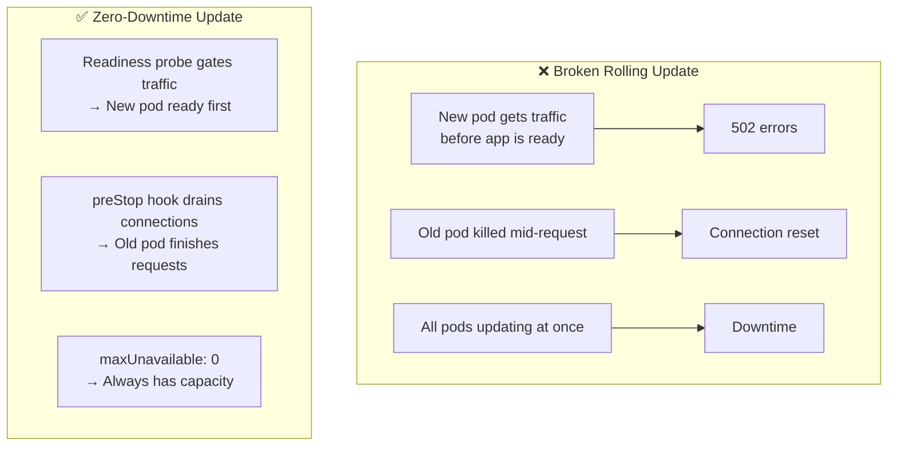

> 💡 **Quick Answer:** Zero-downtime rolling updates require: (1) readiness probe to delay traffic until ready, (2) \`preStop\` lifecycle hook to drain connections before termination, (3) proper \`maxSurge\`/\`maxUnavailable\` settings, and (4) \`terminationGracePeriodSeconds\` long enough for in-flight requests to complete.

## The Problem

A basic rolling update creates new pods and kills old ones. But without proper configuration, users experience errors during the transition — new pods receive traffic before they're ready, old pods are killed while handling requests, or all pods update simultaneously causing a brief outage.



## The Solution

### Complete Zero-Downtime Deployment

```yaml
apiVersion: apps/v1
kind: Deployment
metadata:
  name: web-app
spec:
  replicas: 3
  strategy:
    type: RollingUpdate
    rollingUpdate:
      maxSurge: 1            # Create 1 extra pod during update
      maxUnavailable: 0      # Never remove a pod until new one is ready
  template:
    spec:
      terminationGracePeriodSeconds: 60   # Allow 60s for graceful shutdown
      containers:
        - name: app
          image: myapp:v2.0
          ports:
            - containerPort: 8080

          # 1. READINESS PROBE: Don't send traffic until ready
          readinessProbe:
            httpGet:
              path: /healthz
              port: 8080
            initialDelaySeconds: 5
            periodSeconds: 5
            failureThreshold: 3

          # 2. LIVENESS PROBE: Restart if stuck
          livenessProbe:
            httpGet:
              path: /livez
              port: 8080
            initialDelaySeconds: 15
            periodSeconds: 10
            failureThreshold: 3

          # 3. PRESTOP HOOK: Drain connections before termination
          lifecycle:
            preStop:
              exec:
                command: ["sh", "-c", "sleep 10"]
                # Why: Kubernetes removes pod from endpoints,
                # but iptables/IPVS rules take time to propagate.
                # sleep gives kube-proxy time to update.
```

### Rolling Update Parameters

| Parameter | Default | Recommended | Effect |
|-----------|:-------:|:-----------:|--------|
| \`maxSurge\` | 25% | \`1\` or \`25%\` | Extra pods created during update |
| \`maxUnavailable\` | 25% | \`0\` | Pods removed before new ones ready |

```yaml
# Conservative (safest — always at full capacity)
maxSurge: 1
maxUnavailable: 0
# Process: create 1 new → wait until ready → terminate 1 old → repeat

# Balanced (faster, slight capacity reduction)
maxSurge: 1
maxUnavailable: 1
# Process: create 1 new + terminate 1 old simultaneously

# Fast (for non-critical workloads)
maxSurge: "50%"
maxUnavailable: "50%"
# Process: replace half the fleet at once
```

### The preStop Hook Explained

```
Timeline of pod termination:

t=0:  Pod marked for termination
t=0:  preStop hook starts (sleep 10)
t=0:  Pod removed from Service endpoints (async)
t=1-5: kube-proxy updates iptables rules on all nodes
t=10: preStop completes → SIGTERM sent to app
t=10-50: App handles SIGTERM, finishes in-flight requests
t=60: terminationGracePeriodSeconds reached → SIGKILL

The sleep(10) in preStop ensures iptables are updated
BEFORE the app starts shutting down.
```

### Application-Side Graceful Shutdown

```python
# Python Flask example
import signal
import sys

def graceful_shutdown(signum, frame):
    print("SIGTERM received, finishing in-flight requests...")
    # Stop accepting new connections
    server.shutdown()
    # Wait for current requests to complete
    sys.exit(0)

signal.signal(signal.SIGTERM, graceful_shutdown)
```

```go
// Go example
ctx, stop := signal.NotifyContext(context.Background(), syscall.SIGTERM)
defer stop()

srv := &http.Server{Addr: ":8080"}
go srv.ListenAndServe()

<-ctx.Done()
// Graceful shutdown with 30s timeout
shutdownCtx, cancel := context.WithTimeout(context.Background(), 30*time.Second)
defer cancel()
srv.Shutdown(shutdownCtx)
```

### Monitor Rolling Update Progress

```bash
# Watch rollout status
kubectl rollout status deployment/web-app
# Waiting for deployment "web-app" rollout to finish: 1 of 3 updated replicas are available...
# deployment "web-app" successfully rolled out

# Watch pods during update
kubectl get pods -w -l app=web-app
# NAME                       READY   STATUS        AGE
# web-app-v1-abc12           1/1     Running       1h
# web-app-v1-def34           1/1     Running       1h
# web-app-v1-ghi56           1/1     Running       1h
# web-app-v2-jkl78           0/1     ContainerCreating  0s
# web-app-v2-jkl78           1/1     Running            5s    ← ready
# web-app-v1-abc12           1/1     Terminating        1h    ← old pod draining

# Rollback if needed
kubectl rollout undo deployment/web-app
```

## Common Issues

| Issue | Cause | Fix |
|-------|-------|-----|
| 502 during update | No readiness probe → traffic sent to unready pods | Add readiness probe |
| Connection reset on update | No preStop hook → pod killed mid-request | Add \`preStop: sleep 10\` |
| All pods down briefly | \`maxUnavailable: 100%\` | Set \`maxUnavailable: 0\` |
| Update takes too long | \`maxSurge: 1\` with many replicas | Increase maxSurge to 25-50% |
| Rollout stuck | Readiness probe failing on new version | Check new image, rollback with \`kubectl rollout undo\` |
| SIGKILL before cleanup done | \`terminationGracePeriodSeconds\` too short | Increase to cover max request duration |

## Best Practices

- **Always set \`maxUnavailable: 0\`** for user-facing services — guarantees full capacity
- **Always add readiness probe** — the single most important zero-downtime setting
- **Always add \`preStop: sleep 10\`** — gives iptables time to propagate
- **Set \`terminationGracePeriodSeconds\`** to longest expected request + preStop duration
- **Test with load testing** — run \`hey\` or \`k6\` during updates to verify zero errors
- **Use \`kubectl rollout status\`** in CI/CD — waits for successful rollout

## Key Takeaways

- Zero-downtime = readiness probe + preStop hook + maxUnavailable: 0
- \`preStop: sleep 10\` is essential — bridges the gap between endpoint removal and actual termination
- \`maxSurge\` controls speed, \`maxUnavailable\` controls safety
- Application must handle SIGTERM for graceful shutdown
- \`terminationGracePeriodSeconds\` must exceed preStop + app shutdown time
- Always verify with load testing during updates — theory isn't enough
