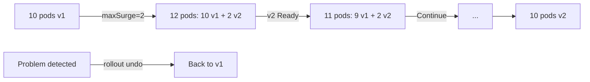

> 💡 **Quick Answer:** deployments

## The Problem

This is one of the most searched Kubernetes topics with thousands of monthly searches. A comprehensive, production-ready guide prevents hours of trial and error.

## The Solution

### Rolling Update Configuration

```yaml
apiVersion: apps/v1
kind: Deployment
metadata:
  name: web-app
spec:
  replicas: 10
  strategy:
    type: RollingUpdate
    rollingUpdate:
      maxSurge: 2              # Create 2 extra pods during update
      maxUnavailable: 1        # Remove at most 1 old pod at a time
  minReadySeconds: 10          # Wait 10s after Ready before continuing
  revisionHistoryLimit: 5      # Keep 5 old ReplicaSets for rollback
```

### maxSurge vs maxUnavailable

| Setting | Effect | Speed | Safety |
|---------|--------|-------|--------|
| maxSurge=25%, maxUnavailable=25% | Default — fast, some capacity reduction | Fast | Medium |
| maxSurge=1, maxUnavailable=0 | Never reduce capacity — safest | Slow | High |
| maxSurge=50%, maxUnavailable=50% | Fast — halves capacity temporarily | Very fast | Low |
| maxSurge=100%, maxUnavailable=0 | Blue-green style (double resources) | Medium | High |

### Rollback

```bash
# Check rollout status
kubectl rollout status deployment/web-app

# View history
kubectl rollout history deployment/web-app
kubectl rollout history deployment/web-app --revision=3

# Rollback to previous
kubectl rollout undo deployment/web-app

# Rollback to specific revision
kubectl rollout undo deployment/web-app --to-revision=2

# Pause / Resume (canary-style)
kubectl rollout pause deployment/web-app
# Inspect new pods...
kubectl rollout resume deployment/web-app
```

### Update Triggers

```bash
# Update image
kubectl set image deployment/web-app app=my-app:v2

# Update env var (triggers rollout)
kubectl set env deployment/web-app LOG_LEVEL=debug

# Restart without changes (force new pods)
kubectl rollout restart deployment/web-app

# Apply manifest changes
kubectl apply -f deployment.yaml
```



## Frequently Asked Questions

### What triggers a rolling update?

Changes to `.spec.template` (container image, env vars, resources, labels). Changes to replicas, strategy, or metadata do NOT trigger a rollout.

### maxSurge=0 and maxUnavailable=0?

Invalid — at least one must be >0. Otherwise the deployment can't make progress (can't add new pods AND can't remove old pods).

## Best Practices

- Start with the simplest configuration that solves your problem
- Test in staging before production
- Use `kubectl describe` and events for troubleshooting
- Document team conventions for consistency

## Key Takeaways

- This is fundamental Kubernetes operational knowledge
- Follow established conventions and recommended labels
- Monitor and iterate based on real production behavior
- Automate repetitive tasks to reduce human error
