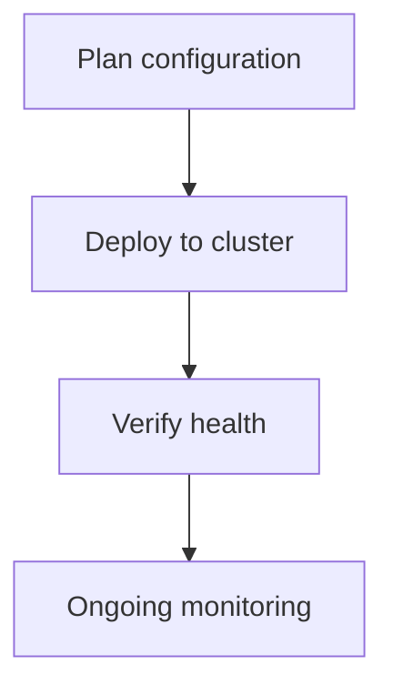

> 💡 **Quick Answer:** Deploy Rook-Ceph for enterprise storage on Kubernetes. Block, file, and object storage, erasure coding, and multi-site replication for production workloads.

## The Problem

Production Kubernetes environments need rook ceph storage guide for reliability, security, and operational efficiency. Without proper configuration, teams face downtime, security gaps, or operational overhead.

## The Solution

### Configuration

```yaml
# Rook Ceph Storage Guide configuration
apiVersion: v1
kind: ConfigMap
metadata:
  name: kubernetes-rook-ceph-guide-config
data:
  config.yaml: |
    enabled: true
```

### Deployment Steps

```bash
# Apply configuration
kubectl apply -f kubernetes-rook-ceph-guide.yaml

# Verify
kubectl get all -l app=rook-ceph-guide
```



## Common Issues

**Resources not created**

Check RBAC permissions and namespace exists. Use `kubectl auth can-i create <resource>` to verify.

**Configuration drift**

Use GitOps (ArgoCD/Flux) to prevent manual changes from diverging from desired state.

## Best Practices

- Test in staging before production
- Version all configuration in Git
- Monitor metrics after deployment
- Document operational procedures
- Automate with CI/CD pipelines

## Key Takeaways

- Rook Ceph Storage Guide improves Kubernetes operational maturity
- Start simple, iterate based on real-world experience
- Combine with observability for full visibility
- Automate repetitive operations
- Keep security as a first-class concern
