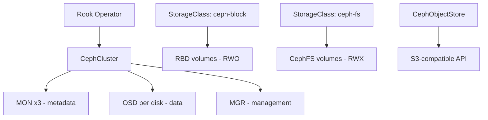

> 💡 **Quick Answer:** Deploy Rook-Ceph on Kubernetes for distributed block, file, and object storage. Covers installation, CephCluster configuration, StorageClasses, and monitoring.

## The Problem

Engineers frequently search for this topic but find scattered, incomplete guides. This recipe provides a comprehensive, production-ready reference.

## The Solution

### Install Rook-Ceph

```bash
helm repo add rook-release https://charts.rook.io/release
helm install rook-ceph rook-release/rook-ceph \
  --namespace rook-ceph --create-namespace
```

```yaml
# CephCluster configuration
apiVersion: ceph.rook.io/v1
kind: CephCluster
metadata:
  name: rook-ceph
  namespace: rook-ceph
spec:
  cephVersion:
    image: quay.io/ceph/ceph:v18
  dataDirHostPath: /var/lib/rook
  mon:
    count: 3
    allowMultiplePerNode: false
  storage:
    useAllNodes: true
    useAllDevices: true        # Auto-detect available disks
    # Or specify devices:
    # nodes:
    #   - name: worker-1
    #     devices:
    #       - name: sdb
    #       - name: sdc
  resources:
    mgr:
      requests:
        cpu: 500m
        memory: 512Mi
    osd:
      requests:
        cpu: 500m
        memory: 2Gi
```

### StorageClasses

```yaml
# Block storage (RWO — databases)
apiVersion: storage.k8s.io/v1
kind: StorageClass
metadata:
  name: ceph-block
provisioner: rook-ceph.rbd.csi.ceph.com
parameters:
  pool: replicapool
  clusterID: rook-ceph
  csi.storage.k8s.io/fstype: ext4
reclaimPolicy: Retain
---
# Shared filesystem (RWX — shared data)
apiVersion: storage.k8s.io/v1
kind: StorageClass
metadata:
  name: ceph-filesystem
provisioner: rook-ceph.cephfs.csi.ceph.com
parameters:
  pool: cephfs-data0
  clusterID: rook-ceph
  fsName: myfs
---
# Object storage (S3-compatible)
apiVersion: ceph.rook.io/v1
kind: CephObjectStore
metadata:
  name: my-store
  namespace: rook-ceph
spec:
  metadataPool:
    replicated:
      size: 3
  dataPool:
    replicated:
      size: 3
  gateway:
    port: 80
    instances: 2
```



## Frequently Asked Questions

### Minimum nodes for Rook-Ceph?

3 nodes minimum for production (3 MONs for quorum). Each node needs at least one raw disk (no filesystem). Rook-Ceph is overkill for small clusters — use NFS or cloud storage instead.


## Best Practices

- Start with the simplest approach that solves your problem
- Test thoroughly in staging before production
- Monitor and iterate based on real metrics
- Document decisions for your team

## Key Takeaways

- This is essential Kubernetes operational knowledge
- Production-readiness requires proper configuration and monitoring
- Use `kubectl describe` and logs for troubleshooting
- Automate where possible to reduce human error
