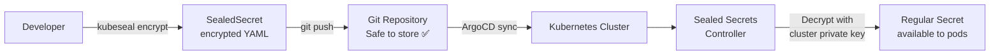

> 💡 **Quick Answer:** Use `kubeseal` to encrypt Kubernetes Secrets into `SealedSecret` resources that are safe to store in Git. The Sealed Secrets controller in the cluster decrypts them back to regular Secrets. Only the cluster's private key can decrypt — even you can't read them after sealing.

## The Problem

Kubernetes Secrets are base64-encoded (not encrypted) and can't be stored in Git safely. Teams end up with Secrets managed outside of GitOps — manually applied, easily forgotten, and never version-controlled. Sealed Secrets solve this by encrypting secrets for Git storage.

## The Solution

### Install Sealed Secrets

```bash
# Install controller
helm repo add sealed-secrets https://bitnami-labs.github.io/sealed-secrets
helm install sealed-secrets sealed-secrets/sealed-secrets \
  --namespace kube-system

# Install kubeseal CLI
brew install kubeseal  # or download binary
```

### Seal a Secret

```bash
# Create a regular secret (don't apply it)
kubectl create secret generic db-creds \
  --from-literal=username=admin \
  --from-literal=password=s3cret123 \
  --dry-run=client -o yaml > secret.yaml

# Seal it
kubeseal --format yaml < secret.yaml > sealed-secret.yaml

# The sealed-secret.yaml is safe to commit to Git!
cat sealed-secret.yaml
```

### SealedSecret Resource

```yaml
apiVersion: bitnami.com/v1alpha1
kind: SealedSecret
metadata:
  name: db-creds
  namespace: production
spec:
  encryptedData:
    username: AgBy3i4OJSWK+PiTySYZZA9rO43cGDEq...
    password: AgAR5VvPmB+KkLfS0aTzrcOTJRVtYhrk...
  template:
    metadata:
      name: db-creds
      namespace: production
    type: Opaque
```

The controller decrypts this into a regular Secret automatically.

### Scoping Options

```bash
# Namespace-scoped (default) — only works in the specified namespace
kubeseal --scope namespace-wide < secret.yaml > sealed.yaml

# Cluster-scoped — works in any namespace
kubeseal --scope cluster-wide < secret.yaml > sealed.yaml

# Strict (default) — name AND namespace must match
kubeseal --scope strict < secret.yaml > sealed.yaml
```

### Key Rotation

```bash
# Fetch the current public key
kubeseal --fetch-cert > pub-cert.pem

# Controller rotates keys every 30 days automatically
# Old secrets remain decryptable (controller keeps old keys)

# Force re-encryption with new key
kubeseal --re-encrypt < sealed-secret.yaml > re-encrypted.yaml
```



## Common Issues

**"cannot fetch certificate" error**

The sealed-secrets controller isn't running or the service isn't accessible. Check: `kubectl get pods -n kube-system | grep sealed-secrets`.

**Secret not decrypting in target namespace**

Scope mismatch. By default, SealedSecrets are strict-scoped — name and namespace must match exactly what was used during sealing.

## Best Practices

- **Store SealedSecrets in Git** — the whole point is GitOps-friendly secret management
- **Backup the sealing keys** — `kubectl get secret -n kube-system sealed-secrets-key* -o yaml > backup.yaml`
- **Strict scope for production** — prevents secrets from being used in wrong namespaces
- **Re-encrypt periodically** — run `kubeseal --re-encrypt` after key rotation
- **Don't commit the original Secret** — only the SealedSecret goes in Git

## Key Takeaways

- Sealed Secrets encrypt Kubernetes Secrets for safe Git storage
- Only the cluster's private key can decrypt — kubeseal uses the public key to encrypt
- Three scoping modes: strict (name+namespace), namespace-wide, cluster-wide
- Controller auto-rotates keys every 30 days — old secrets remain decryptable
- Enables full GitOps — all cluster state, including secrets, lives in Git
