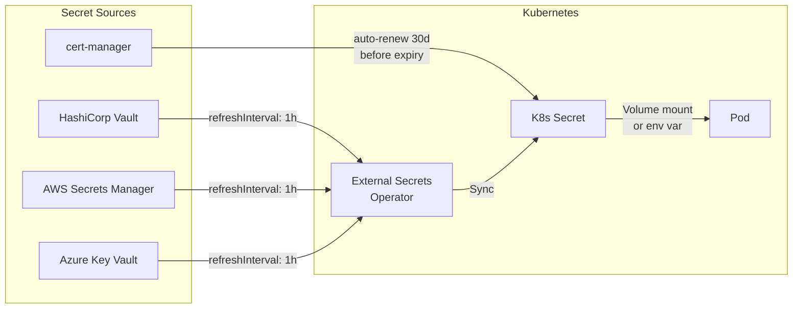

> 💡 **Quick Answer:** Automate key rotation using **cert-manager** for TLS certificates (auto-renews before expiry), **External Secrets Operator** for syncing secrets from Vault/AWS/Azure (with `refreshInterval`), and **CronJobs** for custom rotation scripts. Never rotate manually — humans forget, automation doesn't.

## The Problem

Static secrets are a security liability. API keys expire, TLS certificates lapse, database passwords get compromised. Manual rotation is error-prone, delayed, and doesn't scale. Kubernetes has no built-in secret rotation — you need external tools.



## cert-manager: Automatic TLS Rotation

cert-manager watches Certificate resources and renews them before expiry:

```yaml
apiVersion: cert-manager.io/v1
kind: Certificate
metadata:
  name: app-tls
  namespace: production
spec:
  secretName: app-tls-secret
  duration: 90d          # Certificate validity
  renewBefore: 30d       # Renew 30 days before expiry
  isCA: false
  privateKey:
    algorithm: ECDSA
    size: 256
    rotationPolicy: Always   # Generate new key on every renewal
  usages:
    - server auth
    - client auth
  dnsNames:
    - app.example.com
    - "*.app.example.com"
  issuerRef:
    name: letsencrypt-prod
    kind: ClusterIssuer
```

```bash
# Check certificate status
kubectl get certificate -n production
# NAME      READY   SECRET           AGE   EXPIRATION
# app-tls   True    app-tls-secret   30d   2026-07-16T00:00:00Z

# Check renewal schedule
kubectl describe certificate app-tls -n production | grep -A3 "Renewal"
# Not After:    2026-07-16T00:00:00Z
# Renewal Time: 2026-06-16T00:00:00Z  ← auto-renews here
```

### Pod Auto-Reload on Certificate Rotation

```yaml
# Option A: Use projected volumes (kubelet refreshes automatically)
apiVersion: apps/v1
kind: Deployment
metadata:
  name: app
  annotations:
    # Reloader watches for secret changes and triggers rolling restart
    reloader.stakater.com/auto: "true"
spec:
  template:
    spec:
      containers:
        - name: app
          volumeMounts:
            - name: tls
              mountPath: /etc/tls
              readOnly: true
      volumes:
        - name: tls
          secret:
            secretName: app-tls-secret
---
# Option B: Use Reloader for automatic rolling restart
# Install: helm install reloader stakater/reloader -n kube-system
```

## External Secrets Operator: Vault/Cloud Secret Sync

```yaml
# 1. SecretStore connecting to HashiCorp Vault
apiVersion: external-secrets.io/v1beta1
kind: ClusterSecretStore
metadata:
  name: vault
spec:
  provider:
    vault:
      server: "https://vault.example.com"
      path: "secret"
      version: "v2"
      auth:
        kubernetes:
          mountPath: "kubernetes"
          role: "external-secrets"
          serviceAccountRef:
            name: external-secrets-sa
            namespace: external-secrets
---
# 2. ExternalSecret with automatic refresh
apiVersion: external-secrets.io/v1beta1
kind: ExternalSecret
metadata:
  name: db-credentials
  namespace: production
spec:
  refreshInterval: 1h    # Check Vault for updates every hour
  secretStoreRef:
    name: vault
    kind: ClusterSecretStore
  target:
    name: db-credentials
    creationPolicy: Owner
    template:
      type: Opaque
      data:
        username: "{{ .username }}"
        password: "{{ .password }}"
        connection-string: "postgresql://{{ .username }}:{{ .password }}@db.example.com:5432/mydb"
  data:
    - secretKey: username
      remoteRef:
        key: production/database
        property: username
    - secretKey: password
      remoteRef:
        key: production/database
        property: password
```

```bash
# Verify sync
kubectl get externalsecret -n production
# NAME             STORE   REFRESH   STATUS
# db-credentials   vault   1h        SecretSynced

# Check last sync
kubectl describe externalsecret db-credentials -n production | grep "Last Updated"
```

### Vault Dynamic Secrets (Auto-Rotating)

```yaml
# Vault generates unique credentials per lease
apiVersion: external-secrets.io/v1beta1
kind: ExternalSecret
metadata:
  name: db-dynamic-creds
  namespace: production
spec:
  refreshInterval: 30m    # Refresh before Vault lease expires
  secretStoreRef:
    name: vault
    kind: ClusterSecretStore
  target:
    name: db-dynamic-creds
    creationPolicy: Owner
  data:
    - secretKey: username
      remoteRef:
        key: database/creds/app-role    # Vault dynamic secret engine
        property: username
    - secretKey: password
      remoteRef:
        key: database/creds/app-role
        property: password
```

## CronJob-Based Custom Key Rotation

For APIs, tokens, or custom credentials that don't have operator support:

```yaml
apiVersion: batch/v1
kind: CronJob
metadata:
  name: rotate-api-keys
  namespace: production
spec:
  schedule: "0 2 1 * *"    # 2 AM on the 1st of every month
  concurrencyPolicy: Forbid
  successfulJobsHistoryLimit: 3
  failedJobsHistoryLimit: 3
  jobTemplate:
    spec:
      backoffLimit: 3
      template:
        spec:
          serviceAccountName: key-rotator
          restartPolicy: OnFailure
          containers:
            - name: rotator
              image: bitnami/kubectl:latest
              command:
                - /bin/bash
                - -c
                - |
                  set -euo pipefail
                  
                  echo "=== Rotating API keys ==="
                  
                  # 1. Generate new key
                  NEW_KEY=$(openssl rand -base64 32)
                  
                  # 2. Update the external service (API provider)
                  # curl -X POST https://api.example.com/keys/rotate \
                  #   -H "Authorization: Bearer $CURRENT_KEY" \
                  #   -d "{\"new_key\": \"$NEW_KEY\"}"
                  
                  # 3. Update Kubernetes secret
                  kubectl create secret generic api-key \
                    --from-literal=key="$NEW_KEY" \
                    --dry-run=client -o yaml | kubectl apply -f -
                  
                  # 4. Trigger rolling restart of dependent deployments
                  kubectl rollout restart deployment/api-consumer -n production
                  
                  # 5. Wait for rollout
                  kubectl rollout status deployment/api-consumer -n production --timeout=300s
                  
                  echo "=== Rotation complete ==="
              env:
                - name: CURRENT_KEY
                  valueFrom:
                    secretKeyRef:
                      name: api-key
                      key: key
---
# RBAC for the rotator
apiVersion: rbac.authorization.k8s.io/v1
kind: Role
metadata:
  name: key-rotator
  namespace: production
rules:
  - apiGroups: [""]
    resources: ["secrets"]
    verbs: ["get", "create", "update", "patch"]
  - apiGroups: ["apps"]
    resources: ["deployments"]
    verbs: ["get", "patch"]
---
apiVersion: rbac.authorization.k8s.io/v1
kind: RoleBinding
metadata:
  name: key-rotator
  namespace: production
subjects:
  - kind: ServiceAccount
    name: key-rotator
roleRef:
  kind: Role
  name: key-rotator
  apiGroup: rbac.authorization.k8s.io
```

## Rotation Schedule Recommendations

| Secret Type | Rotation Frequency | Tool |
|------------|-------------------|------|
| TLS certificates | Auto (30d before expiry) | cert-manager |
| Database passwords | Every 30-90 days | Vault dynamic secrets |
| API keys | Every 30-90 days | CronJob + ESO |
| Service account tokens | Auto (1h bound tokens) | Kubernetes native |
| SSH keys | Every 90 days | CronJob |
| Encryption keys (KMS) | Every 365 days | Cloud KMS auto-rotation |
| OAuth client secrets | Every 90 days | CronJob + ESO |

## Common Issues

| Issue | Cause | Fix |
|-------|-------|-----|
| Pod uses stale secret | Secret updated but pod not restarted | Use Reloader or `rollout restart` |
| cert-manager not renewing | Issuer misconfigured or rate limited | `kubectl describe certificate`, check issuer status |
| ESO sync failed | Vault token expired or network issue | Check ExternalSecret status, verify SecretStore |
| CronJob rotation breaks app | New key applied before old key revoked | Implement dual-key (grace period) rotation |
| Vault lease expired | `refreshInterval` longer than lease TTL | Set refresh < lease TTL |

## Best Practices

- **Never rotate manually** — automate everything with cert-manager, ESO, or CronJobs
- **Dual-key rotation** — keep both old and new keys valid during transition
- **Alert on rotation failures** — Prometheus alerts for failed CronJobs and expired certificates
- **Test rotation in staging** — break it in staging, not production
- **Use Vault dynamic secrets** — unique per-lease credentials, auto-revoked
- **Set `rotationPolicy: Always`** — generate new private keys on every cert renewal
- **Use Reloader** — automatically restart pods when secrets change
- **Audit rotation logs** — who rotated what, when, and whether it succeeded

## Key Takeaways

- cert-manager auto-renews TLS before expiry — set `renewBefore: 30d`
- External Secrets Operator syncs from Vault/cloud with `refreshInterval`
- Vault dynamic secrets = unique credentials per lease, auto-revoked
- CronJobs handle custom rotation for APIs and tokens
- Always implement dual-key grace periods to avoid downtime
- Use Reloader to automatically restart pods on secret changes
