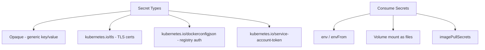

> 💡 **Quick Answer:** Create and manage Kubernetes Secrets for sensitive data. Covers types, encoding, mounting, external secrets operators, and encryption at rest best practices.

## The Problem

This is one of the most searched Kubernetes topics. Having a comprehensive, well-structured guide helps both beginners and experienced users quickly find what they need.

## The Solution

### Create Secrets

```bash
# From literal values
kubectl create secret generic db-credentials \
  --from-literal=username=admin \
  --from-literal=password='S3cur3P@ss!'

# From file
kubectl create secret generic tls-cert \
  --from-file=tls.crt=./cert.pem \
  --from-file=tls.key=./key.pem

# TLS secret
kubectl create secret tls app-tls \
  --cert=cert.pem --key=key.pem

# Docker registry secret
kubectl create secret docker-registry regcred \
  --docker-server=registry.example.com \
  --docker-username=user \
  --docker-password=pass
```

```yaml
# Declarative (values must be base64-encoded)
apiVersion: v1
kind: Secret
metadata:
  name: db-credentials
type: Opaque
data:
  username: YWRtaW4=          # echo -n "admin" | base64
  password: UzNjdXIzUEBzcyE=  # echo -n "S3cur3P@ss!" | base64
---
# Or use stringData (plain text, auto-encoded)
apiVersion: v1
kind: Secret
metadata:
  name: db-credentials
type: Opaque
stringData:
  username: admin
  password: "S3cur3P@ss!"
```

### Use in Pods

```yaml
spec:
  containers:
    - name: app
      # As environment variables
      env:
        - name: DB_PASSWORD
          valueFrom:
            secretKeyRef:
              name: db-credentials
              key: password
      # All keys
      envFrom:
        - secretRef:
            name: db-credentials
      # As files
      volumeMounts:
        - name: secrets
          mountPath: /etc/secrets
          readOnly: true
  volumes:
    - name: secrets
      secret:
        secretName: db-credentials
  # Image pull secret
  imagePullSecrets:
    - name: regcred
```

### Decode Secrets

```bash
# View secret
kubectl get secret db-credentials -o yaml

# Decode specific key
kubectl get secret db-credentials -o jsonpath='{.data.password}' | base64 -d

# Decode all keys
kubectl get secret db-credentials -o json | jq -r '.data | to_entries[] | "\(.key): \(.value | @base64d)"'
```

### Encryption at Rest

```yaml
# /etc/kubernetes/enc/encryption-config.yaml
apiVersion: apiserver.config.k8s.io/v1
kind: EncryptionConfiguration
resources:
  - resources:
      - secrets
    providers:
      - aescbc:
          keys:
            - name: key1
              secret: <base64-encoded-32-byte-key>
      - identity: {}
```



## Frequently Asked Questions

### Are Kubernetes Secrets actually secure?

By default, Secrets are only base64-encoded (NOT encrypted). Enable encryption at rest and use RBAC to restrict access. For production, use External Secrets Operator with Vault, AWS Secrets Manager, or Azure Key Vault.

### What's the size limit for Secrets?

Same as ConfigMaps: 1MB per Secret object.

### How do I rotate Secrets without downtime?

Update the Secret, then either restart pods (`kubectl rollout restart`) for env-based secrets, or wait ~60s for volume-mounted secrets to auto-update.

## Best Practices

- **Start simple** — use the basic form first, add complexity as needed
- **Be consistent** — follow naming conventions across your cluster
- **Document your choices** — add annotations explaining why, not just what
- **Monitor and iterate** — review configurations regularly

## Key Takeaways

- This is fundamental Kubernetes knowledge every engineer needs
- Start with the simplest approach that solves your problem
- Use `kubectl explain` and `kubectl describe` when unsure
- Practice in a test cluster before applying to production
