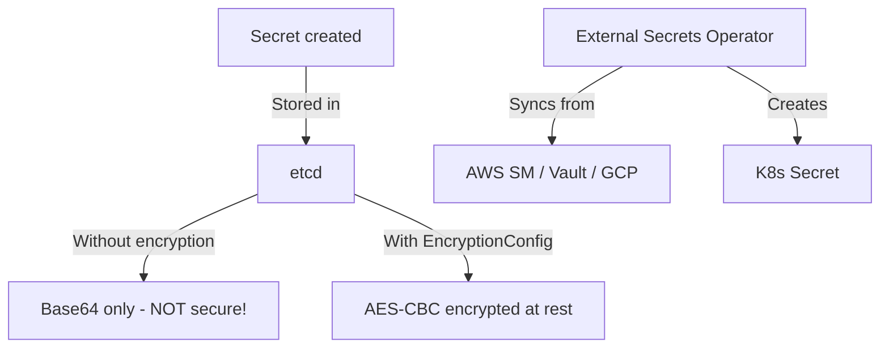

> 💡 **Quick Answer:** security

## The Problem

This is one of the most searched Kubernetes topics with thousands of monthly searches. A comprehensive, production-ready guide prevents hours of trial and error.

## The Solution

### Create Secrets

```bash
# From literal
kubectl create secret generic db-creds \
  --from-literal=username=admin \
  --from-literal=password='S3cur3P@ss!'

# From file (TLS certs)
kubectl create secret tls my-tls \
  --cert=tls.crt --key=tls.key

# From file (generic)
kubectl create secret generic ssh-key --from-file=id_rsa=~/.ssh/id_rsa

# Docker registry
kubectl create secret docker-registry regcred \
  --docker-server=registry.example.com \
  --docker-username=user \
  --docker-password=pass
```

```yaml
apiVersion: v1
kind: Secret
metadata:
  name: db-creds
type: Opaque
stringData:           # Plain text (auto-encoded to base64)
  username: admin
  password: "S3cur3P@ss!"
  connection-string: "postgresql://admin:S3cur3P@ss!@postgres:5432/mydb"
# Or use data: with base64
# data:
#   username: YWRtaW4=
#   password: UzNjdXIzUEBzcyE=
```

### Use in Pods

```yaml
spec:
  containers:
    - name: app
      env:
        - name: DB_PASSWORD
          valueFrom:
            secretKeyRef:
              name: db-creds
              key: password
      # Or mount as files
      volumeMounts:
        - name: certs
          mountPath: /etc/tls
          readOnly: true
  volumes:
    - name: certs
      secret:
        secretName: my-tls
  # Pull from private registry
  imagePullSecrets:
    - name: regcred
```

### Encryption at Rest

```yaml
# /etc/kubernetes/encryption-config.yaml
apiVersion: apiserver.config.k8s.io/v1
kind: EncryptionConfiguration
resources:
  - resources: [secrets]
    providers:
      - aescbc:
          keys:
            - name: key1
              secret: <base64-encoded-32-byte-key>
      - identity: {}   # Fallback for reading unencrypted
```

```bash
# Pass to API server
# --encryption-provider-config=/etc/kubernetes/encryption-config.yaml

# Re-encrypt existing secrets
kubectl get secrets -A -o json | kubectl replace -f -
```

### External Secrets Operator

```yaml
# Sync from AWS Secrets Manager / Vault / GCP
apiVersion: external-secrets.io/v1beta1
kind: ExternalSecret
metadata:
  name: db-creds
spec:
  refreshInterval: 1h
  secretStoreRef:
    name: aws-secrets-manager
    kind: ClusterSecretStore
  target:
    name: db-creds
  data:
    - secretKey: password
      remoteRef:
        key: /prod/database/password
```



## Frequently Asked Questions

### Are Kubernetes Secrets encrypted?

By default, Secrets are only base64-encoded in etcd (NOT encrypted). Enable encryption at rest with EncryptionConfiguration, or use External Secrets Operator with a proper vault.

### Secrets vs ConfigMaps?

Secrets: sensitive data, base64-encoded, can be encrypted at rest, size-limited RBAC. ConfigMaps: non-sensitive config, plain text. Use Secrets for anything you wouldn't put in a README.

## Best Practices

- Start with the simplest configuration that solves your problem
- Test in staging before production
- Use `kubectl describe` and events for troubleshooting
- Document team conventions for consistency

## Key Takeaways

- This is fundamental Kubernetes operational knowledge
- Follow established conventions and recommended labels
- Monitor and iterate based on real production behavior
- Automate repetitive tasks to reduce human error
