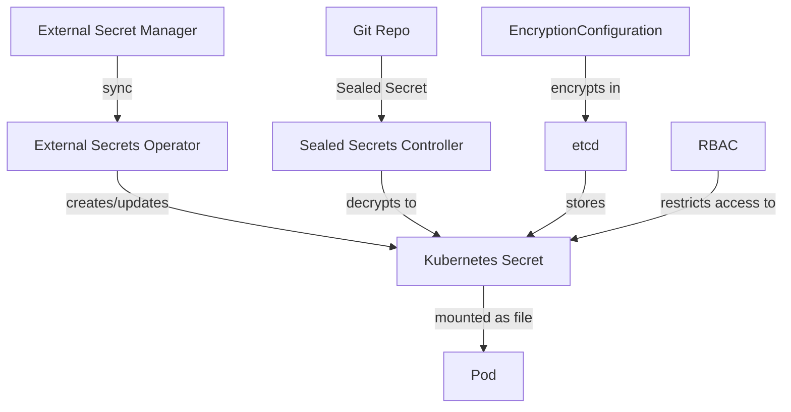

> 💡 **Quick Answer:** Never store secrets in Git, always enable encryption at rest (`EncryptionConfiguration`), use an external secret manager (Vault, AWS Secrets Manager) via External Secrets Operator, restrict access with RBAC, and rotate secrets automatically with TTLs.

## The Problem

Default Kubernetes secrets are:
- Base64 encoded (NOT encrypted) — anyone with etcd access reads them
- Stored in etcd unencrypted by default
- Visible to anyone with `get secret` RBAC permission
- Often committed to Git repos accidentally
- Never rotated automatically

## The Solution

### Layer 1: Encryption at Rest

```yaml
# /etc/kubernetes/encryption-config.yaml
apiVersion: apiserver.config.k8s.io/v1
kind: EncryptionConfiguration
resources:
  - resources:
      - secrets
    providers:
      - aescbc:
          keys:
            - name: key1
              secret: <base64-encoded-32-byte-key>
      - identity: {}  # Fallback for reading old unencrypted secrets
```

```bash
# Generate encryption key
head -c 32 /dev/urandom | base64

# Add to kube-apiserver flags:
# --encryption-provider-config=/etc/kubernetes/encryption-config.yaml

# Re-encrypt all existing secrets
kubectl get secrets --all-namespaces -o json | kubectl replace -f -
```

### Layer 2: External Secrets Operator

```yaml
# Install ESO
helm install external-secrets external-secrets/external-secrets \
  --namespace external-secrets --create-namespace

# Connect to AWS Secrets Manager
apiVersion: external-secrets.io/v1beta1
kind: ClusterSecretStore
metadata:
  name: aws-secrets
spec:
  provider:
    aws:
      service: SecretsManager
      region: us-east-1
      auth:
        jwt:
          serviceAccountRef:
            name: external-secrets-sa
            namespace: external-secrets
---
# Pull secret from AWS into Kubernetes
apiVersion: external-secrets.io/v1beta1
kind: ExternalSecret
metadata:
  name: database-credentials
  namespace: production
spec:
  refreshInterval: 1h  # Auto-sync every hour
  secretStoreRef:
    name: aws-secrets
    kind: ClusterSecretStore
  target:
    name: db-credentials
    creationPolicy: Owner
  data:
    - secretKey: username
      remoteRef:
        key: production/database
        property: username
    - secretKey: password
      remoteRef:
        key: production/database
        property: password
```

### Layer 3: RBAC Restriction

```yaml
# Restrict who can read secrets
apiVersion: rbac.authorization.k8s.io/v1
kind: Role
metadata:
  name: secret-reader
  namespace: production
rules:
  - apiGroups: [""]
    resources: ["secrets"]
    resourceNames: ["app-config"]  # Only specific secrets
    verbs: ["get"]
---
# Deny listing all secrets (common mistake: giving list permission)
# Developers should only get specific named secrets, not list all
apiVersion: rbac.authorization.k8s.io/v1
kind: Role
metadata:
  name: developer
  namespace: staging
rules:
  - apiGroups: [""]
    resources: ["secrets"]
    verbs: ["get"]
    resourceNames: ["app-config", "tls-cert"]  # Named only, no list
```

### Layer 4: Sealed Secrets (Git-Safe)

```bash
# Install Sealed Secrets controller
helm install sealed-secrets sealed-secrets/sealed-secrets \
  --namespace kube-system

# Encrypt a secret for Git
kubectl create secret generic db-creds \
  --from-literal=password=supersecret \
  --dry-run=client -o yaml | \
  kubeseal --controller-name=sealed-secrets \
  --controller-namespace=kube-system \
  -o yaml > sealed-db-creds.yaml

# sealed-db-creds.yaml is safe to commit to Git
# Only the cluster controller can decrypt it
```

### Layer 5: Automatic Rotation

```yaml
# External Secrets with rotation
apiVersion: external-secrets.io/v1beta1
kind: ExternalSecret
metadata:
  name: rotating-api-key
spec:
  refreshInterval: 15m  # Check for new version every 15 min
  secretStoreRef:
    name: vault-backend
    kind: ClusterSecretStore
  target:
    name: api-key
  data:
    - secretKey: key
      remoteRef:
        key: secret/data/api-keys/production
        property: current_key
```

### Anti-Patterns to Avoid

```yaml
# ❌ DON'T: Secret values in plain YAML in Git
apiVersion: v1
kind: Secret
metadata:
  name: db-creds
data:
  password: c3VwZXJzZWNyZXQ=  # This is just base64!

# ❌ DON'T: Secrets in environment variables (visible in pod spec)
env:
  - name: DB_PASSWORD
    value: "hardcoded-password"  # Never do this

# ❌ DON'T: Broad RBAC
rules:
  - apiGroups: [""]
    resources: ["secrets"]
    verbs: ["*"]  # Too permissive

# ✓ DO: Mount as file with restrictive permissions
volumeMounts:
  - name: secrets
    mountPath: /etc/secrets
    readOnly: true
volumes:
  - name: secrets
    secret:
      secretName: db-credentials
      defaultMode: 0400  # Owner read-only
```

### Architecture



## Common Issues

| Issue | Cause | Fix |
|-------|-------|-----|
| Secret visible in `kubectl describe pod` | Using `env` instead of volume mount | Mount as file volume |
| etcd compromise exposes secrets | No encryption at rest | Configure `EncryptionConfiguration` |
| Secret in Git history | Committed plain Secret YAML | Use Sealed Secrets or ESO |
| Stale credentials | No rotation | Set `refreshInterval` in ExternalSecret |
| Developer reads production secrets | Over-permissive RBAC | Use `resourceNames` in Role |

## Best Practices

1. **Enable encryption at rest** — base64 is encoding, not encryption
2. **Use External Secrets Operator** — single source of truth outside K8s
3. **Never commit secrets to Git** — use Sealed Secrets or reference-only manifests
4. **Mount as files, not env vars** — env vars leak in process listings and crash dumps
5. **Rotate automatically** — set `refreshInterval` and use short-lived credentials
6. **Audit secret access** — enable Kubernetes audit logging for secret reads
7. **Use `defaultMode: 0400`** — restrictive file permissions on mounted secrets

## Key Takeaways

- Kubernetes secrets are base64, NOT encrypted — encryption at rest is a separate config
- External Secrets Operator syncs from Vault/AWS/GCP into K8s secrets automatically
- Sealed Secrets encrypts secrets for safe Git storage — only cluster can decrypt
- RBAC should restrict to named secrets — never grant `list` on all secrets
- Mount secrets as files (not env vars) with `defaultMode: 0400` for least privilege
